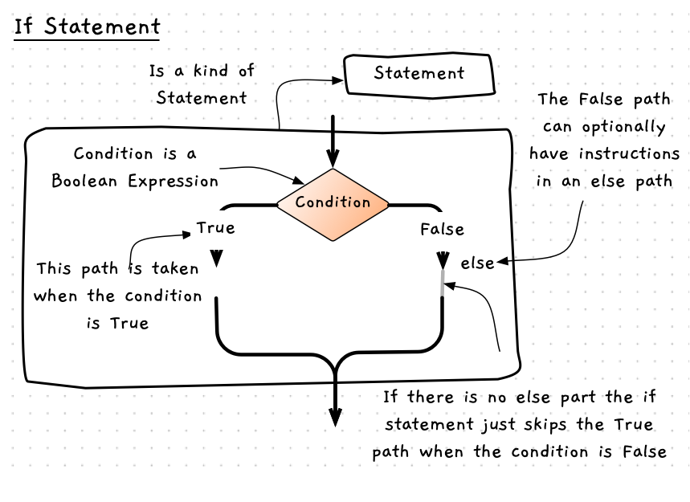

import MySwiper from '../../../../../../components/react/myswiper.jsx'

import Slide01if from './images/control-flow-statements-in-depth/control-flow-if-statement/Slide1.png';
import Slide02if from './images/control-flow-statements-in-depth/control-flow-if-statement/Slide2.png';
import Slide03if from './images/control-flow-statements-in-depth/control-flow-if-statement/Slide3.png';
import Slide04if from './images/control-flow-statements-in-depth/control-flow-if-statement/Slide4.png';
import Slide05if from './images/control-flow-statements-in-depth/control-flow-if-statement/Slide5.png';
import Slide06if from './images/control-flow-statements-in-depth/control-flow-if-statement/Slide6.png';

export const sliderImagesIfStatement = [
  {
    src: Slide01if.src,
    altText: "Shows the state in the computer where the language variable has the data 'C#' and the code is about to run line 4.",
    tipStart: 1,
    tips: [
      "Lines 1-3 get the user's input (which in this case we'll say is 'C#'), and store it in the variable 'language' on the stack.",
      "The program counter is incremented to line 4, ready to run the 'if' statement."
    ]
  },
  {
    src: Slide02if.src,
    altText: "Shows the state in the computer with C# in the language, and the code starting to run the if statement.",
    tipStart: 2,
    tips: [
      "When executing an if statement, the computer first checks the condition. In this case, the condition checks if the value of 'language' is 'C#'.",
      "The value in language is 'C#', so the condition is <span class='booleanTrue'>true</span>. This meaning that the program counter increments by one to move into the associated 'if' block of code."
    ]
  },
  {
    src: Slide03if.src,
    altText: "Shows the state of the computer running the sequence in the if statement.",
    tipStart: 3,
    tips: [
      "The compound statement groups lines 5 to 7.",
      "Line 6 outputs the string 'Good choice. C# is a fine language.' to the terminal.",
      "Line 7 indicates the end of the compound statement, so the end of the if statement."
    ]
  },
  {
    src: Slide04if.src,
    altText: "Line 8 runs and prings the output 'Great chat!' to the terminal. The program counter is incremented, and the program ends",
    tipStart: 4,
    tips: [
      "The program continues with the next instruction on line 8.",
      "Line 8 runs and outputs 'Great chat!' to the terminal."
    ]
  },
  {
    src: Slide05if.src,
    altText: "Shows the state of the computer back at line 4 with 'C++' in the language.",
    tipStart: 5,
    tips: [
      "Let's rewind back to the start of the if statement and try different input.",
      "This time, we'll say the user has input 'C++'.",
      "Now at line 4, the condition is <span class='booleanFalse'>false</span>.",
      "As the condition is false, the if statement sets the program counter to 8, skipping the compound statement."
    ]
  },
  {
    src: Slide06if.src,
    altText: "Line 8 runs, and outputs 'Great chat!' to the terminal. The program counter is incremented, and the program ends",
    tipStart: 6,
    tips: [
      "Line 8 runs, and outputs 'Great chat!' to the terminal.",
      "Notice for both paths computer still executed line 8 and output 'Great chat!'."
    ]
  }
];

import Slide01ifelse from './images/control-flow-statements-in-depth/control-flow-if-else-statement/Slide1.png';
import Slide02ifelse from './images/control-flow-statements-in-depth/control-flow-if-else-statement/Slide2.png';
import Slide03ifelse from './images/control-flow-statements-in-depth/control-flow-if-else-statement/Slide3.png';
import Slide04ifelse from './images/control-flow-statements-in-depth/control-flow-if-else-statement/Slide4.png';
import Slide05ifelse from './images/control-flow-statements-in-depth/control-flow-if-else-statement/Slide5.png';
import Slide06ifelse from './images/control-flow-statements-in-depth/control-flow-if-else-statement/Slide6.png';
import Slide07ifelse from './images/control-flow-statements-in-depth/control-flow-if-else-statement/Slide7.png';

export const sliderImagesIfElseStatement = [
  {
    src: Slide01ifelse.src,
    altText: "Shows the state of the computer at line 4 with 'C#' in the language variable.",
    tipStart: 1,
    tips: [
      "Let's assume that the user enters 'C#' when asked for input.",
      "Lines 1-3 result in the user input 'C#' being stored in the variable 'language' on the stack.",
      "At line 4, the condition evaluates to <span class='booleanTrue'>true</span>.",
      "The program steps into the true branch as before."
    ]
  },
  {
    src: Slide02ifelse.src,
    altText: "Shows the cpu runs line 5-7 - the true branch.",
    tipStart: 2,
    tips: [
      "The compound statement on lines 5-7 runs.",
      "Line 6 outputs the message 'Good choice, C# is a fine language' to the terminal.",
    ]
  },
  {
    src: Slide03ifelse.src,
    altText: "Shows the cpu at the else line - line 8",
    tipStart: 3,
    tips: [
      "Line 8 is back to the if statement.",
      "The 'else' indicates we need to skip this branch, because the condition of the if statement was true.",
      "The if statement sets the program counter to 12, jumping over the compound statement that follows the else."
    ]
  },
  {
    src: Slide04ifelse.src,
    altText: "Shows the cpu at line 12",
    tipStart: 4,
    tips: [
      "Line 12 runs and prints the output 'Great chat!' to the terminal.",
    ]
  },
  {
    src: Slide05ifelse.src,
    altText: "Shows the program back to line 4, with 'C++' in the language",
    tipStart: 5,
    tips: [
      "Let's reset back to line 4 to see what happens if the user enters 'C++'.",
      "The condition is <span class='booleanFalse'>false</span>, so the if statement jumps to the statement that follows the 'else'.",
      "This means the program counter will increment to line 9."
    ]
  },
  {
    src: Slide06ifelse.src,
    altText: "Shows the program running lines 9 to 11 as the statements within the else branch",
    tipStart: 6,
    tips: [
      "The else branch has a compound statement from lines 9 to 11.",
      "Line 10 outputs 'Well... good luck with that!' to the terminal.",
      "Line 11 indicates the end of the compound statement, so the end of the if statement."
    ]
  },
  {
    src: Slide07ifelse.src,
    altText: "Shows the program at line 12 after the if statement.",
    tipStart: 7,
    tips: [
      "The sequence continues as we move out of the if statement.",
      "Line 12 outputs 'Great chat!' to the terminal."
    ]
  }
];

import Slide01ifelseif from './images/control-flow-statements-in-depth/control-flow-if-else-if-statement/Slide1.png';
import Slide02ifelseif from './images/control-flow-statements-in-depth/control-flow-if-else-if-statement/Slide2.png';
import Slide03ifelseif from './images/control-flow-statements-in-depth/control-flow-if-else-if-statement/Slide3.png';
import Slide04ifelseif from './images/control-flow-statements-in-depth/control-flow-if-else-if-statement/Slide4.png';
import Slide05ifelseif from './images/control-flow-statements-in-depth/control-flow-if-else-if-statement/Slide5.png';
import Slide06ifelseif from './images/control-flow-statements-in-depth/control-flow-if-else-if-statement/Slide6.png';
import Slide07ifelseif from './images/control-flow-statements-in-depth/control-flow-if-else-if-statement/Slide7.png';
import Slide08ifelseif from './images/control-flow-statements-in-depth/control-flow-if-else-if-statement/Slide8.png';
import Slide09ifelseif from './images/control-flow-statements-in-depth/control-flow-if-else-if-statement/Slide9.png';
import Slide10ifelseif from './images/control-flow-statements-in-depth/control-flow-if-else-if-statement/Slide10.png';
import Slide11ifelseif from './images/control-flow-statements-in-depth/control-flow-if-else-if-statement/Slide11.png';
import Slide12ifelseif from './images/control-flow-statements-in-depth/control-flow-if-else-if-statement/Slide12.png';

export const sliderImagesIfElseIfStatement = [
    {
    src: Slide01ifelseif.src,
    altText: "Shows the language is set to C# after running lines 1 to 3",
    tipStart: 1,
    tips: [
      "Let's start by running through what happens if the user enters 'C#'.",
      "Lines 1 to 3 have run, and the value 'C#' is stored in the 'language' variable."
    ]
  },
  {
    src: Slide02ifelseif.src,
    altText: "Shows the computer will run lines 4 to 7",
    tipStart: 2,
    tips: [
      "When the computer reaches the if statement it evaluates the condition, which has a value of <span class='booleanTrue'>true</span>.",
      "Because the condition is true, the computer executes lines 5-7."
    ]
  },
  {
    src: Slide03ifelseif.src,
    altText: "The computer is at line 8 with the else part highlighted",
    tipStart: 3,
    tips: [
      "The computer returns to the if statement, and sees the 'else' branch.",
      "The 'else' branch contains a second if statement, which goes all the way to line 16.",
      "Because the condition was true, it skips the entire else branch and the sequence continues from line 16."
    ]
  },
  {
    src: Slide04ifelseif.src,
    altText: "Back to the start, with C++ now in the language",
    tipStart: 4,
    tips: [
      "Let's rewind to line 3 and see what happens if the user enters 'C++'."
    ]
  },
  {
    src: Slide05ifelseif.src,
    altText: "Shows line 4 testing the condition and jumping to the else branch",
    tipStart: 5,
    tips: [
      "At the if statement the condition is evaluated to <span class='booleanFalse'>false</span>.",
      "The if statement jumps to the 'else' branch by setting the program counter to 8."
    ]
  },
  {
    src: Slide06ifelseif.src,
    altText: "Shows the program evaluating the second if statements condition on line 8",
    tipStart: 6,
    tips: [
      "The statement in the else branch is a new if statement",
      "Its condition is <span class='booleanTrue'>true</span> as 'false or true' is true",
      "Because the condition is true, the computer continues to line 9."
    ]
  },
  {
    src: Slide07ifelseif.src,
    altText: "Shows the statements in the second if statements true branch running",
    tipStart: 7,
    tips: [
      "Lines 9-11 are run.",
      "The message 'These are great languages' is output to the terminal."
    ]
  },
  {
    src: Slide08ifelseif.src,
    altText: "The else must jump the second if's else branch",
    tipStart: 7,
    tips: [
      "At line 12 we are back to the second if statement's 'else'.",
      "Because the second if statement's condition was false, the computer skips the 'else' branch and jumps to line 16.",
      "The sequence continues from there, and the message 'Great chat!' is output to the terminal."
    ]
  },
  {
    src: Slide09ifelseif.src,
    altText: "Back to the start again, with Fortran in the language",
    tipStart: 7,
    tips: [
      "Let's reset back to line 3 one last time.",
      "This time, we will pretend the user enters 'Fortran'."
    ]
  },
  {
    src: Slide10ifelseif.src,
    altText: "Line 4 is run, which jumps to line 8",
    tipStart: 7,
    tips: [
      "At line 4 the condition is evaluated to <span class='booleanFalse'>false</span>.",
      "Because the condition is false, the computer skips to line 8 - the 'else' branch of this if statement."
    ]
  },
  {
    src: Slide11ifelseif.src,
    altText: "Line 8 is run, jumping to line 13",
    tipStart: 7,
    tips: [
      "We are now at the second if statement.",
      "On line 8 the condition evaluates to <span class='booleanFalse'>false</span>.",
      "Because the condition is false, the computer skips to line 13 - the 'else' branch of the second if statement."
    ]
  },
  {
    src: Slide12ifelseif.src,
    altText: "Lines 13 to 15 and 16 then run",
    tipStart: 7,
    tips: [
      "The 'else' branch has a compound statement - lines 13-15.",
      "Line 14 outputs the message 'Well... good luck with that!' to the terminal.",
      "The sequence continues from this point."
    ]
  }
];

The if statement is the most frequently used branching statement. It allows you to selectively run code based on the value of a [boolean](../01-0-boolean-data) expression called the **condition**. Every if statement includes a block of code that will only be executed when the condition is true. There is also an option **else** branch that tells the computer what code to execute when the condition is false. We call each of these paths a **branch** of code.

This concept is visualised in the following image.



## `If` Statement - when, why, and how

The if statement will be a regular feature in your programs. You will use this anywhere you want to optionally run a block of code. The condition has to be a [boolean expression](../01-3-conditions), which you can use [comparison](../01-1-comparisons) and [logical](../01-2-logic-operators) operators to create. You then provide code within the if statement to you want to run when the condition is true. You can also optionally include an **else** branch containing code to run when the condition is false.

Remember that things still run in **sequence**, so you have to position the if statement within your sequence at the right location. The only change to sequence from what you have seen before is in the choice of branch, which depends on the value of the condition.

## In C#

:::tip[Syntax]
The following diagram shows the C# syntax for an if statement.


:::

The keyword for an if statement in C# is `if`.
This is followed by the condition in brackets, and then the statement to run when the condition is true.
This can optionally be followed by the `else` keyword and a statement to run when the condition is false.
To run more than one statement in either branch you can use a [compound statement](../02-0-compound-statement).

## How does `if` work?

Let's work through a few examples to see how the if statement works. Pay attention to how the sequence of actions in the code is being affected. Understanding how this works will help you see how to make use of the if statement within your projects.

We will look at running code if a condition is true, running different code when it is false, and combining if statements for more than two paths.

:::tip[Remember]
Control flow statements all utilise the **conditional jump**. This is a very simple mechanism, so you need to add creativity to see how to use it to achieve your ends.
:::

### Standalone `if`

The most basic use of an if statement is to selectively run a block of code when a condition is true. In the following code, we ask the user to tell us which language they use. Then the **if** allows us to check *if* the language is "C#", and when that is true have the computer output a custom message. If anything else is entered, then the condition will be false and these statements will be skipped over.

```csharp
using static System.Console;

string language;

Write("What language do you use? ");
language = ReadLine();

if (language == "C#")
{
    WriteLine("Good choice, C# is a fine language.");
}

WriteLine("Great chat!");
```

Step through the following images to see key points about how this runs within the computer. Pay attention to the actions of the if statement itself.

<MySwiper client:only height="" images={sliderImagesIfStatement}></MySwiper>

:::tip[Attention]
Notice the actions of the if: evaluate the condition -- if true, run the statement that follows; if false, jump over the statement that follows.

That is all the `if` does.
:::

### `If` with `else`

We can add `else` to have a second branch that gets run only when the condition is false. The following code adds an else branch to output a different message when the user enters anything other than "C#".

```csharp
using static System.Console;

string language;

Write("What language do you use? ");
language = ReadLine();

if (language == "C#")
{
    WriteLine("Good choice, C# is a fine language.");
}
else
{
    WriteLine("Well... good luck with that!");
}

WriteLine("Great chat!");
```

The `else` adds to the actions the if statement needs to perform. Review the following images to see how this works.

<MySwiper client:only height="" images={sliderImagesIfElseStatement}></MySwiper>

:::tip[Attention]
This is the full set of if statement actions. They are:

1. Evaluate condition
2. If true:
   - run the statement following the 'if'
   - jump to the end of the if
3. If false:
   - jump to the statement following 'else' or, if there is no 'else', the end of the if.

When thinking through your code, you need to do the same in your head.

- "If this is true, run this code and skip that code" and...
- "if this is false, skip this code and run that code".

:::

### Multiple `if` statements combined

In many cases you will want more than two paths. To achieve this, you need to combine multiple if statements. This is shown in the following code, which gives different outputs for C and C++ as well.

```csharp
using static System.Console;

string language;

Write("What language do you use? ");
language = ReadLine();

if (language == "C#")
{
    WriteLine("Good choice, C# is a fine language.");
}
else if ((language == "C") || (language == "C++"))
{
    WriteLine("These are great languages.");
}
else
{
    WriteLine("Well... good luck with that!");
}

WriteLine("Great chat!");
```

Review the following images to see how the two if statements work together.

<MySwiper client:only height="" images={sliderImagesIfElseIfStatement}></MySwiper>

:::tip[Attention]
Notice how the single statement in the **else** branch can be an **if statement**. When the else is skipped, that means this if statement is skipped.
:::

### Reading code

The image sequences above should give you an idea of how to go about reading code. You need to be able to read through the code in the way it will run. To do this, you need to be able to picture certain values within your variables to see how the program's execution would change.

In general, you should be able to approach this in blocks. This is why it is important to have these blocks flow into each other consistently.

Notice that the "Great chat!" message was always output -- this is the statement **after** the `if` statement. So the `if` statement sits within a sequence, controlling things within its code but still working in the original sequence. It has one entry and one exit.

:::note[Summary]

- An if statement is an **instruction**. It allows you to command the computer to select a path based on a [boolean condition](../01-3-conditions).
- The if statement has **two** branches: one that is taken when the condition is true, and another optional branch that is taken when the condition is false.
- The if statement has one entry point, two paths, and then one exit point.

:::
