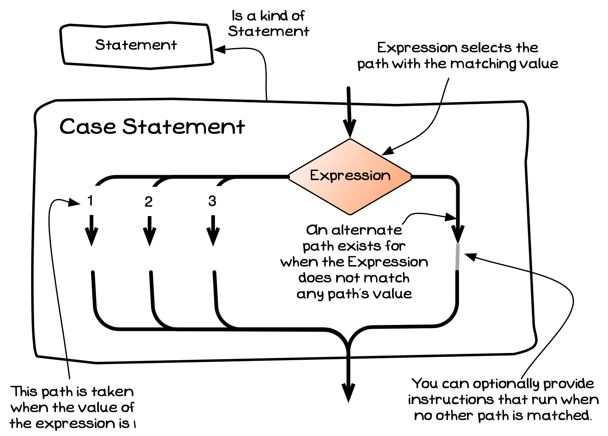

import MySwiper from '../../../../../../components/react/myswiper.jsx'

import caseStatementSlide01 from './images/control-flow-statements-in-depth/control-flow-case-statement-01.png';
import caseStatementSlide02 from './images/control-flow-statements-in-depth/control-flow-case-statement-02.png';
import caseStatementSlide03 from './images/control-flow-statements-in-depth/control-flow-case-statement-03.png';
import caseStatementSlide04 from './images/control-flow-statements-in-depth/control-flow-case-statement-04.png';
import caseStatementSlide05 from './images/control-flow-statements-in-depth/control-flow-case-statement-05.png';
import caseStatementSlide06 from './images/control-flow-statements-in-depth/control-flow-case-statement-06.png';
import caseStatementSlide07 from './images/control-flow-statements-in-depth/control-flow-case-statement-07.png';
import caseStatementSlide08 from './images/control-flow-statements-in-depth/control-flow-case-statement-08.png';
import caseStatementSlide09 from './images/control-flow-statements-in-depth/control-flow-case-statement-09.png';
import caseStatementSlide10 from './images/control-flow-statements-in-depth/control-flow-case-statement-10.png';
import caseStatementSlide11 from './images/control-flow-statements-in-depth/control-flow-case-statement-11.png';


export const sliderImagesCaseStatement = [
  {
    src: caseStatementSlide01.src,
    altText: "",
    tipStart: 1,
    tips: [
      "Lines 1-4 get the user input ('C'), and store it in the variable 'language' on the stack",
      "The program counter is incremented to line 5, ready to run the 'switch' statement."
    ]
  },
  {
    src: caseStatementSlide02.src,
    altText: "On line 5, the switch statement asks the computer to compare the value in the variable 'language' ('C'), to the value of all the case statements in it's scope (which is defined by the opening and closing braces of the switch statement) until a match is found. It increments the program counter to point to the first case statement on line 7.",
    tipStart: 2,
    tips: [
      "On line 5, the switch statement start to compare the value in the variable 'language' ('C'), to the value of all the cases until a match is found",
      "This will remember 'C' and compare it against the constant in each case"
    ]
  },
  {
    src: caseStatementSlide03.src,
    altText: "Line 7 encounters the first case statement, and compares the value of 'language' ('C') to the value of the case statement ('C#'). The comparison is false ('C' != 'C#'). So the program counter jumps to the next 'case' statement (line 10).",
    tipStart: 3,
    tips: [
      "The first case is on line 7",
      "This compares the loaded value ('C') to the value of the case ('C#')",
      "The comparison is <span class='booleanFalse'>false</span> ('C' != 'C#'). So the program counter jumps to the next case (line 10)."
    ]
  },
  {
    src: caseStatementSlide04.src,
    altText: "On line 10 the comparison is 'true' ('C' == 'C'). The program counter then increments to line 11.",
    tipStart: 4,
    tips: [
      "On line 10 the comparison is <span class='booleanTrue'>true</span> ('C' == 'C')",
      "The sequence starts running here",
      "The program counter then increments to line 11"
    ]
  },
  {
    src: caseStatementSlide05.src,
    altText: "Notice that the case statement on line 11, lies directly below the case statement on line 10. When case statements are grouped together like this, as soon as any 'case' in the group evaluates to 'true', the remaining 'case' statements in the group are skipped to execute the code associated with this group of case statements. The program counter therefore increments to line 12 ",
    tipStart: 5,
    tips: [
      "Notice that the case statement on line 11, lies directly below the case statement on line 10",
      "This drops through the case, meaning that the sequence continues.",
      "You can grouped together like this, as soon as any 'case' in the group evaluates to 'true', the the code associated with this group is run.",
      "The program counter therefore increments to line 12"
    ]
  },
  {
    src: caseStatementSlide06.src,
    altText: "At line 12 we output the message to the terminal. The program counter is incremented to line 13.",
    tipStart: 6,
    tips: [
      "At line 12 we output the message to the terminal",
      "The program counter is incremented to line 13"
    ]
  },
  {
    src: caseStatementSlide07.src,
    altText: "At line 13 we encounter a 'break' statement which terminates the code associated with the 'true' case block. The 'break statement will jump to the end of the 'switch' statement (line 16), and the program counter is incremented to point to the next line of code (line 17)",
    tipStart: 7,
    tips: [
      "The 'break' statement on line 13 jumps to the end of the case statement",
      "This sets the program counter to run line 17 - the first instruction after the case statement",
      "Without a break, control would flow into the 'default' code that follows"
    ]
  },
  {
    src: caseStatementSlide08.src,
    altText: "At line 17 the message is output to the terminal. The program counter increases, and the program ends.",
    tipStart: 8,
    tips: [
      "At line 17 the message is output to the terminal",
      "The program counter increases, and the program ends"
    ]
  },
  {
    src: caseStatementSlide09.src,
    altText: "This time the user has input 'Fortran'",
    tipStart: 9,
    tips: [
      "This time the user has input 'Fortran'"
    ]
  },
  {
    src: caseStatementSlide10.src,
    altText: "Now the switch comparison (line 5) to the case statement values (lines 7, 10 and 11) all evaluate to 'false'. So the program is incremented to line 14 (the 'default' statement)",
    tipStart: 10,
    tips: [
      "Now the switch comparison (line 5) to the case statement values (lines 7, 10 and 11) all evaluate to <span class='booleanFalse'>false</span>",
      "So the program is set to line 14 (the 'default' statement)"
    ]
  },
  {
    src: caseStatementSlide11.src,
    altText: "Lines 14 and 15 executes the block of code associated with 'default' and prints a message to the screen. The switch statement ends when it encounters the closing brace. The program counter is incremented to line 17, and the final message is output to the terminal. The program counter increments a final time to end.",
    tipStart: 11,
    tips: [
      "The default branch runs as none of the other cases match",
      "Lines 14 and 15 executes the block of code associated with 'default' and prints a message to the screen",
      "The switch statement ends when it encounters the closing brace",
      "The program counter is incremented to line 17, and the final message is output to the terminal"
    ]
  }
];

The case statement is the second kind of branching statement. This allows you to create paths that execute based on matching a value from an expression. This allows one case statement to handle many alternative paths, where each path checks a simple equality check against a single value.


<a id="FigureCaseStatement"></a>


<div class="caption"><span class="caption-figure-nbr">Figure x.y: </span>Case statement selectively runs multiple branches of code</div><br/>

:::note

- The case statement is a kind of **instruction**. It allows you to command the computer to select a path based on the value of an expression.
- Each path within the case statement has a value. When the computer executes the case statement's expression is compared against each path's value to determine which path to take.
- Older languages limit the case statement to work only with integers and individual characters.
- The case statement has one entry point, multiple paths, and then one exit point.

:::

## Case Statement - Why, When, and How

The case statement is a more specialised branch, so it tends to be used less frequently than the [if statement](../03-1-if). To use a case statement, you need to have a single expression and branches that only test if that expression matches a given value.

Looking back at the example we used for the if statement, you should see that could be coded as a case statement. Each branch only tested if the language entered by the user matched a fixed value. When the language was "C#", we ran one block, when it was "C" or "C++" we ran another, and when it was anything else we ran a different block. This is exactly the right set of requirements for using a case statement.

:::tip[If or case?]

You can code any case statement as a series of if statements. The if statement is the more flexible of the branching statements, so this is possible. This means you will use the if statement for most things.

:::

## In C#

:::tip[Syntax]

The syntax for the case statement in C# uses the keyword **switch** followed by the expression to test. Within the braces. you then have a list of cases where each case has the value to match followed by a colon (:) and a list of statements. When a case is matched, the computer jumps to the statement within that case and runs the sequence from there. This means that it will drop through into the following cases unless you add a [break](../05-1-break) statement. The break is used to jump to the end of the case statement, ensuring that you skip over paths you do not want to run. This ability to fall through to other cases can be used to combine multiple case branches, as you will see in the example below.


:::

## How does case work?

The case statement works in a very similar way to the if statement we worked through previously. The following code will achieve the same output as the example from the if statement page. With this code, you enter the value to check in the parenthesis after the **switch** keyword. For this example, the value we are looking to match is in the `language` variable. Within the body of the case statement you then have the separate cases you want to match. 

Notice that we need to embed the [break](../05-1-break) statement to indicate the end of the instructions for an individual case. Also, notice how we use this to join the "C" and "C++" cases. This means that when the "C" path is matched, the control will flow through into the same set of statements that exist for the "C++" branch.

```csharp
using static System.Console;

string language;

Write("What language do you use? ");
language = ReadLine();

switch (language)
{
  case "C#":
    WriteLine("Good choice, C# is a fine language.");
    break;
  case "C":
  case "C++":
    WriteLine("These are great low level languages - we will be using these soon!");
    break;
  default:
    WriteLine("Well... good luck with that!");
}

WriteLine("Great chat!");
```

Use the following images to see how this code runs.

<MySwiper client:only height="" images={sliderImagesCaseStatement}></MySwiper>

:::tip[Attention]

Grouping cases as shown here is okay, but to help avoid unexpected fall through, the C# language will give you an error if you do not have a break statement if you have code within a branch. You can jump to another case at the end of any given case by using the `goto case` and providing the constant you want to jump to or `goto default`.

:::
