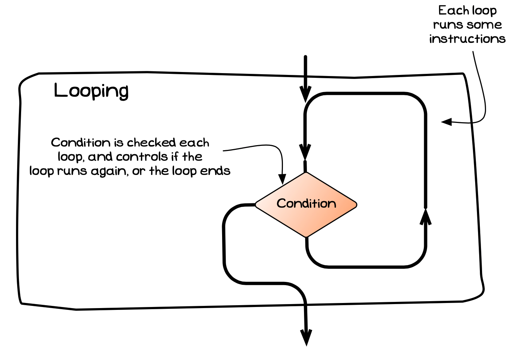
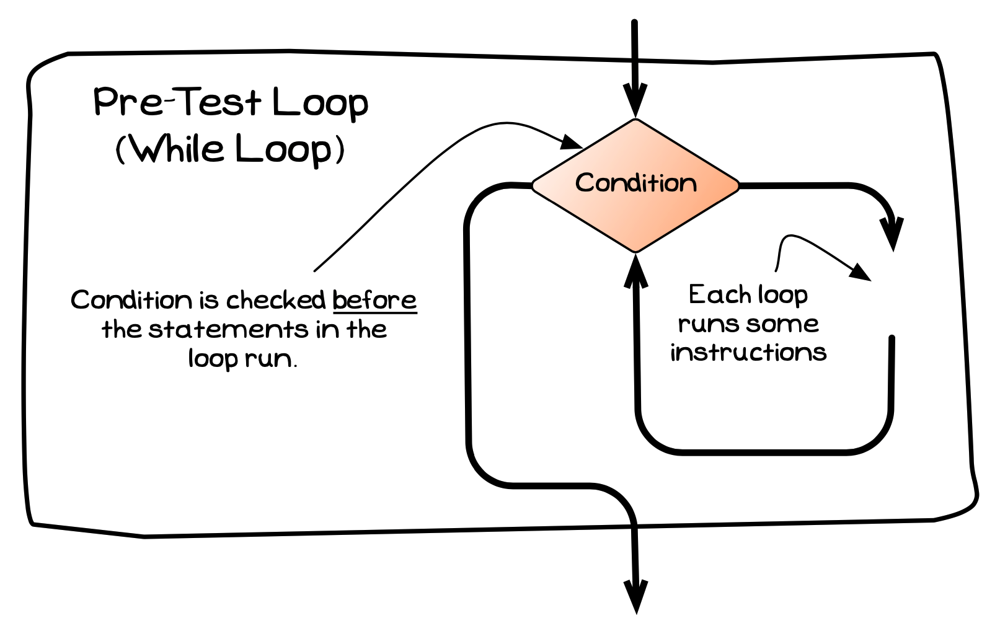

There are two main ways of controlling the sequence of actions in a program: **branching**, which we have just explored, and **looping** or **repetition**. A language's looping statements allow you to jump back and repeat instructions that have already been performed. Different statements let you loop 0 to many or 1 to many times.

A general visualisation for a looping structure is shown in the image below.
As with the branching statements, one important aspect is that looping statements fit within a sequence. They each have a single entry and an exit point, thereby allowing us to embed them within the overall sequence that occurs within the program.

<!-- TODO: add dotted paper background to image -->

## Pre-Test Loop

A pre-test loop is a looping statement that allows code to be run **0 or more** times. The loop checks the condition at the **start** (hence the name "pre-test loop"), and if the condition is `true` the loop's body is executed. At the end of the loop's body the computer jumps back to the condition, checking it again. If the condition is `false` when it is checked the loop ends, and control jumps to the next statement in the code.

A visualisation of this idea is shown in the following diagram.

<!-- TODO: add dotted paper background to image -->

## Post-Test Loop

The post-test loop is a looping statement that allows code to be run **1 or more** times. The post-test loop places the condition **after** the body of the loop (hence the name "post-test loop"). This means that the body of the loop must execute before the condition is checked. When the computer it gets to the end of the body, the loop's condition is checked and the computer either jumps back to the start of the loop to repeat the body, or the loop ends and control flows to the next statement in the code.

A visualisation of this idea is shown in the following diagram.
Note the differences from the pre-test loop above.

Let's look at these different loops in some more detail, and explore how they work within the computer.

:::note[Summary]

- Looping statements are a kind of **instruction** that command the computer to repeat the steps within a given path.
- A looping statement has a condition, which determines whether the instructions in the loop are run again or if the loop should end.
- The condition may be checked **before** or **after** the instructions are executed, giving two kinds of loops:
  - Pre-Test Loop: Repeats instructions 0 or more times.
  - Post-Test Loop: Repeats instructions 1 or more times.
- As with [branching](../03-0-branching), looping statements have a single entry and a single exit.

:::
