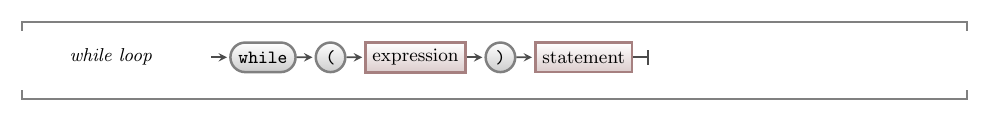

import MySwiper from '../../../../../../components/react/myswiper.jsx'

import whileLoopSlide01 from './images/control-flow-statements-in-depth/control-flow-while-loop-01.png';
import whileLoopSlide02 from './images/control-flow-statements-in-depth/control-flow-while-loop-02.png';
import whileLoopSlide03 from './images/control-flow-statements-in-depth/control-flow-while-loop-03.png';
import whileLoopSlide04 from './images/control-flow-statements-in-depth/control-flow-while-loop-04.png';
import whileLoopSlide05 from './images/control-flow-statements-in-depth/control-flow-while-loop-05.png';
import whileLoopSlide06 from './images/control-flow-statements-in-depth/control-flow-while-loop-06.png';
import whileLoopSlide07 from './images/control-flow-statements-in-depth/control-flow-while-loop-07.png';
import whileLoopSlide08 from './images/control-flow-statements-in-depth/control-flow-while-loop-08.png';
import whileLoopSlide09 from './images/control-flow-statements-in-depth/control-flow-while-loop-09.png';
import whileLoopSlide10 from './images/control-flow-statements-in-depth/control-flow-while-loop-10.png';
import whileLoopSlide11 from './images/control-flow-statements-in-depth/control-flow-while-loop-11.png';

import whileLoopSplashkitImg01 from './images/slider-while-splashkit/Slide1.png';
import whileLoopSplashkitImg02 from './images/slider-while-splashkit/Slide2.png';
import whileLoopSplashkitImg03 from './images/slider-while-splashkit/Slide3.png';
import whileLoopSplashkitImg04 from './images/slider-while-splashkit/Slide4.png';
import whileLoopSplashkitImg05 from './images/slider-while-splashkit/Slide5.png';
import whileLoopSplashkitImg06 from './images/slider-while-splashkit/Slide6.png';
import whileLoopSplashkitImg07 from './images/slider-while-splashkit/Slide7.png';
import whileLoopSplashkitImg08 from './images/slider-while-splashkit/Slide8.png';
import whileLoopSplashkitImg09 from './images/slider-while-splashkit/Slide9.png';
import whileLoopSplashkitImg10 from './images/slider-while-splashkit/Slide10.png';
import whileLoopSplashkitImg11 from './images/slider-while-splashkit/Slide11.png';
import whileLoopSplashkitImg12 from './images/slider-while-splashkit/Slide12.png';
import whileLoopSplashkitImg13 from './images/slider-while-splashkit/Slide13.png';
import whileLoopSplashkitImg14 from './images/slider-while-splashkit/Slide14.png';
import whileLoopSplashkitImg15 from './images/slider-while-splashkit/Slide15.png';
import whileLoopSplashkitImg16 from './images/slider-while-splashkit/Slide16.png';

export const sliderImagesWhileLoop = [
  {
    src: whileLoopSlide01.src,
    altText: "Lines 1-5 get the user input (10), and store it in the variable 'target' on the stack. The program counter is incremented to line 6.",
    tipStart: 1,
    tips: [
      "Lines 1-5 get the user input (<code>10</code>), and store it in the variable 'target' on the stack",
      "The program counter is incremented to line 6"
    ]
  },
  {
    src: whileLoopSlide02.src,
    altText: "On line 6, a variable named 'i' is declared and initialized to 0 on the stack. 'i' will function as our loop counter. The program counter is incremented to line 7, the start of our while loop.",
    tipStart: 2,
    tips: [
      "On line 6, a variable named 'i' is declared and initialized to 0 on the stack",
      "'i' will function as our loop counter",
      "The program counter is incremented to line 7, the start of our while loop."
    ]
  },
  {
    src: whileLoopSlide03.src,
    altText: "The condition of our while loop is evaluated. Since 'i' (0) is less than target (10), it evaluates to true. The program counter is incremented to the start of the while block (line 8).",
    tipStart: 3,
    tips: [
      "The condition of our while loop is evaluated. Since 'i' (0) is less than target (10), it evaluates to <span class='booleanTrue'>true</span>",
      "The program counter is incremented to the start of the while block (line 8)"
    ]
  },
  {
    src: whileLoopSlide04.src,
    altText: "The opening brace indicates the start of our while loop block of code. The program counter is incremented to line 9.",
    tipStart: 4,
    tips: [
      "The opening brace indicates the start of our while loop block of code",
      "The program counter is incremented to line 9"
    ]
  },
  {
    src: whileLoopSlide05.src,
    altText: "Line 9 outputs the value of our loop counter (i) to the terminal (in this case 0). The program counter increments to line 10.",
    tipStart: 5,
    tips: [
      "Line 9 outputs the value of our loop counter (i) to the terminal (in this case 0)",
      "The program counter increments to line 10"
    ]
  },
  {
    src: whileLoopSlide06.src,
    altText: "The value of our loop counter 'i' is incremented by 1. The program counter is incremented to line 11, where it hits the closing brace, at this point it cycles back up to line 7 in order to evaluate the while condition once more to determine if the loop is to continue or not.",
    tipStart: 6,
    tips: [
      "The value of our loop counter 'i' is incremented by 1",
      "The program counter is incremented to line 11, where it hits the closing brace",
      "At this point it cycles back up to line 7 in order to evaluate the while condition once more to determine if the loop is to continue or not"
    ]
  },
  {
    src: whileLoopSlide07.src,
    altText: "The while loop condition is evaluated once more. It evaluates to true because the value of 'i' (1) is still less than the value of 'target' (10), and so it will execute the block of code between the while braces once more.",
    tipStart: 7,
    tips: [
      "The while loop condition is evaluated once more",
      "It evaluates to <span class='booleanTrue'>true</span> because the value of 'i' (1) is still less than the value of 'target' (10), and so it will execute the block of code between the while braces once more."
    ]
  },
  {
    src: whileLoopSlide08.src,
    altText: "Line 9 prints the value of 'i' (1) to the terminal. The program counter increases to line 10.",
    tipStart: 8,
    tips: [
      "Line 9 prints the value of 'i' (1) to the terminal",
      ". The program counter increases to line 10"
    ]
  },
  {
    src: whileLoopSlide09.src,
    altText: "Line 10 increments the value of 'i' by 1. The program counter moves to line 11, then back up to line 7 to evaluate the while condition to determine whether the loop continues or ends. While the loop counter 'i' is less than the value of 'target' (10), it keeps printing the value of 'i' to the terminal, then incrementing 'i'. Let's jump ahead",
    tipStart: 9,
    tips: [
      "Line 10 increments the value of 'i' by 1",
      "The program counter moves to line 11, then back up to line 7 to evaluate the while condition to determine whether the loop continues or ends",
      "While the loop counter 'i' is less than the value of 'target' (<code>10</code>), it keeps printing the value of 'i' to the terminal, then incrementing 'i'",
      "Let's jump ahead..."
    ]
  },
  {
    src: whileLoopSlide10.src,
    altText: "Let's jump ahead to where 'i' has just been incremented to 10. So far, the numbers 0-9 have been output to the terminal. The program counter increments to lines 11, then 7 again to evaluate the while condition.",
    tipStart: 10,
    tips: [
      "Let's jump ahead to where 'i' has just been incremented to 10",
      "So far, the numbers 0-9 have been output to the terminal",
      "The program counter increments to lines 11, then 7 again to evaluate the while condition"
    ]
  },
  {
    src: whileLoopSlide11.src,
    altText: " This time on line 7, 'i' (10) is not less than 'target' (10), and so evaluates to false. The program counter jumps to line 11, and both the while loop and the program end.",
    tipStart: 11,
    tips: [
      " This time on line 7, 'i' (10) is not less than 'target' (10), and so evaluates to <span class='booleanFalse'>false</span>",
      "The program counter jumps to line 11, and both the while loop and the program end."
    ]
  }
];


export const sliderImagesWhileSplashKitLoop = [
  {
    src: whileLoopSplashkitImg01.src,
    altText: "Lines 1 and 2 use the SplashKit library to open a new window on the user's desktop, with the title 'Circle Test' and the dimensions 400px x 400px",
    tipStart: 1,
    tips: [
      "Lines 1 and 2 use the SplashKit library to open a new window",
      "The Window object is created in memory before opening on the user's desktop",
      "It has the title 'Circle Test' and dimensions 400x400px as given by the parameters to the <code>OpenWindow()</code> function"
    ]
  },
  {
    src: whileLoopSplashkitImg02.src,
    altText: "Line 3 clears the main window area, initializing it to the color yellow in memory",
    tipStart: 2,
    tips: [
      "Line 3 clears the main window area, initializing it to the color yellow",
      "It does this in memory - the user window remains unchanged"
    ]
  },
  {
    src: whileLoopSplashkitImg03.src,
    altText: "Line 4 tests if the user has requested a quit operation, and in this case, the user hasn't so the program proceeds into the body of the while loop",
    tipStart: 3,
    tips: [
      "Line 4 contains the while loop condition",
      "It tests if the user has requested a 'Quit' operation (for e.g. clicking the top left red quit button, or entering 'Ctrl-C' on the command-line)",
      "In this case the user hasn't, so execution continues into the body of the while loop"
    ]
  },
  {
    src: whileLoopSplashkitImg04.src,
    altText: "At line 6 the FillCircle() function creates a new circle in the main window area (in memory only) with random dimensions",
    tipStart: 4,
    tips: [
      "At line 6, the <code>FillCircle()</code> function creates a new circle in the main window area with the parameters given to the function",
      "It does this in memory only, not in the window created on the desktop",
      "The parameters specify a circle with a random color, position and radius",
      "The max values for position are the screen width and height",
      "The max value of the radius is 50px"
    ]
  },
  {
    src: whileLoopSplashkitImg05.src,
    altText: "The call to RefreshScreen() on line 7 then updates the window on the user's desktop with the previous operations performed on the window in memory (lines 3 and 6)",
    tipStart: 5,
    tips: [
      "The call to <code>RefreshScreen()</code> on line 7 then updates the window on the user's desktop with the previous operations performed on the window in memory (lines 3 and 6)"
    ]
  },
  {
    src: whileLoopSplashkitImg06.src,
    altText: "Line 8 calls ProcessEvents() which processes any events on the event queue, including looking for user quit events",
    tipStart: 6,
    tips: [
      "Line 8 calls <code>ProcessEvents()</code> which processes any events on the event queue, including looking for user quit events",
      "Execution then moves back to line 4"
    ]
  },
  {
    src: whileLoopSplashkitImg07.src,
    altText: "The while loop condition is evaluated once more. The user hasn't requested a quit, so the while loop continues",
    tipStart: 7,
    tips: [
      "The while loop condition is evaluated once more",
      "The user hasn't requested a quit, so the while loop continues"
    ]
  },
  {
    src: whileLoopSplashkitImg08.src,
    altText: "Another random circle is created in the window in memory",
    tipStart: 8,
    tips: [
      "Another random circle is created in the window in memory"
    ]
  },
  {
    src: whileLoopSplashkitImg09.src,
    altText: "The window is refreshed from memory onto the desktop, displaying the new circle",
    tipStart: 9,
    tips: [
      "The window is refreshed from memory onto the desktop, displaying the new circle"
    ]
  },
  {
    src: whileLoopSplashkitImg10.src,
    altText: "Line 8 calls ProcessEvents() which processes any events on the event queue, including looking for user quit events",
    tipStart: 10,
    tips: [
      "Line 8 calls <code>ProcessEvents()</code> which processes any events on the event queue, including looking for user quit events",
      "Execution then moves back to line 4"
    ]
  },
  {
    src: whileLoopSplashkitImg11.src,
    altText: "The while loop condition is evaluated once more. The user hasn't requested a quit, so the while loop continues",
    tipStart: 11,
    tips: [
      "The while loop condition is evaluated once more",
      "The user hasn't requested a quit, so the while loop continues"
    ]
  },
  {
    src: whileLoopSplashkitImg12.src,
    altText: "Let's skip ahead to the 10th iteration of the loop, line 6 will update the window object in memory with the tenth circle. At this point, the user also decides to click the 'Close Window' (quit) button on the window to close it",
    tipStart: 12,
    tips: [
      "Let's skip ahead to the 10th iteration of the loop",
      "Line 6 will update the window object in memory with the tenth circle",
      "At this point, the user also decides to click the 'Close Window' (quit) button on the window to close it<ul><li>This event is added to the event queue which will be processed later</li></ul>"
    ]
  },
  {
    src: whileLoopSplashkitImg13.src,
    altText: "The window is refreshed from memory onto the desktop, displaying the new circle",
    tipStart: 13,
    tips: [
      "The window is refreshed from memory onto the desktop, displaying the new circle"
    ]
  },
  {
    src: whileLoopSplashkitImg14.src,
    altText: "Now, the 'Close Window' event that was triggered previously, will be processed by the call to ProcessEvents(), which makes it available to our program",
    tipStart: 14,
    tips: [
      "Now, the 'Close Window' (quit) event that was triggered previously, will be processed by the call to <code>ProcessEvents()</code>, which makes it available to our program"
    ]
  },
  {
    src: whileLoopSplashkitImg15.src,
    altText: "This means that when the while condition is evaluated, it will return false because the user has requested a quit. Execution moves to the end of the while loop",
    tipStart: 15,
    tips: [
      "This means that when the while condition is evaluated, it will return <span class='booleanFalse'>false</span> because the user has requested a quit",
      "Execution moves to the end of the while loop"
    ]
  },
  {
    src: whileLoopSplashkitImg16.src,
    altText: "The loop finishes and the program ends. The window in memory will be wiped and the window on the desktop will be closed",
    tipStart: 16,
    tips: [
      "The loop finishes and the program ends (the window in memory is wiped and the window on the desktop will be closed)"
    ]
  }
];


The while loop is a common feature of most programming languages. The loop starts with the condition and is followed by a statement to be repeated. In C# we can use the [compound statement](../02-compound-statement) to have the while loop repeat a block of code.

<a id="FigurePreTestLoop"></a>


<div class="caption"><span class="caption-figure-nbr">Figure x.y: </span>A while loop is a pre-test loop, evaluating the condition before running or jumping the loop body.</div><br/>

## While - Why, When, and How

The while loop is a flexible way to have code repeated and will be used more often than the do while loop. The while loop should be your first thought when you want something to be repeated.

When planning to use a while loop, you need to determine the condition that will indicate if the loop should be run. This condition then determines if the code continues into the while loop's body, or if the loop body is skipped and the sequence continues with the instructions that follow the loop.

You then want to make sure that something in the loop will change the condition so that there is a definite end to the loop. This could be reading a value from the user, or re-checking which events have occurred.

:::caution

At some point, you will end up with an unexpected infinite loop. In these cases, you need to remember the details on how to [signal](../../../../part-0-getting-started/2-computer-use/1-concepts/8-signals) the operating system. You can use the ctrl-c to [kill](../../../../part-0-getting-started/2-computer-use/1-concepts/8-signals/#killing-a-program-ctrl-c) the program.

:::

At a lower level, the while loop is achieved using two jump statements:

1. At the start of the loop, we have a conditional jump. If the condition is false, we jump to the instruction that follows the loop. Otherwise, control continues to flow in sequence to the loop's body (the statement following the condition).
2. At the end of the body of the loop, a jump statement is added to go back to the condition. Repeating step 1.

It is important to remember these actions that are performed. The while is just testing at the start, then either going into the body of the loop or jumping to the statement that follows. The condition may change at any time, but this will only be used by the while loop when it is back at the top of the loop checking it and using the expression to determine if to skip the body or not.

:::tip

Remember everything is always in sequence. The word "while" seems to indicate this happens any time the condition is true. This would bring in lots of complexity if that were true, like what happens if we are halfway through and the condition is no longer true? Fortunately for us, this isn't even something we need to think about. This is simply a way of organising jumping statements to create a loop. The condition is only checked when it is the instruction that is being run. So, you can retain the sequential, stepwise, thinking process as you picture how this works.

:::

## In C#

:::tip[Syntax]

In C#, as with most languages, the while loop starts with the `while` keyword followed by the condition within parenthesis. The statement that is repeated follows this, which in almost all cases will be a [compound statement](../02-compound-statement).



:::

## How does while work?

Let's work through two examples, a while loop for a terminal-based program and one for a graphical application using SplashKit.

### Counting with while

The following code provides a simple example of how to work with the while loop. In this program we want to output a count from 0 up to a target the user provides. To achieve this, we will need a variable for the target which will store the value the user wants us to count to. We will also need a variable to keep track of our count, indicating which value we are up to. These steps are coded into the program below.

The user is asked to enter a number, which we store in the `target` variable, and we create a second variable (`i`) that we use to count the number of times the loop runs. Before the loop, `i` is set to 0 as we generally count from 0 in our code.

The while loop run **while** `i` is less than the `target`. Within the loop, we use the `i++` [assignment statement](../../../1-sequence-and-data/1-concepts/08-assignment-statement) to increase the value of `i`. This means that the value of `i` will eventually be larger than or equal to the `target`, thereby ensuring the loop will end.

```csharp
using static System.Console;
using static System.Convert;

int target;

Write("Count to: ");
target = ToInt32(ReadLine());

int i =  0;

while (i < target)
{
  WriteLine(i);
  i++;
}
```

:::tip[Why i?]

You will very often need to create working variables, like `i`, to help keep track of things for you. In this case, i is keeping track of the number of times the loop is run. When we have a simple integer value to track a count of something, we generally call this `i`. It comes from Fortran, an early language, where integer variables started with `i`. Developers then generally just used `i` if the variable had a simple counting purpose - it saved time thinking about what to call the variable and was easy to type. It stuck, and is now a common practice.

:::

Use the following images to see how this runs.

<MySwiper client:only height="" images={sliderImagesWhileLoop}></MySwiper>

:::tip[Attention]

Notice how the loop is achieved through a few simple jump statements.

:::

### Keeping graphical programs running

Now let's look at how we can use a while loop to keep a window open in SplashKit. In this case, we can use the `QuitRequested` method from SplashKit to find out if the user has asked to quit the program (by closing the window). This will return false if they have not asked to quit, so we need to loop *while* quit was **not** requested. Remember, in C# the `!` is used for not, giving us `!QuitRequested()`.

Within the loop, we need to tell SplashKit to respond to any events the user has performed. This is achieved with the `ProcessEvents()` method. It reads things like key presses, mouse moves, window closes, etc and retains this information so that you can access it using the methods provided. In this case, it will record if the user has asked to quit and we check this when we call `QuitRequested` in the condition. If you forget to add the call to `ProcessEvents` then you will not be able to close the window. In these cases, switch to the terminal and kill the program with ctrl-c.

```csharp
using static SplashKitSDK.SplashKit;

OpenWindow("Circle Test", 400, 400);
ClearScreen(ColorWhite());

while ( !QuitRequested())
{
  FillCircle(RandomColor(), Rnd(ScreenWidth()), Rnd(ScreenHeight()), Rnd(50));
  RefreshScreen();

  ProcessEvents();
}
```

Use the following images to see how this runs.

<MySwiper client:only height="" images={sliderImagesWhileSplashKitLoop}></MySwiper>

If you have looked at sample code for most windowed programs online, you will not have seen this loop. This is what is generally known as an **event loop**, which the libraries usually take care of for you. That is great for productivity, but not great when you are trying to learn how this all works. With SplashKit we want you to be in control, so you need to create something like this loop to keep things going. When you move on to the professional libraries, you will then have a good idea of what they are doing for you in the background.
