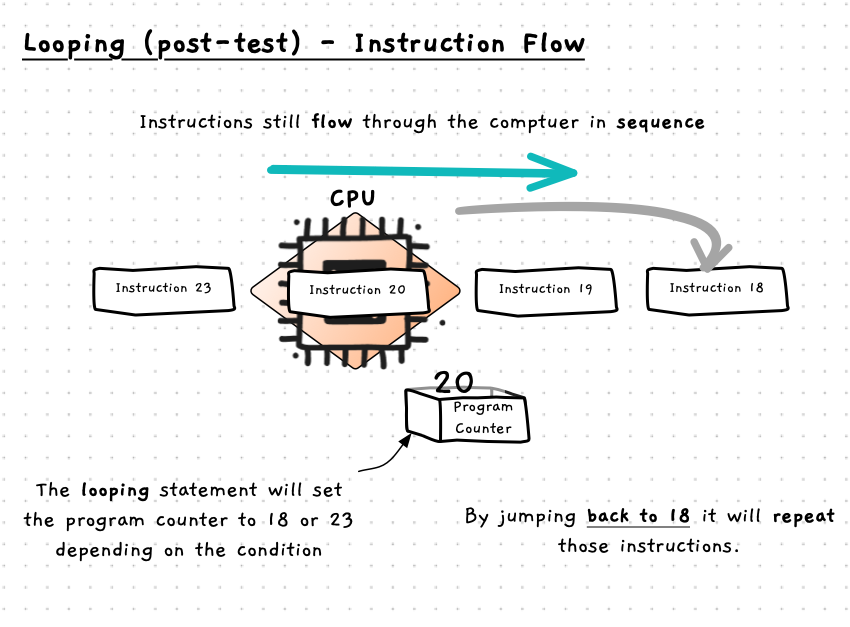
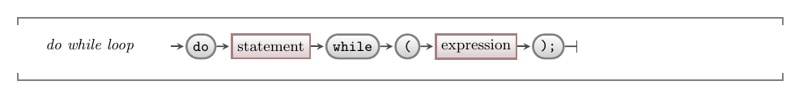

import MySwiper from '../../../../../../components/react/myswiper.jsx'

import doWhileLoopSlide01 from './images/control-flow-statements-in-depth/control-flow-do-while-loop/Slide1.png';
import doWhileLoopSlide02 from './images/control-flow-statements-in-depth/control-flow-do-while-loop/Slide2.png';
import doWhileLoopSlide03 from './images/control-flow-statements-in-depth/control-flow-do-while-loop/Slide3.png';
import doWhileLoopSlide04 from './images/control-flow-statements-in-depth/control-flow-do-while-loop/Slide4.png';
import doWhileLoopSlide05 from './images/control-flow-statements-in-depth/control-flow-do-while-loop/Slide5.png';
import doWhileLoopSlide06 from './images/control-flow-statements-in-depth/control-flow-do-while-loop/Slide6.png';
import doWhileLoopSlide07 from './images/control-flow-statements-in-depth/control-flow-do-while-loop/Slide7.png';
import doWhileLoopSlide08 from './images/control-flow-statements-in-depth/control-flow-do-while-loop/Slide8.png';
import doWhileLoopSlide09 from './images/control-flow-statements-in-depth/control-flow-do-while-loop/Slide9.png';

export const sliderImagesDoWhileLoop = [
  {
    src: doWhileLoopSlide01.src,
    altText: "Lines 1-3: The string variable 'again' is allocated space on the stack.",
    tipStart: 1,
    tips: [
      "Line 1 allocates space on the stack for the string variable 'again'.",
      "The program counter is increased to 2."
    ]
  },
  {
    src: doWhileLoopSlide02.src,
    altText: "Line 4 is the keyword 'do' which indicates the start of a do while loop",
    tipStart: 2,
    tips: [
      "Line 4 is the keyword 'do' which indicates the start of the do while loop.",
      "Note that there is no test condition associated with the 'do' keyword, so the program will proceed into the block below it, which will always run at least once.",
      "The counter increments to line 4."
    ]
  },
  {
    src: doWhileLoopSlide03.src,
    altText: "Lines 3-6 print 'Hello' and 'Again: ' to the terminal then read in user input (in this case 'y'), storing it in the 'again' variable on the stack",
    tipStart: 3,
    tips: [
      "Lines 3 - 6 print 'Hello' and 'Again: ' to the terminal, then read the user's (in this case 'y') stores it in the 'again' variable on the stack.",
      "The program counter increases to line 7."
    ]
  },
  {
    src: doWhileLoopSlide04.src,
    altText: "Line 9 tests the condition, which evaluates to true, and jumps back up to the start of the do-while block (lines 3,4)",
    tipStart: 4,
    tips: [
      "Line 9 encounters the closing right brace, which indicates the end of the loop's body.",
      "Next is the keyword 'while', and the condition of the loop.",
      "In this case, the condition evaluates to <span class='booleanTrue'>true</span>, so the program counter will jump back up to the start of the loop's body at line 3.",
      "Line 3 is just an opening brace, so the program counter increments to 4."
    ]
  },
  {
    src: doWhileLoopSlide05.src,
    altText: "Lines 6-8 reads user input, in this case 'y' and stores it in the variable 'again'",
    tipStart: 5,
    tips: [
      "Line 3 - 6 are executed again.",
      "In this case the user again inputs 'y', which is stored in the 'again' variable",
      "The program counter increases to line 7 once more."
    ]
  },
  {
    src: doWhileLoopSlide06.src,
    altText: "The condition is tested at the end of this iteration of the do-while block of code, and evaluates to true once more",
    tipStart: 6,
    tips: [
      "The condition at line 7 evaluates to <span class='booleanTrue'>true</span> again, and so the program jumps back up to the start of the loop's body once more."
    ]
  },
  {
    src: doWhileLoopSlide07.src,
    altText: "Line 3-6 are stepped through again, but this time the user inputs 'n'",
    tipStart: 7,
    tips: [
      "Line 3 - 6 are executed again",
      "This time the user inputs 'n'.",
      "The program counter increases to line 7 once more."
    ]
  },
  {
    src: doWhileLoopSlide08.src,
    altText: "With 'n' input, the test condition evaluates to false, signalling the end of the do-while loop",
    tipStart: 8,
    tips: [
      "With 'n' stored in 'again', condition evaluates to <span class='booleanFalse'>false</span>.",
      "As the condition is false, the loop ends.",
      "The program counter steps to line 8."
    ]
  },
  {
    src: doWhileLoopSlide09.src,
    altText: "Line 8 runs, printing 'Bye...' to the terminal and the program ends",
    tipStart: 9,
    tips: [
      "Line 8 runs, printing 'Bye...' to the terminal.",
      "The program counter increments, and the program ends."
    ]
  }
];

The do while loop is a post-test loop, meaning it starts with a statement to be repeated, then a condition.
As the condition is after the body of the loop, the code inside the loop will be repeated one or more times depending on the value of the condition.
This is visualised in the diagram below.
These loops are rarely used but are useful to know about.


{/* TODO: fix image with dot paper background */}

## Do While -- when, why, and how

In most cases you will use a [pre-test loop](../04-1-while-loop). The do while is provided for situations where it really makes more sense to check the condition after the loop. You can usually achieve the same thing with a regular while loop with a carefully designed condition, but sometimes a do while loop is still a better choice.

Do while will perform the following actions:

1. Execute the body of the loop.
2. Evaluate the condition. If the condition is true, jump back to the start of the loop. If the condition false, continue with the code after the loop.

Notice that this ordering of actions means a do while loop will always run the body of the loop once.

As with the [pre-test loop](../04-1-while-loop), the do while loop controls the flow of instructions to the CPU.
The only different between the two is the location of the condition.
So, with the do while loop, a repetition of the loop's body means "rewinding" through the sequence back to the start of the loop, as shown in the image below.



## In C#

:::tip[Syntax]
The following diagram shows the C# syntax for a do while loop.


:::

This loop starts with the keyword `do`, followed by a statement to be repeated.
As with the [while](../04-1-while-loop#in-c) loop, this will almost always be a [compound statement](../02-0-compound-statement).
Following the statement there is the keyword `while`, followed by a condition in parentheses.

## How does do while work?

The following code demonstrates the use of a do while loop to repeat some code. The body of the loop will run once, and at the end check if `again` is "y" or "Y". When it is, the computer will move back to the start of the statement after the `do` keyword, repeating that code, and checking the condition again. This will repeat until the condition is false (i.e., the user enters "y" or "Y").

```csharp
using static System.Console;

string again;

do
{
    WriteLine("Hello");

    Write("Again: ");
    again = ReadLine();
} while (again == "y" || again == "Y");
```

Use the following images to see how this works.

<MySwiper client:only height="" images={sliderImagesDoWhileLoop}></MySwiper>

Notice how `do` marks the start of the statements to repeat, and `while` evaluates the condition and jumps back as needed. As with the while loop, the do while loop's condition is only checked when the computer is at that location in the code. This means we can still think about the do while loop as part of a sequence -- although it can cause some code to be repeated, overall it still has just one entry and exit point.
