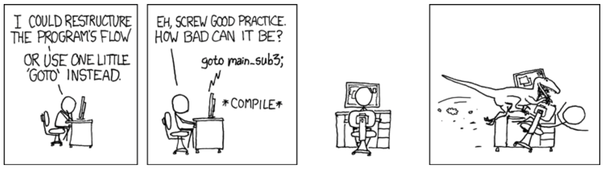

## Concept

The jump statements allow you to alter the sequence of instructions in the code, getting the computer to jump to another instruction.

Figure x.y: Jump Statements cause control to jump to another location in the code
 

:::note

- The jump statements are **actions**, they allow you to alter the standard sequence of the instructions and have the computer jump to another location in the instructions.
- **Structured Programming** was proposed as a means of providing order and structure to the control flow through the code. These jump statements complicate this sequential flow, but in some cases they are able to simplify code.
- Structured jump statements allow you to control the sequence of actions related to a [Looping](../03-looping) statement, a [Function](#), or a [Method](../../../1-sequence-and-data/1-concepts/02-method). These work the looping and procedural structures used in structured programming
- Unstructured jump statements allow you to jump to any instruction within the code. You need to be aware that these statements exist, but they should not be used.
 

:::

## Break
The break statement is used to jump out of the current loop, in effect terminating the loop early. This is useful for ending the current loop, skipping all future cycles.

Figure x.y: The Break Statement allows you to end a loop early
 

:::note

- The break statement is an **action**, allowing you to jump to the end of the current loop. 
- The break statement should be coded within an [Branching](../02-branching) statement that checks if the loop should terminate early.

:::

## Continue

The continue statement is used to jump to the condition of the current loop. This is useful for skipping the processing of the current loop, but to allow the loop to continue for the next cycle.

Figure x.y: The continue Statement allows you to jump to the condition, skipping the remainder of the code in the loop but allowing the loop to continue
 

:::note

- The continue statement is an **action**, allowing you to jump to the condition of the current loop. 
- The continue statement should be coded within a [Branching](../02-branching) statement that checks if the loop should skip processing of the current cycle.
 

:::

## Exit

The exit statement, or the return in C, ends the current [Function](#) or [Method](../../../1-sequence-and-data/1-concepts/02-method). This is useful for skipping the rest of the processing of the Function or Procedure, exiting it early and returning to the calling code.

Figure x.y: Exit ends the current Function or Procedure
 

:::note

- Exit is an **action**, allowing you to jump out of the current [Function](#) or [Method](../../../1-sequence-and-data/1-concepts/02-method), and return to the calling code.
- The Exit should be coded within a [Branching](../02-branching) statement that checks if the Function or Method should end.

:::

:::note[C#]

C’s version of the exit statement is the [Return Statement](#). The return statement also provides the value that will be returned when exiting from a Function. As this sets the value ♢ to be returned you must have a return statement as the last action within a Function.

:::

## Goto

The last jump statement is the goto statement. This is an unstructured jump, allowing you to jump anywhere in the code. Structured Programming principles called for the abolition of the goto statement. This is a statement you need to be aware of, but not one that should be used.

Figure x.y: The dangers of using goto, from <a href="http://xkcd.com/292" target="_blank">http://xkcd.com/292</a>
 

:::note

- Goto is an **action** that allows you to jump to another instruction and continue from there.
- You need to be aware of the goto statement, but you should not use it

:::