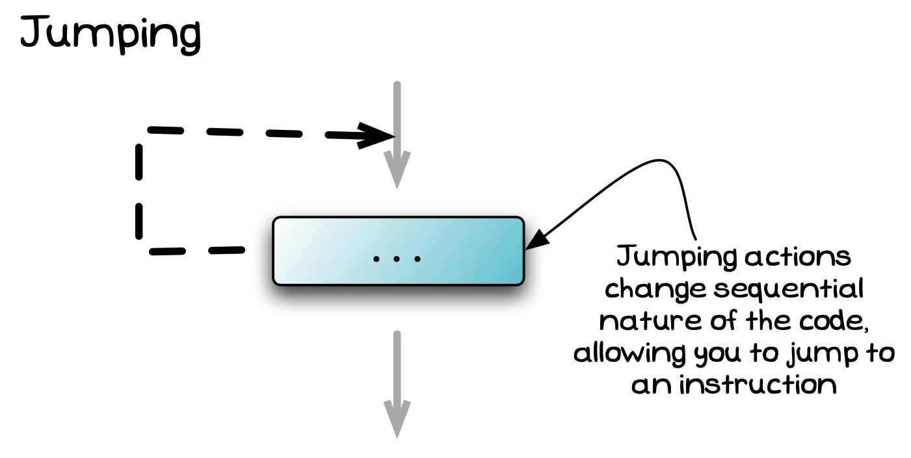

The jump statements allow you to alter the sequence of instructions in the code, getting the computer to jump to another instruction.
You have already seen jumping in action in [branching](../03-0-branching) and [looping](../04-0-looping), but many programming languages also provide explicit jumping instructions, visualised in the image below.

<!-- TODO: add paper dot background to image -->

There are two kinds of jumping statements: **structured** and **unstructured**.

**Structured** jumping statements like [break](../05-1-break) and [continue](../05-2-continue) only allow you to jump to specific points in your code.
When you use these, take care that you do not complicate the overall sequence of your code unnecessarily.
**Unstructured** jumping statements like [goto](../05-3-goto) allow you to jump to any instruction within the code.
You need to be aware that these statements exist, but they should not be used.

We'll explore each of these jumping statements in detail now.
