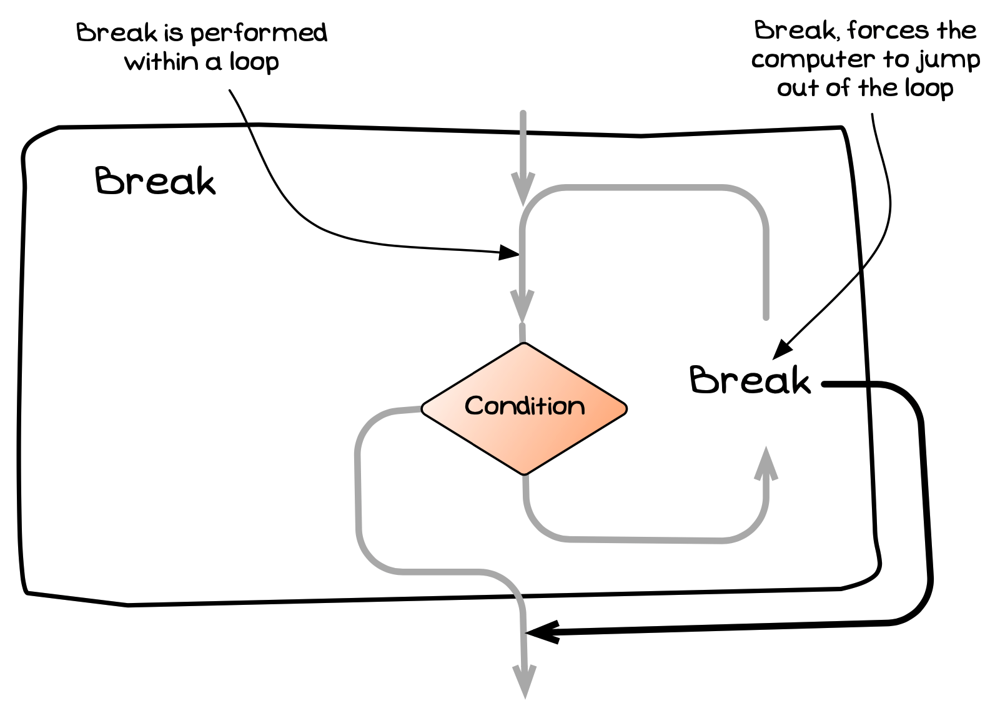

import { YouTube } from 'astro-embed';

import MySwiper from '../../../../../../components/react/myswiper.jsx'

import breakStatementSlide01 from './images/control-flow-statements-in-depth/control-flow-break/Slide1.png';
import breakStatementSlide02 from './images/control-flow-statements-in-depth/control-flow-break/Slide2.png';
import breakStatementSlide03 from './images/control-flow-statements-in-depth/control-flow-break/Slide3.png';
import breakStatementSlide04 from './images/control-flow-statements-in-depth/control-flow-break/Slide4.png';
import breakStatementSlide05 from './images/control-flow-statements-in-depth/control-flow-break/Slide5.png';
import breakStatementSlide06 from './images/control-flow-statements-in-depth/control-flow-break/Slide6.png';
import breakStatementSlide07 from './images/control-flow-statements-in-depth/control-flow-break/Slide7.png';
import breakStatementSlide08 from './images/control-flow-statements-in-depth/control-flow-break/Slide8.png';
import breakStatementSlide09 from './images/control-flow-statements-in-depth/control-flow-break/Slide9.png';

export const sliderImagesBreakStatement = [
  {
    src: breakStatementSlide01.src,
    altText: "Lines 1-3 use the SplashKit SDK to create a new window",
    tipStart: 1,
    tips: [
      "Lines 1 - 3 use SplashKit to create a new window with dimensions 400x400px, and set its background color to white.",
      "The program counter is increased to line 4."
    ]
  },
  {
    src: breakStatementSlide02.src,
    altText: "The while loop condition is tested (let's assume it's true) so processing proceeds into the body of the loop",
    tipStart: 2,
    tips: [
      "The while loop begins by testing the condition between the parentheses.",
      "The condition SplashKit to check if the user asked for the program to quit.",
      "Let's assume the user has not intervened, and so this evaluates to <span class='booleanTrue'>true</span>.",
      "The program counter increments through lines 5, 6, 7, and 8 to execute the body of the loop."
    ]
  },
  {
    src: breakStatementSlide03.src,
    altText: "Lines 6-8 draws a circle with a random color, position and radius in the window, then listens for events",
    tipStart: 3,
    tips: [
      "Line 6 draws a circle with a random color, position, and radius to the window.",
      "Line 7 refreshes the screen to show the new circle.",
      "Line 8 uses SplashKit to listen for user events.",
      "The program counter increments to line 9."
    ]
  },
  {
    src: breakStatementSlide04.src,
    altText: "Let's assume the user hasn't pressed the 'Escape' key, and so the 'if' condition is false. Processing moves back to the start of the while loop.",
    tipStart: 4,
    tips: [
      "At line 9 the if statement condition is checked.",
      "Let's assume the user hasn't pressed the 'escape' key this time around, so the condition evaluates to <span class='booleanFalse'>false</span>.",
      "The counter increments to the end of the if statement (line 12), then jumps back up to the start of the while loop (line 4)."
    ]
  },
  {
    src: breakStatementSlide05.src,
    altText: "The while loop condition is tested (let's assume it's true) so processing proceeds into the body of the loop",
    tipStart: 5,
    tips: [
      "The while loop condition is tested once more.",
      "Again let's assume that the user hasn't asked for the program to quit.",
      "The program counter increments through lines 5, 6, 7, and 8 to execute the body of the loop again."
    ]
  },
  {
    src: breakStatementSlide06.src,
    altText: "Lines 6-8 draw another random circle to the window, and listen for user events",
    tipStart: 6,
    tips: [
      "Lines 6 - 8 draw another random circle to the window, and listen for user events.",
      "The program counter increments to line 9."
    ]
  },
  {
    src: breakStatementSlide07.src,
    altText: "This time the user presses the 'Escape' key and execution moves.",
    tipStart: 7,
    tips: [
      "The if statement condition is checked once more.",
      "This time let's assume the user has pressed the 'escape' key, and so the condition evaluates to <span class='booleanTrue'>true</span>.",
      "The counter increments to line 10, then line 11."
    ]
  },
  {
    src: breakStatementSlide08.src,
    altText: "The break statement instructs the CPU to terminate the while loop by jumping to the first line of code outside of the while loop. The counter increments from lines 11 to 14.",
    tipStart: 8,
    tips: [
      "The body of the 'if' statement is executed, which in this case contains a single <code>break</code> statement.",
      "The <code>break</code> statement instructs the CPU to terminate the while loop by <strong>jumping</strong> to the first line of code after it.",
      "The counter increments from line 11 to 14."
    ]
  },
  {
    src: breakStatementSlide09.src,
    altText: "The WriteLine() function executes and prints 'Bye' to the terminal. The program counter increments and the program ends",
    tipStart: 9,
    tips: [
      "The WriteLine method executes, printing 'Bye' to the terminal.",
      "The program counter increments and the program ends."
    ]
  }
];

import infiniteLoopSlide01 from './images/control-flow-statements-in-depth/control-flow-infinite-loop/Slide1.png';
import infiniteLoopSlide02 from './images/control-flow-statements-in-depth/control-flow-infinite-loop/Slide2.png';
import infiniteLoopSlide03 from './images/control-flow-statements-in-depth/control-flow-infinite-loop/Slide3.png';
import infiniteLoopSlide04 from './images/control-flow-statements-in-depth/control-flow-infinite-loop/Slide4.png';
import infiniteLoopSlide05 from './images/control-flow-statements-in-depth/control-flow-infinite-loop/Slide5.png';
import infiniteLoopSlide06 from './images/control-flow-statements-in-depth/control-flow-infinite-loop/Slide6.png';
import infiniteLoopSlide07 from './images/control-flow-statements-in-depth/control-flow-infinite-loop/Slide7.png';
import infiniteLoopSlide08 from './images/control-flow-statements-in-depth/control-flow-infinite-loop/Slide8.png';
import infiniteLoopSlide09 from './images/control-flow-statements-in-depth/control-flow-infinite-loop/Slide9.png';

export const sliderImagesInfiniteLoop = [
  {
    src: infiniteLoopSlide01.src,
    altText: "Lines 1-6 print some text to the terminal",
    tipStart: 1,
    tips: [
      "Lines 1 - 6 print some introductory text to the terminal.",
      "The program counter is increased to line 7."
    ]
  },
  {
    src: infiniteLoopSlide02.src,
    altText: "The condition in the while loop always evaluates to true and moves the program counter into the body of the loop",
    tipStart: 2,
    tips: [
      "The while loop on line 7 contains the boolean <span class='booleanTrue'>true</span> as the condition, meaning it will always proceed into the body of the loop.",
      "The program counter moves through lines 8, 9, and 10."
    ]
  },
  {
    src: infiniteLoopSlide03.src,
    altText: "Lines 9 and 10 write a text prompt to the terminal",
    tipStart: 3,
    tips: [
      "Lines 9 and 10 write a text prompt to the terminal.",
      "The program counter moves to line 11."
    ]
  },
  {
    src: infiniteLoopSlide04.src,
    altText: "The condition in the 'if' statement reads in user input ('n'), and compares it to the literal string 'y'. It evaluates to 'false' and moves to the next iteration of the while loop.",
    tipStart: 4,
    tips: [
      "The condition in the 'if' statement reads in user input and compares it to the literal string 'y'.",
      "Let's say the user enters 'n', so the condition evaluates to <span class='booleanFalse'>false</span>.",
      "The program counter jumps to the end of the if statement (line 14), then back up to the start of the while loop (line 7)."
    ]
  },
  {
    src: infiniteLoopSlide05.src,
    altText: "The condition in the while loop always evaluates to true and moves the program counter into the body of the loop",
    tipStart: 5,
    tips: [
      "The condition of the while statement evaluates <span class='booleanTrue'>true</span> again.",
      "The program counter moves through lines 8, 9, and 10."
    ]
  },
  {
    src: infiniteLoopSlide06.src,
    altText: "Lines 9 and 10 write further text prompts to the terminal",
    tipStart: 6,
    tips: [
      "Lines 9 and 10 write a text prompt to the terminal.",
      "The program counter moves to line 11."
    ]
  },
  {
    src: infiniteLoopSlide07.src,
    altText: "The condition in the 'if' statement reads in user input ('y'), which in this case evaluates to true, so the program counter moves to the first line in the body of the 'if' statement",
    tipStart: 7,
    tips: [
      "The condition in the 'if' statement reads in user input and compares it to the literal string 'y'.",
      "This time, let's say the user enters 'y', so the condition evaluates to <span class='booleanFalse'>true</span>.",
      "The program counter moves to line 12, then line 13."
    ]
  },
  {
    src: infiniteLoopSlide08.src,
    altText: "The break statement instructs the CPU to terminate the while loop by jumping to the first line of code outside of the while loop",
    tipStart: 8,
    tips: [
      "Line 13 contains a single <code>break</code> statement.",
      "The <code>break</code> statement instructs the CPU to terminate the while loop by <strong>jumping</strong> to the first line of code after it.",
      "The program counter jumps to line 16."
    ]
  },
  {
    src: infiniteLoopSlide09.src,
    altText: "Line 16 writes some text to the terminal. The program counter increments, and the program ends.",
    tipStart: 9,
    tips: [
      "Line 16 writes some text to the terminal.",
      "The program counter increments and the program ends."
    ]
  }
];

The break statement is used to jump **out** of the current loop. As shown in the visualisation below, this is useful for ending a loop early.


{/* TODO: add paper dot background to image */}

## Break -- when, why, and how?

Sometimes you get part-way through a loop and know that the remainder of the loop's code is not needed, and there is no need to check the loop's condition again. If you can capture that in a condition, then combining a [branching statement](../03-0-branching) with a `break` will let you jump out of the loop.

This isn't something you will use often, but is good to know exists.

## In C#

:::tip[Syntax]
The C# syntax for a break statement is shown in the following diagram.


:::

The break statement is simply the `break` keyword terminated with a semicolon.

## How break works

### Ending a loop early

The following code demonstrates the use of the break statement in an event driven program. Here the `if` statement checks whether the user has hit the escape key on their keyboard, and it breaks the event loop when that is true.

```csharp
using static SplashKitSDK.SplashKit;

OpenWindow("Circle Test", 400, 400);
ClearScreen(ColorWhite());

while (!QuitRequested())
{
    FillCircle(RandomColor(), Rnd(ScreenWidth()), Rnd(ScreenHeight()), Rnd(50));
    RefreshScreen();

    ProcessEvents();

    if (KeyTyped(KeyCode.EscapeKey))
    {
        break;  // end the loop
    }
}
```

The following images show how this works.

<MySwiper client:only height="" images={sliderImagesBreakStatement}></MySwiper>

### Leaving intentionally infinite loops

You can create intentionally infinite loops, and use `break` statements within the code to terminate the loop. The following program uses an infinite loop, with a break in an `if` statement to terminate the loop.

```csharp
using static System.Console;
using static System.Convert;

WriteLine("Before you stands a 12 foot tall Knight...");
WriteLine();
WriteLine("\"We are the Knights who say 'Ni'.\"");
WriteLine("\"I will say Ni to you again if you do not appease us!\"");

while(true)
{
    WriteLine("\"Ni!\"");

    Write("Submit? ");
    
    if (ReadLine() == "y")
    {
        break;
    }

}

WriteLine("\"Bring us a Shrubbery!\"");
```

:::caution[Use your power wisely]
Just because you *can* do something in code doesn't mean it's a *good* way of doing it.
Try to avoid writing intentionally infinite loops.
In some cases doing so can make your code simpler, but usually there's a way of restructuring your logic to use a condition instead.
:::

The following images show how this works.

<MySwiper client:only height="" images={sliderImagesInfiniteLoop}></MySwiper>

This example was inspired by the classic Monty Python sketch below. This comedy group was the inspiration behind the name for the Python programming language.

<div class="not-content">
  <YouTube id="zIV4poUZAQo" params="fs=1&start=104&modestbranding=1&rel=0&autoplay=1"/>
</div>

:::note[Summary]

- The break statement is an **instruction** allowing you to jump to the end of the current loop.
- The break statement is typically coded within a [branching](../03-0-branching) statement that checks if the loop should terminate early.

:::
