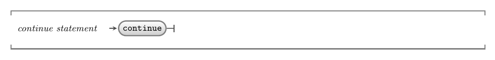

import MySwiper from '../../../../../../components/react/myswiper.jsx'

import continueStatementSlide01 from './images/control-flow-statements-in-depth/control-flow-continue/Slide1.png';
import continueStatementSlide02 from './images/control-flow-statements-in-depth/control-flow-continue/Slide2.png';
import continueStatementSlide03 from './images/control-flow-statements-in-depth/control-flow-continue/Slide3.png';
import continueStatementSlide04 from './images/control-flow-statements-in-depth/control-flow-continue/Slide4.png';
import continueStatementSlide05 from './images/control-flow-statements-in-depth/control-flow-continue/Slide5.png';
import continueStatementSlide06 from './images/control-flow-statements-in-depth/control-flow-continue/Slide6.png';
import continueStatementSlide07 from './images/control-flow-statements-in-depth/control-flow-continue/Slide7.png';
import continueStatementSlide08 from './images/control-flow-statements-in-depth/control-flow-continue/Slide8.png';
import continueStatementSlide09 from './images/control-flow-statements-in-depth/control-flow-continue/Slide9.png';
import continueStatementSlide10 from './images/control-flow-statements-in-depth/control-flow-continue/Slide10.png';
import continueStatementSlide11 from './images/control-flow-statements-in-depth/control-flow-continue/Slide11.png';
import continueStatementSlide12 from './images/control-flow-statements-in-depth/control-flow-continue/Slide12.png';
import continueStatementSlide13 from './images/control-flow-statements-in-depth/control-flow-continue/Slide13.png';
import continueStatementSlide14 from './images/control-flow-statements-in-depth/control-flow-continue/Slide14.png';
import continueStatementSlide15 from './images/control-flow-statements-in-depth/control-flow-continue/Slide15.png';
import continueStatementSlide16 from './images/control-flow-statements-in-depth/control-flow-continue/Slide16.png';

export const sliderImagesContinueStatement = [
  {
    src: continueStatementSlide01.src,
    altText: "Line 1 begins the for loop which initializes the variable 'i' to 0 (step 1a), then tests the condition (which evaluates to true). Control moves to line 3.",
    tipStart: 1,
    tips: [
      "Line 1 begins the for loop.",
      "The variable 'i' is initialized to 0 (step 1a), then the condition is checked (step 1b).",
      "Since 0 is less than 11, the condition evaluates to <span class='booleanTrue'>true</span>, and control moves into the body of the loop.",
      "The program counter is incremented to line 2, then 3."
    ]
  },
  {
    src: continueStatementSlide02.src,
    altText: "The first condition in the 'if' statement evaluates to false, and the program counter jumps to line 7 without executing the body of the 'if' statement",
    tipStart: 2,
    tips: [
      "The if statement on line 3 has two component conditions:<ul><li>The first evaluates to <span class='booleanFalse'>false</span> since 0 is not greater than 0.</li><li>The second does not need to be checked as false <code>and</code> anything else evaluates to false.</li><li>So, the entire condition evaluates to <span class='booleanFalse'>false</span>.</li></ul>",
      "The program counter skips the if statement and jumps to line 7."
    ]
  },
  {
    src: continueStatementSlide03.src,
    altText: "Line 7 prints the value of the variable 'i' to the terminal (0) then moves back to the for loop at line 1",
    tipStart: 3,
    tips: [
      "Line 7 prints the value of the variable 'i' to the terminal.",
      "The program counter increments to line 8, the end of the loop, then jumps back to the for loop at line 1."
    ]
  },
  {
    src: continueStatementSlide04.src,
    altText: "Step 1c increments the variable i from 0 to 1, then step 1b tests the for loop condition which evaluates to true since 1 is less than 11",
    tipStart: 4,
    tips: [
      "Step 1c increments the value of 'i' to 1.",
      "Control then moves to step 1b to evaluate the for loop condition.",
      "At step 1b, since 1 is less than 11 the condition evaluates to <span class='booleanTrue'>true</span> and control moves back into the body of the loop.",
      "The program counter is incremented to line 2, then 3."
    ]
  },
  {
    src: continueStatementSlide05.src,
    altText: "The first condition in the 'if' statement evaluates to true but the second condition to false, so the entire condition is false. The program counter jumps to line 7 without executing the body of the 'if' statement",
    tipStart: 5,
    tips: [
      "Again, the if statement has two parts to evaluate:<ul><li>The first part evaluates to <span class='booleanTrue'>true</span> since 1 is greater than 0.</li><li>The second evaluates to <span class='booleanFalse'>false</span>, as <code>1%3</code> is 1.</li><li>As <code>true and false</code> is false, the whole condition evaluates to <span class='booleanFalse'>false</span>.</li></ul>",
      "The program counter skips the body of the 'if' and moves to line 7."
    ]
  },
  {
    src: continueStatementSlide06.src,
    altText: "Line 7 prints the value of the variable 'i' to the terminal (1) then moves back to step 1c of the for loop at line 1",
    tipStart: 6,
    tips: [
      "Line 7 prints the value of the variable 'i' to the terminal.",
      "The program counter increments to line 8, the end of the loop, then jumps back to the for loop at line 1."
    ]
  },
  {
    src: continueStatementSlide07.src,
    altText: "Step 1c increments the variable i from 1 to 2, then step 1b tests the for loop condition which evaluates to true since 2 is less than 11",
    tipStart: 7,
    tips: [
      "Step 1c increments the value of 'i' to 2.",
      "At step 1b, since 2 is less than 11 the condition evaluates to <span class='booleanTrue'>true</span>, and control moves back into the body of the loop.",
      "The program counter is incremented to line 2, then 3."
    ]
  },
  {
    src: continueStatementSlide08.src,
    altText: "The condition in the 'if' statement evaluates to false since 2%3 equals 2. The program counter jumps to line 7 without executing the body of the 'if' statement",
    tipStart: 8,
    tips: [
      "The condition in the 'if' statement evaluates to <span class='booleanFalse'>false</span> since 2%3 is 2.",
      "The program counter skips the body of the 'if' and moves to line 7."
    ]
  },
  {
    src: continueStatementSlide09.src,
    altText: "Line 7 prints the value of the variable 'i' to the terminal (2) then moves back to the for loop at line 1",
    tipStart: 9,
    tips: [
      "Line 7 prints the value of the variable 'i' to the terminal.",
      "The program counter increments to line 8, the end of the loop, then jumps back to the for loop at line 1."
    ]
  },
  {
    src: continueStatementSlide10.src,
    altText: "Step 1c increments the variable i from 2 to 3, then step 1b tests the for loop condition which evaluates to true since 2 is less than 11",
    tipStart: 10,
    tips: [
      "Step 1c increments the value of the variable 'i' to 3",
      "At step 1b, since 3 is less than 11 the condition evaluates to <span class='booleanTrue'>true</span> and control moves back into the body of the loop.",
      "The program counter is incremented to line 2, then 3."
    ]
  },
  {
    src: continueStatementSlide11.src,
    altText: "This time the condition in the 'if' statement evaluates to true since i(3) is greater than zero and 3%3 equals 0",
    tipStart: 11,
    tips: [
      "This time the condition in the 'if' statement evaluates to <span class='booleanTrue'>true</span> since 'i' is greater than zero <strong>and</strong> 3%3 equals 0.",
      "The program counter moves into the body of the 'if' on line 4, then to line 5."
    ]
  },
  {
    src: continueStatementSlide12.src,
    altText: "The continue statement instructs the CPU to >skip any remaining code in this iteration of the for loop by jumping to the next iteration of the loop at line 1",
    tipStart: 12,
    tips: [
      "Line 5 contains a single <code>continue</code> statement.",
      "The <code>continue</code> statement instructs the CPU to skip any remaining code in this iteration of the for loop by <strong>jumping to the next iteration of the loop</strong>.",
      "The program counter moves from line 5 back to line 1."
    ]
  },
  {
    src: continueStatementSlide13.src,
    altText: "Step 1c increments the variable i from 3 to 4, then step 1b tests the for loop condition which evaluates to true since 4 is less than 11",
    tipStart: 13,
    tips: [
      "Step 1c increments the value of 'i' to 4.",
      "At step 1b, since 4 is less than 11, the condition evaluates to <span class='booleanTrue'>true</span> and control moves back into the body of the loop.",
      "The program counter moves to line 2, then 3."
    ]
  },
  {
    src: continueStatementSlide14.src,
    altText: "The condition in the 'if' statement evaluates to false since 4%3 equals 1. The program counter jumps to line 7 without executing the body of the 'if' statement",
    tipStart: 14,
    tips: [
      "The condition in the 'if' statement evaluates to <span class='booleanFalse'>false</span>, since 4%3 equals 1.",
      "The program counter skips the body of the 'if' and moves to line 7."
    ]
  },
  {
    src: continueStatementSlide15.src,
    altText: "Line 7 prints the value of the variable 'i' to the terminal (4) then moves back to the for loop at line 1",
    tipStart: 15,
    tips: [
      "Line 7 prints the value of the variable 'i' to the terminal.",
      "The program counter increments to line 8, the end of the loop, then jumps back to the for loop at line 1."
    ]
  },
  {
    src: continueStatementSlide16.src,
    altText: "Let's jump ahead - the loop continues in the same manner printing the numbers 0,1,2,4,5,7,8,10. Now when the variable 'i' is incremented from 10 to 11, the condition at step 1c evaluates to false, and the for loop ends.",
    tipStart: 16,
    tips: [
      "The loop continues in the same manner printing the numbers 0,1,2,4,5,7,8,10.",
      "Note how it has skipped printing 3, 6 and 9, since these are both greater than 0 and perfectly divisible by 3.",
      "Let's jump ahead to the post-loop increment (step 1c) where 'i' is incremented to 11.",
      "This time at step 1b the condition evaluates to <span class='booleanFalse'>false</span>, since 11 is <strong>NOT less than</strong> 11.",
      "The program counter moves to the end of the for loop at line 8, and the program ends."
    ]
  }
];

The continue statement is used to jump back to the condition of the current loop. This can be very useful for skipping the processing of the current loop, while allowing the loop to continue for another cycle. See a visualisation of this in the image below.


{/* TODO: add paper dot background to image */}

## Continue -- when, why, and how?

Like [break](./.05-1-break), the continue statement isn't something you use often. Most of the time you will want to execute the entire body of a loop. However, when needed you can use `continue` skip an iteration. This is typically done by using continue within a [branching statement](../03-0-branching).

When you use continue in a [for loop](../04-3-for-loop), the post-loop increment will still be executed to ensure that you move to the next value in the control variable. In a [while loop](../04-1-while-loop), you need to make sure you have updated the condition before the continue statement so that you do not end up in an infinite loop.

## In C#

:::tip[Syntax]
The C# syntax for a break statement is shown in the following diagram.


:::

The continue statement is simply the `continue` keyword terminated by a semicolon (`;`).

## How does continue work?

### Skipping iterations in a for loop

The following code loops from 0 to 10, skipping all loops where `i` is larger than 0 and divisible by 3. Therefore, this will print 0, 1, 2, 4, 5, 7, 8, and 10 (skipping 3, 6, and 9).

```csharp
using static System.Console;
using static System.Convert;

for (int i = 0; i < 11; i++)
{
    if( i > 0 && i % 3 == 0)
    {
        continue;
    }
    WriteLine(i);
}
```

The following images show how this works.

<MySwiper client:only height="" images={sliderImagesContinueStatement}></MySwiper>

### Skipping iterations in a while loop

The following example is functionally the same as the previous, just using a while loop instead of a for loop.
Note that this code also has an increment (`i++`) in the if statement.
This makes sure that even when continue is executed the loop counter is incremented so that our code does not have an infinite loop.
See if you can step through this code yourself and understand how it works the same way as the for loop above.

```csharp
using static System.Console;
using static System.Convert;

int i = 0;

while (i < 11)
{
    if ( i > 0 && i % 3 == 0 )
    {
        i++;
        continue;
    }

    WriteLine(i);
    i++
}
```

:::note[Summary]

- The continue statement is an **instruction** allowing you to jump to the condition of the current loop.
- The continue statement should be coded within a [branching](../03-0-branching) statement that checks if the loop should skip processing of the current cycle.

:::
