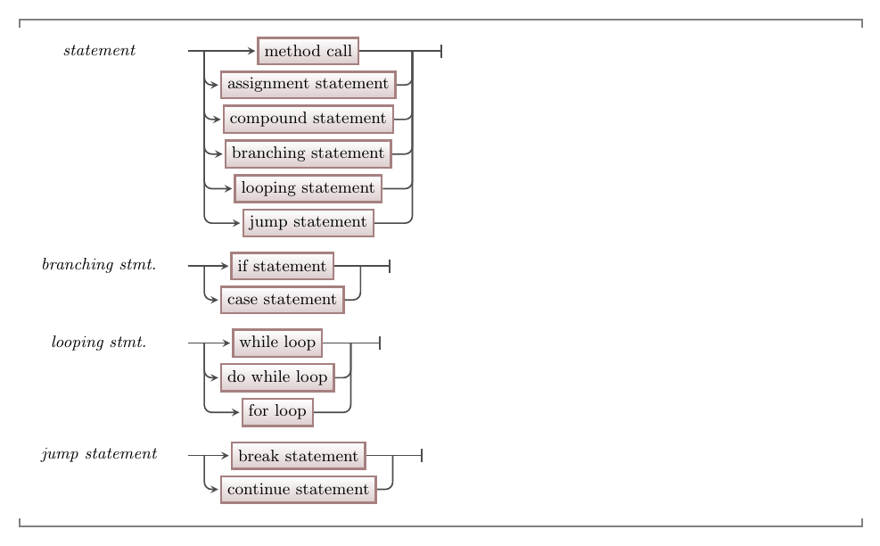

Statements are instructions that we can get the computer to perform. Now that we have added control flow statements to our tool kit we have a whole range of different things we can get the computer to do.

Hopefully these seem like very simple actions, and you may even be thinking "Surely programs are made of more complex things?". The answer is no! Individual instructions are very simple. Once you know how they work, you need to practice combining them in different ways to help achieve your goals.

:::tip
Remember. The computer is **unintelligent**, so none of the actions it performs can be complex. It achieves things by doing millions of tiny, insignificant, actions every second.
:::

## Statements -- when, why, and how?

We have already seen that a [program](../../../1-sequence-and-data/1-concepts/00-program) is just a list of statements, as is a [compound statement](../02-0-compound-statement).
[If](../03-1-if), [case](../03-2-case), [while](../04-1-while-loop), [do while](../04-2-do-while), and [for](../04-3-for-loop) loop statements also contain statements, which are only run under certain conditions.

The great thing to see now is that you can **combine** these in lots of different ways. An `if` statement can contain a `while` loop, that contains a `case` statement. Anywhere you can put a statement, you can now choose between any of these different statements to create a sequence of actions that get the computer to do what you want.

## In C#

:::tip[Syntax]
The following diagram shows the list of things we have seen so far that can exist as statements.

:::

:::note[Summary]

- A statement is a single instruction in code.
- **Simple Statements** that perform an action. The actions you can perform are:
  - [Method Call](../../../1-sequence-and-data/1-concepts/03-method-call): run the code in a method.
  - [Assignment Statement](../../../1-sequence-and-data/1-concepts/08-assignment-statement): store a value in a variable.
  - [Jump Statements](../05-0-jumping): alter which instruction will be performed next.
  This includes:
    - [Break](../05-1-break): jump out of a looping statement.
    - [Continue](../05-2-continue): jump to the condition in a looping statement.
    - [Goto](../05-3-goto): jump[1](#FootnoteRaptor) to an arbitrary location in the code.
- **Structured Statements** contain statements and control the flow of execution:
  - [Looping Statements](../04-0-looping): repeat a statement a number of times.
    - [While Loop](../04-1-while-loop): test condition **before** the body, repeating **0 to many** times.
    - [Do While Loop](../04-2-do-while): test condition **after** the body, repeating **1 to many** times.
    - [For Loop](../04-3-for-loop): a variation of the while designed to perform a counting loop.
  - [Branching](../03-0-branching): select from a number of optional statements.
    - [If Statement](../03-1-if): branch based on a boolean expression (2 paths).
    - [Case Statement](../03-2-case): branch based on the value of an expression (n paths).

1Often resulting in death by raptor

:::
