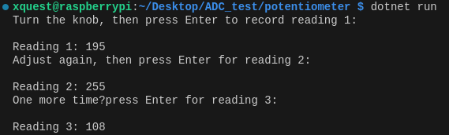

TODO: Update this to flow on from reading values - page will focus on reading Analog values.

import { Accordion, AccordionItem } from "accessible-astro-components";

# Overview

In this guide, we’ll explore how to use SplashKit’s new ADC functions to read a potentiometer on your Raspberry Pi. A potentiometer is a variable resistor whose wiper outputs a voltage you can adjust—perfect for dynamic inputs. With the ADS7830 ADC module, SplashKit can now convert that analog voltage into digital values. Let’s dive in!

# Hardware Setup

You’ll need:

- **Potentiometer** (3.3 V ↔ GND with wiper)  
- **ADS7830 ADC Module** (I²C)  
- **Breadboard & Jumper Wires**  
- **Raspberry Pi** (with I²C enabled)

### Wiring

1. **Potentiometer:**  
   - Outer legs → 3.3 V and GND  
   - Middle (wiper) → ADC input channel A0  
2. **ADS7830 Module:**  
   - Connect SDA, SCL, VCC (3.3 V) and GND to the Pi  
   - Connect wiper to A0 on ADS7830

---

# 1. Initialization

```csharp
using System;
using SplashKitSDK;
using static SplashKitSDK.SplashKit;


// Prepare GPIO and I²C
RaspiInit();

// Open the ADS7830 on I2C bus 1, address 0x48
AdcDevice adc = OpenAdc("ADC1", 1, 0x48, AdcType.Ads7830);
````

---

# 2. Reading the Potentiometer

We’ll take three readings—each after you adjust the knob and press Enter:

```csharp
// First reading
WriteLine("Turn the knob, then press Enter to record reading 1:");
ReadLine();
int reading1 = ReadAdc(adc, AdcPin.AdcPin0);
WriteLine($"Reading 1: {reading1}");

// Second reading
WriteLine("Adjust again, then press Enter for reading 2:");
ReadLine();
int reading2 = ReadAdc(adc, AdcPin.AdcPin0);
WriteLine($"Reading 2: {reading2}");

// Third reading
WriteLine("One more time—press Enter for reading 3:");
ReadLine();
int reading3 = ReadAdc(adc, AdcPin.AdcPin0);
WriteLine($"Reading 3: {reading3}");
```

---

# Full Code Example

<Accordion>
  <AccordionItem header="Full Code (C#)">

```csharp
using System;
using SplashKitSDK;
using static SplashKitSDK.SplashKit;


// Initialize GPIO & I�C

RaspiInit();
// Open ADC device on bus 1, address 0x48
AdcDevice adc = OpenAdc("ADC1", 1, 0x48, AdcType.Ads7830);
// Three separate readings
WriteLine("Turn the knob, then press Enter to record reading 1:");
ReadLine();

int r1 = ReadAdc(adc, AdcPin.AdcAdcPin0);
WriteLine($"Reading 1: {r1}");
WriteLine("Adjust again, then press Enter for reading 2:");
ReadLine();

int r2 = ReadAdc(adc, AdcPin.AdcAdcPin0);
WriteLine($"Reading 2: {r2}");
WriteLine("One more time, press Enter for reading 3:");
ReadLine();

int r3 = ReadAdc(adc, AdcPin.AdcAdcPin0);
WriteLine($"Reading 3: {r3}");

// Clean up
CloseAdc(adc);
RaspiCleanup();
```

  </AccordionItem>
</Accordion>

---

# Build and Run

1. **Create Project**

   ```bash
   mkdir ReadPotentiometer
   cd ReadPotentiometer
   dotnet new console
   dotnet add package SplashKit
   code .
   ```

2. **Paste the Code** into `Program.cs`.

3. **Build**

   ```bash
   dotnet build
   ```

4. **Run**

   ```bash
   dotnet run
   ```

---

# Expected Outcome

When you run the program, you’ll be prompted three times to adjust the potentiometer and press Enter. Each prompt will display the actual ADC reading from channel A0 (0–255). Enjoy exploring analog inputs with SplashKit’s new ADC support!


