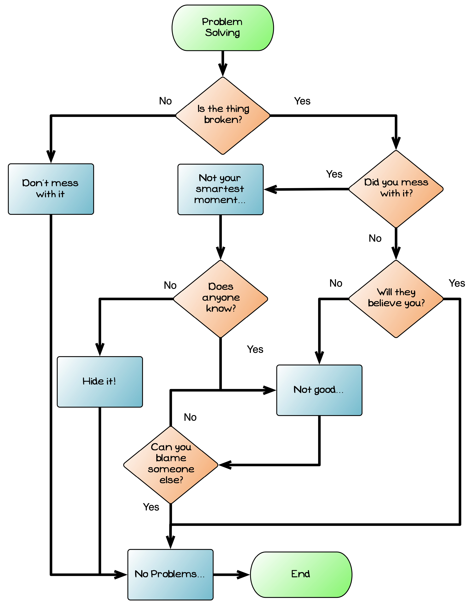
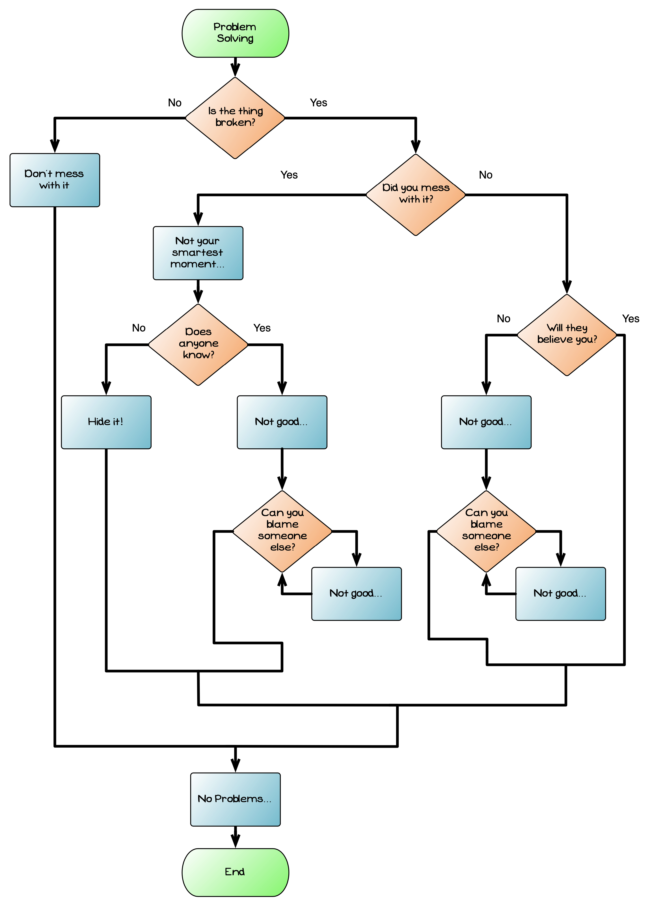
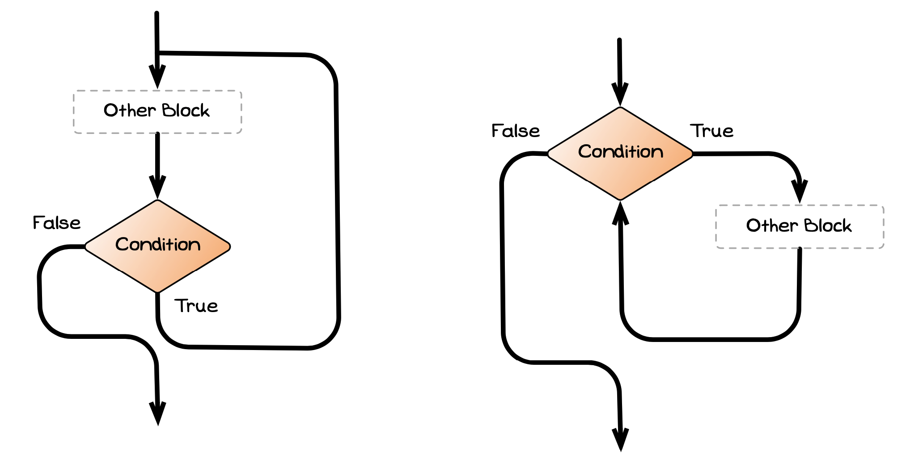

Before examining the use of control flow within the change calculator, let's have a look at a way of visually representing the flow of instructions within code. A common way of doing this is to use a **flowchart**. A flowchart is a diagram used to represent a sequence of actions, so it's perfect for representing a sequence of instructions (i.e., some code).

There are four basic flowchart symbols, shown in the figure below:

- **Start/Stop**: represents the start and end of the process. Typically, the start node has text to indicate the part of the code that is being visualised.
- **Flow**: point from one symbol to another to represent which action is to be performed next.
- **Process**: represents a task being performed. In our case this will be one or more simple statements (assignment statements or method calls). Each process can only have a single flow leaving it, as processes are performed in sequence, and should have text indicating what task is being performed.
- **Decision**: represents a point where the code needs to make a decision. This represents a location where we have a [branching](../../1-concepts/03-0-branching) or [looping](../../1-concepts/04-0-looping) statement. The text in the decision represents the condition that will determine which path is taken. A decision **must** have more than one flow coming out of it, and each flow should indicate the condition that triggers that path.

import guessThatNumberFlowChartSymbols from './images/guess-that-number-flowchart-symbols.png';

## Structured Programming and Flowcharts

Flowcharts can be used to represent *any* sequence of actions, but not all sequences of actions will be easy to code. For example, the image below is a flowchart that captures a joke about changing things. This flowchart is **not** one that can be coded using the structured statements covered in this chapter. The reason for this is that there are some steps that appear in multiple paths. This makies it impossible to code using the structured programming principles.

:::note
Taking responsibility for your actions is always the best policy, but that doesn't make as interesting a joke.
:::

The image below shows a **structured** version of the same flow chart. Notice that in this version there are identifiable blocks, each having a single entry and a single exit. This structure could easily be converted to code using structured statements.

The structured programming principles indicate that code within our programs should be organised into **blocks**.
These blocks match to the structured statements in modern programming languages: [branching](../../1-concepts/03-0-branching) and [looping](../../1-concepts/04-0-looping) statements.
Each block has a **single entry point** and a **single exit point**, allowing them to be combined in a way that is easy to follow in the code.
The addition of [jumping](../../1-concepts/05-0-jumping) statements to the language allows the blocks to have **multiple exit points**: one at the end of the block's code, another at a break or continue statement.
This provides extra flexibility, but still works within the general goals of the structured programming principles to help create readable code.

Hopefully you can see these principles as you compare the two flowcharts.
Although the structured version does involve more processes, it also made it possible to organise them processes so that each block has a single entry and exit.

:::note
Prior to structured programming, programs had two control flow mechanisms: `if` and `goto`. Control flow was not easy to picture or understand. Programs written in this way are now known as **spaghetti code**, as understanding this code is much like trying to untangle a bowl of spaghetti (though not nearly as tasty).
:::

## Designing blocks to achieve goals

In structured programming there are three kinds of blocks:

- **Sequence**: one instruction follows the next in a sequence.
- **Selection**: the ability to branch the sequence.
- **Repetition**: the ability to repeat a block a number of times.

Designing a program's logic is all about figuring out how to combine these blocks to achieve the desired behaviour from your code.

You have already seen flowcharts for two of the blocks -- the pages on [branching](../../1-concepts/03-0-branching) showed selection via the [if](../../1-concepts/03-1-if) and [case](../../1-concepts/03-2-case) statements, and the pages on [looping](../../1-concepts/04-0-looping) showed repetition via the [while](../../1-concepts/04-1-while-loop), [do while](../../1-concepts/04-2-do-while), and [for](../../1-concepts/04-3-for-loop) loop statements.

The flow chart snippet below shows what **sequence** looks like in a flowchart.

import seqblock from './images/guess-that-number-flows-sequence-blocks.png';

To recap, a flow chart showing **selection** will look like one of the following three blocks...

...and a flow chart showing **repetition** will look like one of these two blocks, depending on when the loop's condition is evaluated.

Now that we have a tool for visualising a program's instructions, let's apply it to our change calculator.
