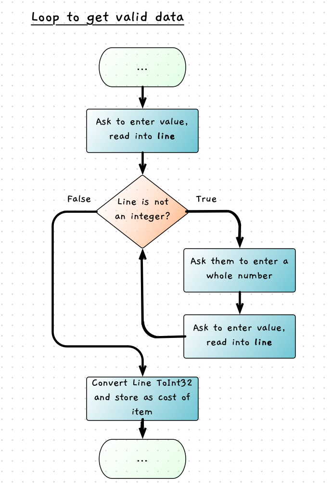

The next task on our list is to fix are a couple of validation issues. First we need to check that the user enters a whole number for the cost and payment, and then we need to add a check to see that the payment was sufficient.

## Values are Whole Numbers

When the user enters text other than a whole number for the cost or payment, then the program will crash (try it!). This is never a good thing, and we have to expect that users will make errors (intentionally or by mistake).

:::tip
Validations are an important part of every program. You have to anticipate the different ways that users will work with your programs.
:::

For this, let's look at the code we have at the moment. The code that we have looks like this:

```csharp
int costOfItem = ToInt32(ReadLine());
```

This reads a line of input, and sends it directly to `Convert`'s `ToInt32` method. If the data is not a number, `ToInt32` raises and error that causes our program to crash.

To work around this we need to add some extra steps. Rather than just sending the data straight to the convert method, we can first check if it is an integer, and if not we can ask the user to enter the value again.

This might sound like good spot for a branching statement, but think about it a little more. What if the user *still* enters something that is not a number? If we just ask them to try again just *once*, that may not be enough. In fact, we don't know how many times the user will need to be asked to enter a valid value. So this is not a branch, but another loop. We need to keep asking for a valid value *while* the user has not provided one.

The logic for this looks like this:



For this we are using a [while](../../1-concepts/04-1-while-loop) loop, as we have different messages based on valid and invalid data entry. The loop will need to test if the line entered by the user is **not** an integer, and repeat the code when that is true.

In order to do this, we will need to use the `IsInteger` method from SplashKit. The method that C# uses is a little more involved, so we will come back to that later. For now, the SplashKit method will meet our needs. As both SplashKit and Console provide ReadLine and WriteLine methods, we should switch the using statement in our program to use the `SwinGameSDK.SwinGame` library.

The pseudocode for this logic would be:

```txt
Write the prompt to the user
Store their response in line

While line is not an integer
    Output a message saying we need whole numbers
    Write the prompt to the user
    Store their response in line

Convert line to Int32 and store in costOfItem
```

Have a go at implementing this yourself now. Start with the cost of the item, and then update the payment as well. Test it out and try breaking this with different combinations of errors. Make sure it also works with valid integers.

:::tip
Remember to using the `using` directives at the top of your program so you have access to the `IsInteger` and `ToInt32` methods.

```csharp
// using static System.Console;
using static SwinGameSDK.SwinGame;
using static System.Convert;
```

:::

## Sufficient Funds

Another test we need is to check to see if sufficient funds have been provided. If the payment is less than the cost, then we can end this transaction as there is no need to provide change.

There are a few ways we could implement this.
Both will involve a branch where we can skip over the change calculations and output when there are insufficient funds.

Option 1 will use [if](../../1-concepts/03-1-if) and [else](../../1-concepts/03-1-if#if-with-else), where one branch gives change and the other outputs an error message. In both cases we should still be able to check if the user wants to run the program again, which we can do by nesting the if statement within the program's overall do while loop. The logic for this option is in the following flowchart.


<!-- TODO add colours to match other flowcharts -->

The pseudocode for this is as follows.

```plaintext
Constants:
    TWO_DOLLARS = 200;
    ONE_DOLLAR = 100;
    FIFTY_CENTS = 50;
    TWENTY_CENTS = 20;
    TEN_CENTS = 10;
    FIVE_CENTS = 5;

Variables:
    costOfItem - integer
    amountPaid - integer
    changeValue - integer
    toGive - integer
    again - string (initialise to "")

Steps:

    Do
        Get the details from the user.
        
        If Payment >= Cost Of Item
            Calculate the amount of change to provide 
            Give change
        Else
            Output an error message
        
        Ask the user if they want to run again
        Read string from user into again
    While (again != "N" and again != "n")
```

Option 2 is to test for the insufficient payment, and use the [continue](../../1-concepts/05-2-continue) statement within the branch to jump back to the start of the loop. However, this option will skip asking the user if they want to enter another payment, and also breaks the elegant structured programming approach of the first option. The following flowchart shows the logic for this option, with the pseudocode also provided below.


```plaintext
Constants:
    TWO_DOLLARS = 200;
    ONE_DOLLAR = 100;
    FIFTY_CENTS = 50;
    TWENTY_CENTS = 20;
    TEN_CENTS = 10;
    FIVE_CENTS = 5;

Variables:
    costOfItem - integer
    amountPaid - integer
    changeValue - integer
    toGive - integer
    again - string (initialise to "")

Steps:

  Do
      Get the details from the user.
      
      If Payment < Cost Of Item
          Output an error message
          Continue
      
      Calculate the amount of change to provide 
      Give change

      Ask the user if they want to run again
      Read string from user into again
  While (again != "N" and again != "n")
```

Have a go at implementing one of these two options. Both will work. Look at the examples and syntax related to the [if statement](../../1-concepts/03-1-if) and the [continue statement](../../1-concepts/05-2-continue) if you need to. Compile and test your program to make sure it works as expected. Try testing with the exact amount, and a little over and a little under. These are where errors are more likely to occur.

:::tip
Make sure to [indent](../../1-concepts/07-indentation) the code within the if statement to help make the structure of the code apparent. See how this is done in the pseudocode above as a guide. Indenting code within these statements helps make it clear which lines are within the loop or branch and which lines follow it.
:::

Remember at each step you want to make sure that you have the software working. When you encounter issues, make sure to address these before continuing. Work through them one at a time, starting with the first error and reading the error messages carefully. If you get stuck, you can check the [wrap up](../../5-wrapup/0-wrapup) for the code that we developed. Just remember that there are several ways that you can achieve the same thing, so you're not necessarily wrong if your code doesn't match ours exactly.

:::tip
Persistence and attention to detail are important attributes for IT professionals.
:::
