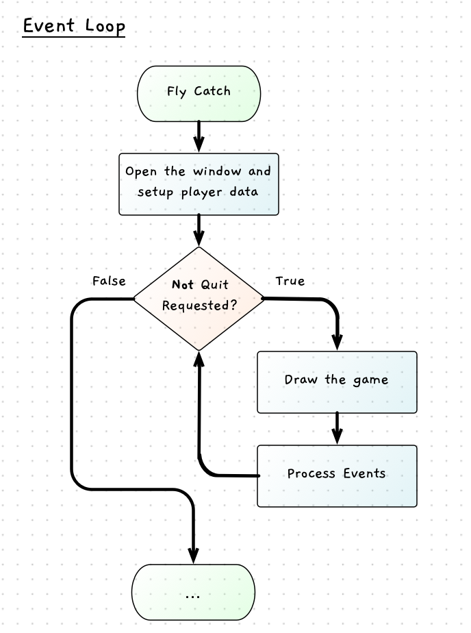

To get this started, we can set up some details for the spider and get it appearing on the screen. We can then add in the event loop which will give us the main control flow of the program.

## Basic Drawing

The spider needs a location, size, and shape.

- We can use a circle as the shape for now, and later replace this with an image.
- The location will need a distance from the left and top of the screen. To achieve this we can add two variables:
  1. `spiderX` to store the distance from the left of the screen. This can start at half the width of the screen.
  2. `spiderY` to store the distance from the top of the screen. This can start at half the height of the screen.
- The size will not change, so we can set it as a constant called `SPIDER_RADIUS`.

As we will need the screen width and height, we can code these in constants called `SCREEN_WIDTH` and `SCREEN_HEIGHT`. We can then use these when we open the window, and when we initialise the spider's location. These will also be useful later when we need to set the location of the fly.

:::tip[Circle Positions]
When we switch this to use an image, we will need to remember that the position of a circle is based on its center point whereas the position of an image will be its top left corner.

This will be easy to adjust, but something to keep in mind as you switch between shapes.
:::

We can capture this in pseudocode:

```txt
Constants:
    SCREEN_WIDTH = 800
    SCREEN_HEIGHT =  600
    SPIDER_RADIUS = 25

Variables:
    spiderX (an int) = SCREEN_WIDTH / 2
    spiderY (an int) = SCREEN_HEIGHT / 2

Steps:
    Open the window - use SCREEN_WIDTH and SCREEN_HEIGHT
  
    Draw the game
        Clear the screen to white
        Fill a black circle using spiderX, spiderY, and SPIDER_RADIUS
        Refresh the screen to show it to the user

    Delay 5000ms to let the user see
```

## Loop until quit

With the basic details drawn, we can now place this within an [event loop](../../1-concepts/04-1-while-loop/#keeping-graphical-programs-running). This will loop **while** the user has not asked to quit, with each loop clearing the screen, drawing the game, and processing any events the user has performed. This is captured in the following flowchart.



Notice how this will keep the program running. While nothing may be changing on the screen, the computer is looping over and over to check if the user has done anything. The logic is captured in the following pseudocode.

```txt
Constants:
    SCREEN_WIDTH = 800
    SCREEN_HEIGHT =  600
    SPIDER_RADIUS = 25

Variables:
    spiderX (an int) = SCREEN_WIDTH / 2
    spiderY (an int) = SCREEN_HEIGHT / 2

Steps:
    Open the window - use SCREEN_WIDTH and SCREEN_HEIGHT
    
    While not quit
        Draw the game
            Clear the screen white
            Fill a black circle using spiderX, spiderY, and SPIDER_RADIUS
            Refresh the screen to show it to the user
        Process Events
```

Notice how we put the drawing code **inside** the loop. Code this then run it and **think** about what is going on. The computer is running through that loop as fast as it can. Each loop it draws the game, clearing the screen, drawing the spider, and showing that to you. You see a static picture, but that is because nothing is changing...yet.

Create a new project for this, and code the program's instructions using the above pseudocode as your guide. You want to make sure you have this working before continuing. When it works, you should see the "spider" (a black circle) in the center of the screen. The window should stay open until you close it.

:::tip[Where is the game?]
Start to think about where the game really is occurring. You will see it on the screen, but the game actually exists within the data that we have created within this program. Try to picture the spider when you read the code -- it is a little hard to see at the moment as we only have individual variables.

This is the [digital reality](../../../../part-0-getting-started/1-digital-realities/0-overview) we are creating. When we think about this code we can see the spider, and link it to the variables in the code. Try to see this reality in your mind. It will get easier once we can [structure our data](../../../../part-2-organised-code/3-structuring-data/0-overview), but before we can do that we need to be able to work with control flow statements.
:::
