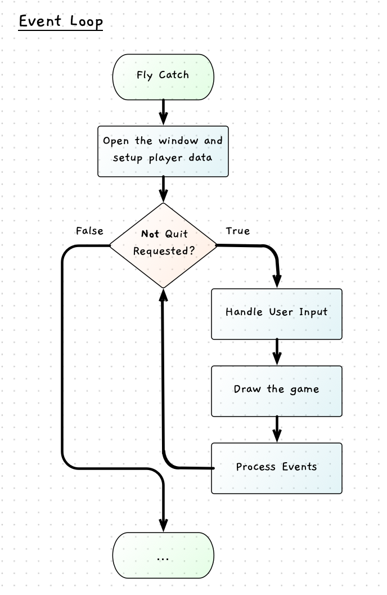

Now we have a loop constantly updating what is drawn to the screen, we can focus on making some changes. Let's test this out first, then see how we can use control flow to limit when the data changes.

## Bye bye spider

To get things moving let's add a `SPIDER_SPEED` constant, which we can then add to the `spiderX` value within the loop.

```
Constants:
  SCREEN_WIDTH = 800
  SCREEN_HEIGHT =  600
  SPIDER_RADIUS = 25
  SPIDER_SPEED = 3

Variables:
  spiderX (an int) = SCREEN_WIDTH / 2
  spiderY (an int) = SCREEN_HEIGHT / 2

Steps:
  Open the window - use SCREEN_WIDTH and SCREEN_HEIGHT
  
  While not quit
    Increase spiderX by SPIDER_SPEED

    Draw the game
    Process Events
```

Code this up, and compile and run. What happens?

:::tip
Use `+=` to increment the `spiderX` variable. Remember that this reads the value of the variable, and then adds the value to the right. So, `spiderX += SPIDER_SPEED;` is equivalent to `spiderX = spiderX + SPIDER_SPEED;` but requires less typing.
:::

When you run this you should see the circle move! Isn't it cool. How is this happening? Well remember that the loop is running over and over, and in each loop we are changing the value of `spiderX`. The code then clears the screen, draw the circle (with the new `spiderX`), and shows it to you. So you **see** the circle move. 

This is how all animation works within the computer - you can think of this like a flip-book where the picture changes each page. Here the `RefreshScreen` call flips to the new *"page"* that the user will see. You have the computer draw the new page, then show it to the user, then draw the next page, and show it to the user, over and over in the loop. Isn't it amazing what you can do when you have something that can process millions of small instructions each second.

Play around with this now. Try the following changes. For each change, think about what will happen before you run it. You want to be able to see what is going to happen in the code without running it, and things like these small tests can help you understand that.

- Remove clear screen
- Decrease, rather then increase, `spiderX` each loop.
- Increase `spiderY` instead of `spiderX`
- Try decreasing `spiderY` instead of increasing it each loop.
- Increment both `spiderX` and `spiderY` each loop.
- Test different combinations, for example increase `spiderX` but decrease `spiderY`

## Controlling spider movement

Having the spider move off the screen is fun, but we want the user to be in control.

**If only** there was a way to say *when* we want this code to run, rather than always increasing or decreasing these values. We could then only do this when the user was holding down a certain key on the keyboard.

This is where we can use [branching](../../1-concepts/03-0-branching) statement to ensure that these actions only occur when (if) the user has provided some input. For example, we can increase the `spiderX` if the user is holding down the right arrow key. In general, we could call this step **handle input**, as it will check for the external events and use these to update things within the program (within the digital reality).

The following flowchart illustrates where the **handle input** step would go in our processing. It can occur at the start of the loop before we draw the screen, and then read in the new user interactions. This would work anywhere in this loop, but it made more sense to me to have it at the start. That way we update where things are before we draw the current scene.



This can be represented in the pseudocode as follows:

```
Constants:
  SCREEN_WIDTH = 800
  SCREEN_HEIGHT =  600
  SPIDER_RADIUS = 25
  SPIDER_SPEED = 3

Variables:
  spiderX (an int) = SCREEN_WIDTH / 2
  spiderY (an int) = SCREEN_HEIGHT / 2

Steps:
  Open the window - use SCREEN_WIDTH and SCREEN_HEIGHT
  
  While not quit
    Handle Input
    Draw the game
    Process Events
```

### Going right and left

To move right, we can add an [if statement](../../1-concepts/03-1-if) that can contain the code to increase the value of `spiderX`. This is captured in the following pseudocode, where we are starting to expand out the steps within the handle input section of the code.

```
Constants:
  SCREEN_WIDTH = 800
  SCREEN_HEIGHT =  600
  SPIDER_RADIUS = 25
  SPIDER_SPEED = 3

Variables:
  spiderX (an int) = SCREEN_WIDTH / 2
  spiderY (an int) = SCREEN_HEIGHT / 2

Steps:
  Open the window - use SCREEN_WIDTH and SCREEN_HEIGHT
  
  While not quit
    Handle Input
      If the user is holding down the right arrow
        Increase spiderX by SPIDER_SPEED

    Draw the game
      Clear the screen white
      Fill a black circle using spiderX, spiderY, and SPIDER_RADIUS
      Refresh the screen to show it to the user
    
    Process Events
```

Try coding this and test that the spider now only moves when you press the right arrow key.

:::tip[Key Codes]

SplashKit provides a list of key codes in a `KeyCode` type. This provides a list of values you can choose from. You should be able to see these in vscode using its IntelliSense.

The main options include:

||||||
|--|--|--|--|--|
| BackspaceKey | TabKey | ReturnKey | EscapeKey | SpaceKey |
| Num0Key | Num1Key | Num2Key | Num3Key | Num4Key |
| Num5Key | Num6Key | Num7Key | Num8Key | Num9Key |
| ColonKey | SemiColonKey | AKey | BKey | CKey |
| DKey | EKey | FKey | GKey | HKey |
| IKey | JKey | KKey | LKey | MKey |
| NKey | OKey | PKey | QKey | RKey |
| SKey | TKey | UKey | VKey | WKey |
| XKey | YKey | ZKey | DeleteKey | Keypad0 |
| Keypad1 | Keypad2 | Keypad3 | Keypad4 | Keypad5 |
| Keypad6 | Keypad7 | Keypad8 | Keypad9 | KeypadPeriod |
| KeypadDivide | KeypadMultiply | KeypadMinus | KeypadPlus | KeypadEnter |
| KeypadEquals | UpKey | DownKey | RightKey | LeftKey |
| InsertKey | HomeKey | EndKey | PageUpKey | PageDownKey |
| F1Key | F2Key | F3Key | F4Key | F5Key |
| F6Key | F7Key | F8Key | F9Key | F10Key |
| F11Key | F12Key | F13Key | F14Key | F15Key |
| RightShiftKey | LeftShiftKey | RightCtrlKey | LeftCtrlKey | RightAltKey |
| LeftAltKey | LeftSuperKey | RightSuperKey | | |
:::

### Controlling Speed

If you keep the idea of the flip-book in your mind. Imagine an animation with a circle moving from the left to the right of the page.

How long will this take?

The answer depends on how quickly you flip through the pages. That is the same with our code here. To help ensure a consistent speed, we can limit the number of times we redraw the screen. SplashKit has a version of the [Refresh Screen](https://splashkit.io/api/graphics/#refresh-screen-with-target-fps) method that accepts an integer argument that indicates our target framerate. This then adds in a variable delay to limit the computer to redrawing at the indicated rate.

For this we can update our refresh screen call to limit us to sixty frames per second.

```csharp
RefreshScreen(60);
```

### Moving left

Now let's add the code to move the player left if they hold down the left arrow key. Here there are a few options we could use. We could use an **if ... else if**, or just have an **if** followed by another **if**. Let's think through these options.

If we use an **if ... else if** we will test the right arrow and move right, **else** test the left arrow and move left. In effect, we only check the left arrow if they are not moving right. The alternative is to have two separate if statements in sequence. This would test each arrow independently of the other arrow key. 

Which version do we want? It may be hard to picture the implications of this choice. To help we can draw this as a flowchart so that we can visually see the different paths through the logic. The two options are shown in the following figure.


The flowchart on the left shows the **if...else if ...** option. Notice that the first decision impacts the whether the second if statement is evaluated, or now. If you hold down the right arrow then you move right. If you do not hold down the right arrow, and you do hold down the left arrow, then you move left. Hold down both arrows and you move right.

In contrast, the flowchart on the right shows the two sequential if statements. It works the same if you hold down the keys individually, but when you hold down both arrow keys it works differently. In this case, it will move right (adding `SPIDER_SPEED` to `spiderX`) and then move left (subtracting `SPIDER_SPEED` to `spiderX`). The two actions will cancel each other out, so the spider will remain stationary.

:::tip[Paths]

Notice that the flowchart on the left has three paths through its logic, whereas the one on the right has four paths. With the sequential if statements you get two paths through the first if statement, and for each of these two paths there are two paths through the second if.

:::

In this case we can code this as sequential if statements. That way holding down both keys will not move the spider. The resulting pseudocode is shown below:

```
Constants:
  SCREEN_WIDTH = 800
  SCREEN_HEIGHT =  600
  SPIDER_RADIUS = 25
  SPIDER_SPEED = 3

Variables:
  spiderX (an int) = SCREEN_WIDTH / 2
  spiderY (an int) = SCREEN_HEIGHT / 2

Steps:
  Open the window - use SCREEN_WIDTH and SCREEN_HEIGHT
  
  While not quit
    Handle Input
      If the user is holding down the right arrow
        Increase spiderX by SPIDER_SPEED
      If the user is holding down the left arrow
        Decrease spiderX by SPIDER_SPEED

    Draw the game
      Clear the screen white
      Fill a black circle using spiderX, spiderY, and SPIDER_RADIUS
      Refresh the screen to show it to the user
    
    Process Events
```

Code this up, and test it to ensure you can move left and right. Make sure to try holding down both arrow keys. Perhaps test out the alternate logic with an else around the second if statement.

### Staying on the web

In your testing, have you noticed that you can move off the edge of the screen. We should keep the spider on its web. To do this, we can add in some additional checks to keep the spider in the screen - on its web.

To do this, we can adjust the condition to add extra logic, using boolean operators, to further restrict this condition. It is not enough to press the right key for example. You now also need to be able to move right. This could be coded in a number of ways, depending on how we want this to work. Some options are shown below.

```csharp
  // Option 1
  if (KeyDown(KeyCode.RightKey) && spiderX + SPIDER_SPEED + SPIDER_RADIUS < SCREEN_WIDTH)
  {
    spiderX += SPIDER_SPEED;
  }

  // Option 2
  if (KeyDown(KeyCode.RightKey) && spiderX + SPIDER_RADIUS < SCREEN_WIDTH)
  {
    spiderX += SPIDER_SPEED;
  }

  // Option 3
  if (KeyDown(KeyCode.RightKey) && spiderX + SPIDER_RADIUS < SCREEN_WIDTH)
  {
    spiderX += SPIDER_SPEED;
    if ( spiderX + SPIDER_RADIUS > SCREEN_WIDTH )
    {
      spiderX = SCREEN_WIDTH - SPIDER_RADIUS;
    }
  }
```

Option 1 tests the new position of the spider (`spiderX + SPIDER_SPEED`) to see if the right side (`... + SPIDER_RADIUS`) will still be on the screen (`... < SCREEN_WIDTH`). This will never let the spider go past the edge of the screen. However, it may mean that the spider can never get right next to the edge of the screen. For example, if the right edge is 2 pixels from the edge of the screen, then when we add `SPIDER_SPEED` (3) to that, it will not be able to move. So the spider remains stuck 2 pixels away from the edge.

Option 2 takes a different approach, it checks if the current right side of the spider (`spiderX + SPIDER_RADIUS`) is on the screen (`... < SCREEN_WIDTH`) and allows the spider to move then. This means that the spider may be able to move slightly off the edge of the screen. If we use the above example, the spider would be able to move but would then be one pixel off the right-hand side.

Option 3 adds an if statement inside the move right code which move the spider back in the case where it has gone slightly past the edge of the screen.

:::tip[Short Circuit Evaluation]

Putting the key code check first will mean the computer only tests if you are going off the edge of the screen when the key is pressed as `false && ?` is always false.

:::

Which of these options is best? Well for this game, any of them are probably ok. I know I would probably be a bit frustrated if I couldn't get right to the edge - so maybe not option 1 - but then I may not even notice this. Similarly, if I go slightly off the screen this may not look right.

Pick one of these options (or think of another way to achieve this) and code this up. Then test to make sure it feels right to you. Once you have this working, try adding in the code to move up and down as well. Get this working, and test the different key combinations before you continue.

:::tip[Review your code]

Make sure to spend enough time to be able to see how this works. Remember to focus on the digital reality you are creating here. Picture the spider, it has an x and y location. When the keys are held down, the spider moves. Drawing it to the screen helps the user see what is happening - but the game is really playing out within the data.

:::
