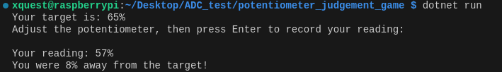

import { Accordion, AccordionItem } from 'accessible-astro-components'

# Task Overview

Your challenge is to build a simple judgement game using a potentiometer and an ADC (such as the ADS7830). In this game, the program will display a target percentage, and your goal is to adjust the potentiometer so that its output is as close as possible to that target. When you think you've matched the target, press Enter to record your reading. The program will then calculate and display how close your reading is to the target.

**Expected Outcome:**
- A target percentage (e.g., 65%) is displayed.
- You adjust the potentiometer and, when ready, press Enter.
- The ADC converts the potentiometer's analog voltage into a digital value (assumed to be between 0 and 100).
- The program calculates the absolute difference between the target percentage and your potentiometer reading.
- The final output shows the target, your reading, and the difference.

# What You Need to Do

1. **Initialize the ADC and Potentiometer:**
   - Set up your ADC to read the value from the potentiometer.
   - Ensure you convert the raw ADC value to a percentage (assume a scale from 0 to 100).

2. **Generate or Display a Target Value:**
   - Display a fixed target percentage (for example, 65%).

3. **Prompt the User:**
   - Ask the user to adjust the potentiometer until they believe the value is close to the target.
   - Instruct the user to press Enter when ready to record the reading.

4. **Calculate the Difference:**
   - Compute the absolute difference between the target percentage and the recorded potentiometer percentage.

5. **Display the Outcome:**
   - Print the target percentage, the potentiometer reading, and the difference (i.e., how close or far the reading is from the target).

# Hints

- **Reading the Potentiometer:**  
  For details on how to read a potentiometer, refer to:  
  [here](/book/part-1-instructions/3-control-flow/1-tour/4-00-potentiometer/)

- **Data Conversion:**  
  Consider how to map the ADC's raw value into a percentage (0–100).

- **Arithmetic Calculation:**  
  Use basic arithmetic to compute the absolute difference between your target and the reading.

# Important Note

At this stage, focus on basic control and flow. **Do not use loops or conditionals.** Your program should execute the steps in sequence:
1. Display the target.
2. Wait for the user to press Enter.
3. Read and convert the potentiometer value.
4. Immediately calculate and display the result.

Design your program step by step, test each individual part, and then integrate them to complete your judgement game. This task helps you practice working with analog inputs and simple arithmetic, paving the way for more advanced control and logic in the future. Happy coding and good luck!