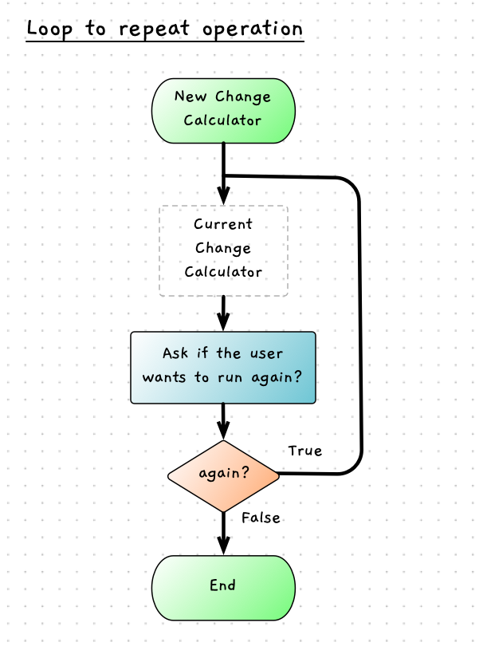

import { Accordion, AccordionItem } from 'accessible-astro-components'


To conclude the change calculator we need to make this so that the user has the option to calculate another change value. The logic for this is shown in the following flow chart.



1. Add a new `again` variable, write out a prompt, and read in the new value at the end of the current code.
2. Add in a `do...while` loop that will repeat while `again` is not equal "N" or "n".

    :::tip
    While you might be thinking the condition for this loop needs to be "repeat while again does not equal 'N' **or** 'n'", in code you would actually need to use `again != "N" && again != "n"`.
    :::

    Go ahead and try implementing this. Make sure the `do while` loop, captures the code that reads the values from the users, as well as the code that outputs the change values.

    <Accordion>
      <AccordionItem header="Looping when asked">

      ```cs {20-23,94-97}
      using static SplashKitSDK.SplashKit;
      using static System.Convert;

      const int NUM_COIN_TYPES = 6;

      const int TWO_DOLLARS = 200;
      const int ONE_DOLLAR = 100;
      const int FIFTY_CENTS = 50;
      const int TWENTY_CENTS = 20;
      const int TEN_CENTS = 10;
      const int FIVE_CENTS = 5;

      string line;
      int costOfItem;
      int amountPaid;
      int changeValue;
      int toGive;
      int coinValue;
      string coinText;
      string again;

      do
      {
          Write("Cost of item in cents: ");
          line = ReadLine();
          while (!IsInteger(line))
          {
              WriteLine("Please enter a whole number.");
              Write("Cost of item in cents: ");
              line = ReadLine();
          }

          costOfItem = ToInt32(line);

          Write("Payment in cents: ");
          line = ReadLine();
          while (!IsInteger(line))
          {
              WriteLine("Please enter a whole number.");
              Write("Payment in cents: ");
              line = ReadLine();
          }

          amountPaid = ToInt32(line);

          changeValue = amountPaid - costOfItem;

          WriteLine($"Change to give {changeValue}");

          for(int i = 0; i < NUM_COIN_TYPES; i++)
          {
              switch (i)
              {
                  case 0:
                      coinValue = TWO_DOLLARS;
                      coinText = "$2, ";
                      break;
                  case 1:
                      coinValue = ONE_DOLLAR;
                      coinText = "$1, ";
                      break;
                  case 2:
                      coinValue = FIFTY_CENTS;
                      coinText = "50c, ";
                      break;
                  case 3:
                      coinValue = TWENTY_CENTS;
                      coinText = "20c, ";
                      break;
                  case 4:
                      coinValue = TEN_CENTS;
                      coinText = "10c, ";
                      break;
                  case 5:
                      coinValue = FIVE_CENTS;
                      coinText = "5c";
                      break;
                  default:
                      coinValue = 1;
                      coinText = "ERROR";
                      break;
              }

              // Calculate the number of coins to give using the coinValue.
              toGive = changeValue / coinValue;

              // Update the amount of change remaining
              changeValue = changeValue - toGive * coinValue;

              // Output the number of coins with the coin text
              Write($"{toGive} x {coinText}");
          }

          WriteLine();
          Write("Run again: ");
          again = ReadLine();
      } while (again != "N" && again != "n");

      ```
      </AccordionItem>
    </Accordion>

    Compile, run, and test. Make sure that you can loop multiple times, and exit when you want. Test the program, and see if you can spot any issues.

    :::tip
    Make sure that you nest the existing code within the loop as a [compound statement](/book/part-1-instructions/3-control-flow/5-reference/02-0-compound-statement). Once you code the loop you can select the existing code in Visual Studio Code and press *tab* to indent it all one level further. You can also right-click and select "Format Document" to help with code layout.
    :::

3. To complete the program, we can need to check if the user has paid enough. If they have not paid enough, then we should output a message and see if they want to calculate change again.

    Have a go at this yourself. There are several ways you can achieve this.

    <Accordion>
      <AccordionItem header="Final code">

      In this solution we use a `continue;` statement to jump to the condition of the `do ... while` when there is insufficient funds.

      ```cs {48-54}
      using static SplashKitSDK.SplashKit;
      using static System.Convert;
  
      const int NUM_COIN_TYPES = 6;
  
      const int TWO_DOLLARS = 200;
      const int ONE_DOLLAR = 100;
      const int FIFTY_CENTS = 50;
      const int TWENTY_CENTS = 20;
      const int TEN_CENTS = 10;
      const int FIVE_CENTS = 5;
  
      string line;
      int costOfItem;
      int amountPaid;
      int changeValue;
      int toGive;
      int coinValue;
      string coinText;
      string again;
  
      do
      {
          Write("Cost of item in cents: ");
          line = ReadLine();
          while (!IsInteger(line))
          {
              WriteLine("Please enter a whole number.");
              Write("Cost of item in cents: ");
              line = ReadLine();
          }
  
          costOfItem = ToInt32(line);
  
          Write("Payment in cents: ");
          line = ReadLine();
          while (!IsInteger(line))
          {
              WriteLine("Please enter a whole number.");
              Write("Payment in cents: ");
              line = ReadLine();
          }
  
          amountPaid = ToInt32(line);
  
          changeValue = amountPaid - costOfItem;
  
          if (changeValue < 0)
          {
              WriteLine("Not enough money was paid.");
              Write("Run again: ");
              again = ReadLine();
              continue;
          }
  
          WriteLine($"Change to give {changeValue}");
  
          for(int i = 0; i < NUM_COIN_TYPES; i++)
          {
              switch (i)
              {
                  case 0:
                      coinValue = TWO_DOLLARS;
                      coinText = "$2, ";
                      break;
                  case 1:
                      coinValue = ONE_DOLLAR;
                      coinText = "$1, ";
                      break;
                  case 2:
                      coinValue = FIFTY_CENTS;
                      coinText = "50c, ";
                      break;
                  case 3:
                      coinValue = TWENTY_CENTS;
                      coinText = "20c, ";
                      break;
                  case 4:
                      coinValue = TEN_CENTS;
                      coinText = "10c, ";
                      break;
                  case 5:
                      coinValue = FIVE_CENTS;
                      coinText = "5c";
                      break;
                  default:
                      coinValue = 1;
                      coinText = "ERROR";
                      break;
              }
  
              // Calculate the number of coins to give using the   coinValue.
              toGive = changeValue / coinValue;
  
              // Update the amount of change remaining
              changeValue = changeValue - toGive * coinValue;
  
              // Output the number of coins with the coin text
              Write($"{toGive} x {coinText}");
          }
  
          WriteLine();
          Write("Run again: ");
          again = ReadLine();
      } while (again != "N" && again != "n");

      ```

      </AccordionItem>
    </Accordion>
