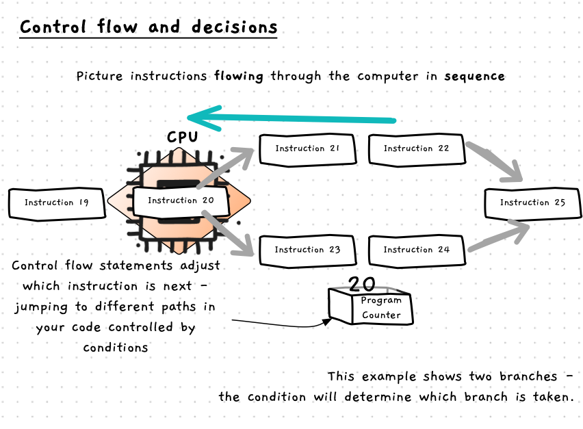

We have been focusing on sequence so far. With sequence, you can picture instructions flowing through the computer as it executes them one at a time.

Control flow is all about controlling that flow of instructions (hence the name - control flow). Each language has several control flow statements that define a certain flow pattern. Each of these patterns is controlled by a condition which evaluates to true of false - which is known as a **boolean** value.

:::note[Control flow...]

- still means that instructions run in [sequence](/book/part-1-instructions/1-sequence/5-reference/01-sequence).
- allows you to add decision points where you can change what instruction runs next.
- gives you the ability to selectively run code - also known as branching.
- lets you repeat code - also known as looping.
- uses conditions to determine which path is taken.
- statements give you the ability to implement algorithms in your code.

:::

To use control flow there are a few things you need to learn:

- How to use [boolean data](/book/part-1-instructions/3-control-flow/5-reference/01-0-boolean-data) to craft the data that the computer will use to make decisions.
- To group instructions into blocks using [compound statements](/book/part-1-instructions/3-control-flow/5-reference/02-0-compound-statement).
- How to use [branching](/book/part-1-instructions/3-control-flow/5-reference/03-0-branching) statements to selectively run code.
- How to use [looping](/book/part-1-instructions/3-control-flow/5-reference/03-0-branching) statements to repeat code.
