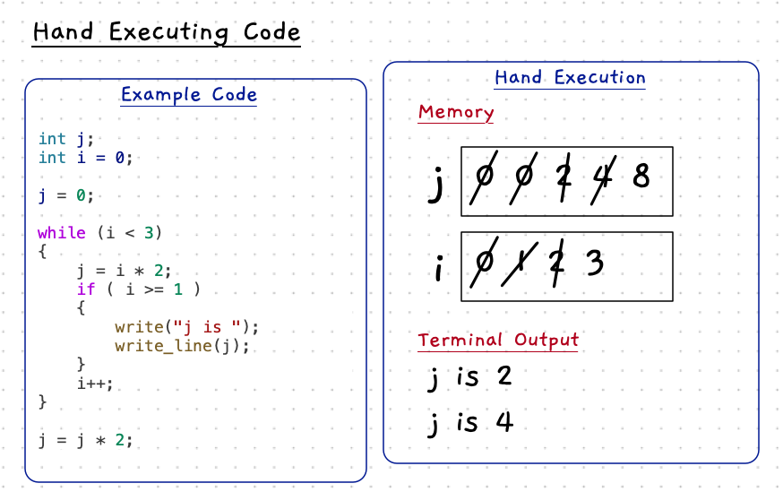

import YouTube from '/src/components/YouTube.astro';
import MySwiper from '/src/components/react/myswiper.jsx';

import Slide1 from './images/hand-exec-slider/Slide1.png';
import Slide2 from './images/hand-exec-slider/Slide2.png';
import Slide3 from './images/hand-exec-slider/Slide3.png';
import Slide4 from './images/hand-exec-slider/Slide4.png';
import Slide5 from './images/hand-exec-slider/Slide5.png';
import Slide6 from './images/hand-exec-slider/Slide6.png';
import Slide7 from './images/hand-exec-slider/Slide7.png';
import Slide8 from './images/hand-exec-slider/Slide8.png';
import Slide9 from './images/hand-exec-slider/Slide9.png';
import Slide10 from './images/hand-exec-slider/Slide10.png';
import Slide11 from './images/hand-exec-slider/Slide11.png';
import Slide12 from './images/hand-exec-slider/Slide12.png';
import Slide13 from './images/hand-exec-slider/Slide13.png';
import Slide14 from './images/hand-exec-slider/Slide14.png';
import Slide15 from './images/hand-exec-slider/Slide15.png';
import Slide16 from './images/hand-exec-slider/Slide16.png';
import Slide17 from './images/hand-exec-slider/Slide17.png';
import Slide18 from './images/hand-exec-slider/Slide18.png';
import Slide19 from './images/hand-exec-slider/Slide19.png';
import Slide20 from './images/hand-exec-slider/Slide20.png';
import Slide21 from './images/hand-exec-slider/Slide21.png';

export const sliderImages = [
    {
        src: Slide1.src,
        altText: "Hand execution step 1",
        tipHeader: "For the highlighted line in the code:",
        tipStart: 1,
        tips: [
        "Create the memory (box) for the variable: <code><strong>j</strong></code>   "
        ]
    },
    {
        src: Slide2.src,
        altText: "Hand execution of arrays - step 2",
        tipHeader: "For the highlighted line in the code:",
        tipStart: 2,
        tips: [
        "Create the memory (box) for the variable: <code><strong>i</strong></code>.",
        "Write the initial value assigned to <code><strong>i</strong></code> inside the <strong>i</strong> variable's box.  "
        ]
    },
    {
        src: Slide3.src,
        altText: "Hand execution of arrays - step 3",
        tipHeader: "For the highlighted line in the code:",
        tipStart: 3,
        tips: [
        "Write the initial value assigned to <code><strong>j</strong></code> inside the <strong>j</strong> variable's box.   "
        ]
    },
    {
        src: Slide4.src,
        altText: "Hand execution of arrays - step 4",
        tipHeader: "For the highlighted line in the code:",
        tipStart: 4,
        tips: [
        "Evaluate the <strong>while loop condition</strong> using the current value of <code><strong>i</strong></code>.",
        "The condition is <strong>true</strong>. Therefore, we jump into the loop.  "
        ]
    },
    {
        src: Slide5.src,
        altText: "Hand execution of arrays - step 5",
        tipHeader: "For the highlighted line in the code:",
        tipStart: 5,
        tips: [
        "Evaluate the expression <code><strong>i &ast; 2</strong></code> using the current value of <code><strong>i</strong></code>.",
        "Reassign <code><strong>j</strong></code>: Cross out the old value in the <strong>j</strong> variable's box and write in the new value: <strong>0</strong>."
        ]
    },
    {
        src: Slide6.src,
        altText: "Hand execution of arrays - step 6",
        tipHeader: "For the highlighted line in the code:",
        tipStart: 6,
        tips: [
        "Evaluate the <strong>if statement condition</strong> using the current value of <code><strong>i</strong></code>.",
        "The condition is <strong>false</strong>. Therefore, we jump to <strong>after</strong> the if statement.  "
        ]
    },
    {
        src: Slide7.src,
        altText: "Hand execution of arrays - step 7",
        tipHeader: "For the highlighted line in the code:",
        tipStart: 7,
        tips: [
        "Increment <code><strong>i</strong></code>: Cross out the old value in the <strong>i</strong> variable's box and write in the incremented value: <code><strong>1</strong></code>.  "
        ]
    },
    {
        src: Slide8.src,
        altText: "Hand execution of arrays - step 8",
        tipHeader: "For the highlighted line in the code:",
        tipStart: 8,
        tips: [
        "Evaluate the <strong>while loop condition</strong> using the current value of <code><strong>i</strong></code>.",
        "The condition is <strong>true</strong>. Therefore, we jump into the loop again.  "
        ]
    },
    {
        src: Slide9.src,
        altText: "Hand execution of arrays - step 9",
        tipHeader: "For the highlighted line in the code:",
        tipStart: 9,
        tips: [
        "Evaluate the expression <code><strong>i &ast; 2</strong></code> using the current value of <code><strong>i</strong></code>.",
        "Reassign <code><strong>j</strong></code>: Cross out the old value in the <strong>j</strong> variable's box and write in the new value: <strong>2</strong>."
        ]
    },
    {
        src: Slide10.src,
        altText: "Hand execution of arrays - step 10",
        tipHeader: "For the highlighted line in the code:",
        tipStart: 10,
        tips: [
        "Evaluate the <strong>if statement condition</strong> using the current value of <code><strong>i</strong></code>.",
        "The condition is <strong>true</strong>. Therefore, we jump into the if statement.  "
        ]
    },
    {
        src: Slide11.src,
        altText: "Hand execution of arrays - step 11",
        tipHeader: "For the highlighted line in the code:",
        tipStart: 11,
        tips: [
        "Create a separate section to indicate what is shown in the Terminal.",
        "In the <strong>Terminal Output</strong> section, write the string argument (<code><strong>j is </strong></code>) passed to the <code><strong>write</strong></code> procedure call."
        ]
    },
    {
        src: Slide12.src,
        altText: "Hand execution of arrays - step 12",
        tipHeader: "For the highlighted line in the code:",
        tipStart: 12,
        tips: [
        "Evaluate the expression <code><strong>j</strong></code> using the current value of <code><strong>j</strong></code>.",
        "After the previous terminal output, but <strong>on the same line</strong>, write the integer argument (<code><strong>2</strong></code>) passed to <code><strong>write_line</strong></code>."
        ]
    },
    {
        src: Slide13.src,
        altText: "Hand execution of arrays - step 13",
        tipHeader: "For the highlighted line in the code:",
        tipStart: 13,
        tips: [
        "Increment <code><strong>i</strong></code>: Cross out the old value in the <strong>i</strong> variable's box and write in the incremented value: <code><strong>2</strong></code>.  "
        ]
    },
    {
        src: Slide14.src,
        altText: "Hand execution of arrays - step 12",
        tipHeader: "For the highlighted line in the code:",
        tipStart: 12,
        tips: [
        "Evaluate the <strong>while loop condition</strong> using the current value of <code><strong>i</strong></code>.",
        "The condition is <strong>true</strong>. Therefore, we jump into the loop again.  "
        ]
    },
    {
        src: Slide15.src,
        altText: "Hand execution of arrays - step 12",
        tipHeader: "For the highlighted line in the code:",
        tipStart: 12,
        tips: [
        "Evaluate the expression <code><strong>i &ast; 2</strong></code> using the current value of <code><strong>i</strong></code>.",
        "Reassign <code><strong>j</strong></code>: Cross out the old value in the <strong>j</strong> variable's box and write in the new value: <strong>4</strong>."
        ]
    },
    {
        src: Slide16.src,
        altText: "Hand execution of arrays - step 12",
        tipHeader: "For the highlighted line in the code:",
        tipStart: 12,
        tips: [
        "Evaluate the <strong>if statement condition</strong> using the current value of <code><strong>i</strong></code>.",
        "The condition is <strong>true</strong>. Therefore, we jump into the if statement.  "
        ]
    },
    {
        src: Slide17.src,
        altText: "Hand execution of arrays - step 12",
        tipHeader: "For the highlighted line in the code:",
        tipStart: 12,
        tips: [
        "After the previous terminal output, <strong>on a new line</strong>, write the string argument (<code><strong>j is </strong></code>) passed to <code><strong>write</strong></code>.  "
        ]
    },
    {
        src: Slide18.src,
        altText: "Hand execution of arrays - step 12",
        tipHeader: "For the highlighted line in the code:",
        tipStart: 12,
        tips: [
        "Evaluate the expression <code><strong>j</strong></code> using the current value of <code><strong>j</strong></code>.",
        "After the previous terminal output, but <strong>on the same line</strong>, write the integer argument (<code><strong>4</strong></code>) passed to <code><strong>write_line</strong></code>."
        ]
    },
    {
        src: Slide19.src,
        altText: "Hand execution of arrays - step 12",
        tipHeader: "For the highlighted line in the code:",
        tipStart: 12,
        tips: [
        "Increment <code><strong>i</strong></code>: Cross out the old value in the <strong>i variable's</strong> box and write in the incremented value: <strong>3</strong>.  "
        ]
    },
    {
        src: Slide20.src,
        altText: "Hand execution of arrays - step 12",
        tipHeader: "For the highlighted line in the code:",
        tipStart: 12,
        tips: [
        "Evaluate the <strong>while loop condition</strong> using the current value of <code><strong>i</strong></code>.",
        "The condition is now <strong>false</strong>. Therefore, we jump to <strong>after</strong> the while loop."
        ]
    },
    {
        src: Slide21.src,
        altText: "Hand execution of arrays - step 12",
        tipHeader: "For the highlighted line in the code:",
        tipStart: 12,
        tips: [
        "Evaluate the expression <code><strong>j &ast; 2</strong></code> using the current value of <code><strong>j</strong></code>: <strong>4</strong>.",
        "Reassign <code><strong>j</strong></code>: Cross out the old value in the <strong>j</strong> variable's box and write in the new value: <strong>8</strong>."
        ]
    }
];

:::tip[There is a video on this...]
Make sure to check out the [Hand Execution Intro Tour](/book/part-1-instructions/3-control-flow/2-intro-tour/09-hand-execution)
:::

Running code yourself can be a great way to help you understand how a program works. This is useful both for functioning programs, and for when you are thinking through issues that have arisen.

The idea is to read through the code, and "run" it yourself. So you have to act like a computer (remember that the computer is unintelligent!). This should be an entirely mechanical process. Read each line, perform each action as they occur. An example is shown below.

:::note
You can also look at the [Step-by-step process](#step-by-step-process) of the example below, at the end of this page.
:::

The main thing you will need is a piece of paper to act as your **memory**. The computer is unintelligent, but it can "remember" values in variables. We can use our paper to act as memory, while we act as the CPU by performing the instructions that are coded in the program.

:::tip[Building your understanding]
Hand execution, also known as tracing, is a great way to develop your understanding. By acting as the CPU you have to focus on the instructions that the computer performs when it runs the code.
:::

One of the keys to doing this is to remember the computer is unintelligent. All you need to do is follow the steps the computer will perform as it runs the code. You should not really have to "think". The computer doesn't.

Use the following steps to get started

1. Locate the first instruction
2. Focus on just that one line - the computer runs these instructions one at a time. It doesn't need to "think" about what is going to happen next. It just performs the instructions one at a time.
3. Perform the actions from the current line of code:
    - When you encounter a variable declaration, you need to create space for the variable in memory (on your piece of paper). Create a box somewhere on your page to keep track of that variable's value. When the instruction use that variable later you will be able to use the value from that box.
    - With each assignment statement, you need to perform the steps associated: calculate the value of the expression, and store the result in the variable. For the store step, cross out the old value in the variable's box and write in the new value.
    - With a method call, you will need to know what the procedure does. For example, if the code calls `write`/`write_line` you can indicate what is shown in the Terminal without having to step through the instructions in `write` or `write_line`.
    - With control flow statements, you will need to evaluate their condition and jump to the next instruction. Remember to focus on each instruction one at a time. You only evaluate the condition of the loops when that is the current part being executed.

:::tip
Start with big boxes for the variables.
You want to make sure you have space for every value the variable is assigned over the execution of the program.
:::

Hand execution is a great way to see if you really understand the actions that each statement performs. Hopefully you have noticed we have been using it a lot to explain how different statements work! As your programs get more complex, you can use hand execution to see how the computer is organising its data. This can be a valuable tool for debugging, but also helpful when initially designing your program's logic.

## Step-by-step process

:::note[Taking a closer look...]

To see each step of the example above, use the arrows in the panel below:

<MySwiper client:only height="" images={sliderImages}></MySwiper>

:::
