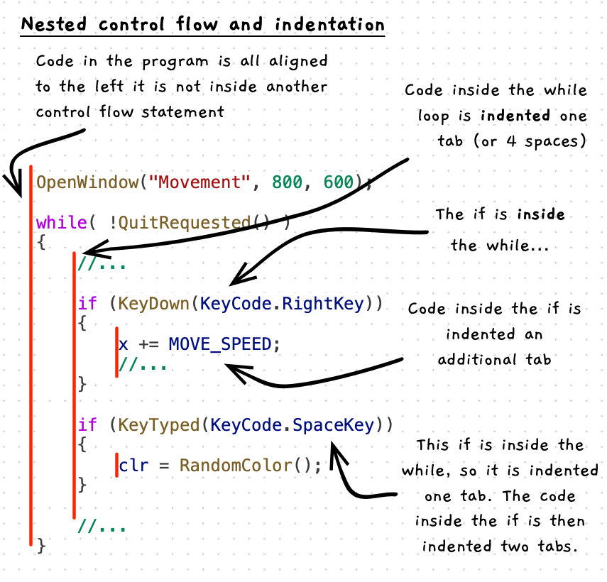

Control flow statements can be nested within each other.




:::note[Indentation...]

- involves indenting code so that you can easily see the control flow structure.
- uses spaces or tabs to show which statements are inside other control flow statements.
- is not used by the compiler, but is *essential* for the human readers.
- is really important!

:::

:::tip

Always indent your code as you progress. Periodically you can use VS Code's "Format Document" shortcut to help you out. Right-click on your code and select "Format Document". This will adjust the indentation, to make sure that it aligns with your control flow.

:::

## Example

```cs
using static SplashKitSDK.SplashKit;
using SplashKitSDK;

const int MOVE_SPEED = 3;

OpenWindow("Movement", 800, 600);

// Event loop
double x = 400;
Color clr = ColorBlack();

while( !QuitRequested() )
{
  ProcessEvents();

  if (KeyDown(KeyCode.RightKey))
  {
    x += MOVE_SPEED;
  }

  if (KeyDown(KeyCode.LeftKey))
  {
    x -= MOVE_SPEED;
  }

  if (KeyTyped(KeyCode.SpaceKey))
  {
    clr = RandomColor();
  }

  ClearScreen(ColorWhite());
  FillCircle(clr, x, 300, 50);
  RefreshScreen(60);
}
```

The following code shows an example of using the mouse, and its position as part of a program. This uses the distance from the player to the mouse to set the direction of a ball which is thrown when the mouse is clicked.

```c++
// Code in the program is all lined up on the left...
#include "splashkit.h"

const int BALL_RADIUS = 5;
const int PLAYER_RADIUS = 20;

// Used to calculate distance from player - mouse for
// Ball speed. speed = distance / DIST_TO_SPEED_RATIO.
const double DIST_TO_SPEED_RATIO = 30;
// as above for the line drawn to show direction of shot
const double DIST_LINE_RATIO = 10;

int main()
{
    // Code in the main function is indented one tab

    open_window("Ball Throw", 800, 600);

    bool ball_fired = false;

    double player_x = 400, player_y = 300;
    double ball_x = player_x;
    double ball_y = player_y;
    double ball_x_speed = 0;
    double ball_y_speed = 0;

    while (!quit_requested())
    {
      // Code in this while loop is indented again, so two tabs
      process_events();

      if (mouse_clicked(LEFT_BUTTON) && !ball_fired)
      {
        // This is inside the if inside the while inside main...
        // So this is indented three tabs
        ball_fired = true;

        ball_x_speed = (mouse_x() - player_x) / DIST_TO_SPEED_RATIO;
        ball_y_speed = (mouse_y() - player_y) / DIST_TO_SPEED_RATIO;
      }

      // Here we are back in the while... indented two tab

      if (ball_fired)
      {
        // inside the if in the while inside main... so three tabs
        ball_x += ball_x_speed;
        ball_y += ball_y_speed;

        // check if off screen
        if (ball_x + BALL_RADIUS < 0 || // off left
            ball_x - BALL_RADIUS > screen_width() || // off right
            ball_y + BALL_RADIUS < 0 || // off top
            ball_y - BALL_RADIUS > screen_height()
            ) // off bottom
        {
          // Inside an if in an if in a while inside main... so 4 tabs
          ball_fired = false;
          ball_x = player_x;
          ball_y = player_y;
        }
      }

      // back just in the while in main... two tabs

      clear_screen(COLOR_WHITE);
      fill_circle(COLOR_LIGHT_GREEN, player_x, player_y, PLAYER_RADIUS);
      fill_circle(COLOR_BLACK, ball_x, ball_y, BALL_RADIUS);

      if ( ! ball_fired )
      {
        // indented 3 tabs...

        // Show direction of travel
        draw_line(COLOR_BLACK,
          player_x, player_y,
          player_x + (mouse_x() - player_x) / DIST_LINE_RATIO,
          player_y + (mouse_y() - player_y) / DIST_LINE_RATIO
        );
      }

      // indented 2 tab

      refresh_screen(60);
    }

    // Back in the main function - indented 1 tabs
    write_line("I hope you enjoyed this program!");
}
```
