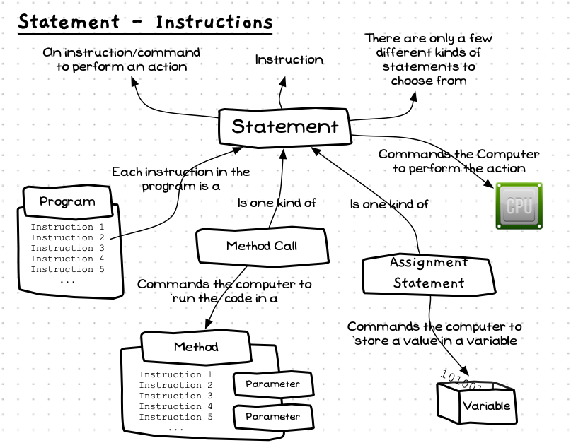

As we explored in the previous chapter, when you are creating a program you define the actions the computer will perform when the program is run. Each of these instructions is coded as a **statement** within the program. This style is [imperative programming](/book/part-1-instructions/1-sequence/2-trailside/12-other-languages#imperative-programming-paradigms). Imperative means to give authoritative commands, and that is what we do in our programs. Our programs are lists of authoritative commands (statements) that *tell* the computer the actions it is to perform.

The concept map below shows the concepts related to statements. A statement is a term used to describe the instructions in your code, and as such represent an **instruction** or **command** to perform an action. As we have seen, a [program](/book/part-1-instructions/1-sequence/2-trailside/00-program) has a list of statements that are followed when it is executed. For example, a [method call](/book/part-1-instructions/1-sequence/2-trailside/03-method-call) is a kind of statement that tells the computer to run the code in a [method](/book/part-1-instructions/1-sequence/2-trailside/02-method). An [assignment statement](/book/part-1-instructions/1-sequence/2-trailside/08-assignment-statement) gets the computer to store a value in a [variable](/book/part-1-instructions/1-sequence/2-trailside/07-variable).



## Statement -- when, why, and how

As you learn to program, you will need to learn all of the different kinds of instructions you can give the computer. These will be **statements** in the programming languages you learn. Just knowing that **statement** means **instruction** will help you engage with these conversations and documentation.

## In C#

:::tip[Syntax]
The following diagram shows the C# syntax for a statement.


:::

In a statement you are commanding the computer to perform an action. There are only a few statements you can choose from in a programming language. At this stage we have two : [assignment statements](/book/part-1-instructions/1-sequence/2-trailside/08-assignment-statement) and [method calls](/book/part-1-instructions/1-sequence/2-trailside/03-method-call).

## Examples

The following listing shows an example of method call statements in a simple C# program.

```csharp
using static System.Console;

// Introduce knights
WriteLine("We are the knights who say 'Ni!'");
Write("We are the keepers of the sacred words:");
WriteLine(" 'Ni', 'Peng', and 'Neee-wom !'");
WriteLine("The Knights Who Say 'Ni' demand a sacrifice.");
WriteLine("We want .... a shrubbery!");
```

:::note[Summary]

- A statement is a term used to describe the instructions (commands) in your code.
- Learning a language involves learning the different kinds of statements and how to write them in code.

:::
