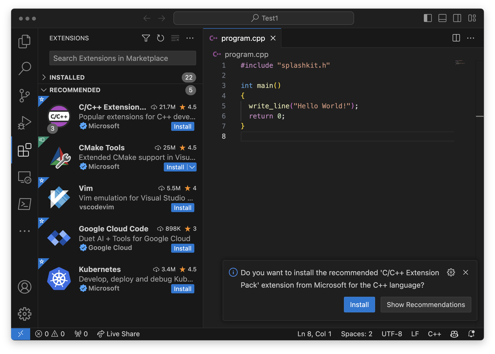
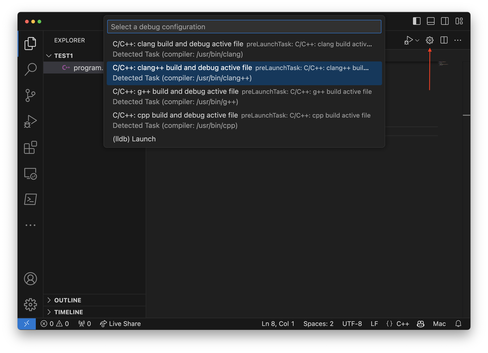

C/C++ are **compiled** languages. Unlike C#, they do not need a runtime environment. This means that you compile and then directly run the resulting program.

To get started, let's build a Hello World program.
For now, we will use the SplashKit library to handle user input and output, as they are a bit easier to work with.
[Later on](../../../9-low-level-programming/0-overview) you will understand the concepts needed to use the native C input and output functions, which are very primitive.

The following steps go through the necessary actions to build and run programs using C/C++.
These steps assume that you have followed the [instructions from part 0](http://127.0.0.1:3001/book/part-0-getting-started/2-computer-use/2-put-together/1-0-set-up-my/) on setting up the C/C++ tools for your operating system.

## Hello World in C/C++

To get started, we need to:

1. Create a new folder for the project.
2. Open the folder in VS Code.
3. Create a new **program.cpp** file.

The following shell commands should achieve this, assuming your code is stored in the `~/Documents/Code` path:

```zsh
cd ~/Documents/Code
mkdir HelloWorldCPP
cd HelloWorldCPP
touch program.cpp
code .
```

:::tip[File extensions]
Source code is written in text files, but we use different extension for these files to help indicate which language we are using. The **.cs** extension indicated a C# code file, whereas now we use the **.cpp** extension to indicate that this is a C++ source code file.
:::

In VS Code, open the **program.cpp** file, and enter the following code:

```cpp
#include "splashkit.h"

int main()
{
    write_line("Hello World!");
    return 0;
}
```

:::tip
You should be able to connect the `#include` with C#'s `using`, and the call to `write_line` should also look familiar.
:::

## Compile and Run

Compiling in C/C++ is a little more involved. This is because the C# and dotnet tools include features that take care of many small details for us, whereas the C/C++ compiler gives you a lot more control.

### Compile on your platform

As the C/C++ compiler works differently on each platform, we will need slightly different shell instructions for each of them. In general, you need to provide the following options:

- `-l` is used to link with an external library. We need to link to **SplashKit** and **SplashKitCPP**.
- `-o` will indicate the name of the executable file to create. By default, the compiler will create an `a.out` file. Usually you want a different name, so you can use this option to specify one. For our hello world program we will name the file **program**.
- `-Wl,-rpath,` is used to indicate where to find the library files. The `rpath` is the path that the computer will search at runtime, when it is loading libraries. You need to tell this where you have installed the SplashKit library.

Review the details for your computer below.

#### Raspberry Pi, macOS, Linux, or Windows (WSL)

On the Raspberry Pi, macOS, Linux, or Windows (WSL) you compile with the following command (enter it all on line one):

```zsh
clang++ program.cpp -l SplashKitCPP -l SplashKit -Wl,-rpath,/usr/local/lib -o program
```

#### Windows (MSys2)

**TODO: Test this!**

For Windows (MSys2), you need to use g++. This will create a program you can run from the MSys terminal window.

```zsh
g++ program.cpp -I /usr/local/include -L /usr/local/lib -l SplashKitCPP -l SplashKit -o program
```

This has a few additional options. The reason for this is that most unix systems automatically search the `/usr/local/include` path for library header files and the `/usr/local/lib` path for library code. In MSys2, you have to tell the compiler about these paths manually. The `-I /usr/local/include` tells MSys2 to add this folder to the paths it searches for header files (like "splashkit.h"). Similarly, the `-L /usr/local/lib` adds this folder to the paths MSys2 searches for libraries you have linked (in this case `SplashKitCPP` and `SplashKit`). You can use `ls` to check that these files are in the expected paths. For example, `ls /usr/local/include` should show you `splashkit.h` and `ls /usr/local/lib` should show you the `SplashKitCPP` and `SplashKit` library files.

There are a few more options that you can also include if you want to be able to run the program by double-clicking it in the Windows explorer instead of only from within MSys2:

```zsh
g++ program.cpp -I /usr/local/include -L /usr/local/lib -Wl,--as-needed -static-libstdc++ -static-libgcc -lSplashKit -Wl,-Bstatic -lstdc++ -lpthread -lSplashKitCPP -o program
```

#### Using skm

On all platforms, you can use the **skm** tool to wrap these commands for you. This will allow you to leave out the options for linking in the library, as the skm tool will do so for you.

```zsh
skm clang++ program.cpp -o program
```

### Run your program

When the compiler runs successfully it will output an executable file: the program. With the above commands, we used the `-o` option to indicate the name of the file to create. So, when you compile your code you should see a **program** file appear. This is the machine code for the program all ready to go, so you can run this directly from the terminal. For example, the following shell commands would build and run out hello world program on the Raspberry Pi.

```zsh
clang++ program.cpp -l SplashKitCPP -l SplashKit -Wl,-rpath,/usr/local/lib -o program
ls -lha
# Notice the program file
./program
```

:::tip[Program's path]
When you want to run the program, you need to specify the path to it even though it is in the current folder. This is why we have the **./** in front of the filename here. If your programming isn't running, make sure you included this.
:::

Once this is working, you have everything set up and ready to go. Getting this to work can be a bit finicky, as the C/C++ tools were designed for a professional audience and do not include much to make this a user-friendly process. If you have others you are studying with, make sure to ask for help if you get stuck.

## Configuring Visual Studio Code

Getting the program compiling and running in the terminal will mean that you now know the steps an editor like Visual Studio Code would need to automate for us.

Visual Studio Code uses [extensions](https://code.visualstudio.com/docs/editor/extension-marketplace) to extend its capabilities to support developers working in a range of languages. To get support with C/C++ we need to install the associated extensions and then configure their settings to get them to link in the required libraries.

The extension you need to install is called the [C/C++ Extension Pack](https://marketplace.visualstudio.com/items?itemName=ms-vscode.cpptools-extension-pack) by Microsoft. Visual Studio Code should automatically show you this in the extensions' pane if you have the program.cpp file open. Click the **install** button to install this extension in your editor.



With the extension installed, you now need to add some files to configure this to work with your code. The extension will have added a quick configure button that will help get you started. With your **program.cpp** file selected, click the **cog** icon near the top right of the window as highlighted in the following image. This will open a prompt where you can select the version with your preferred compiler. We have selected the **clang++** version in the image below.



This will create two files in a **.vscode** folder:

- **launch.json**: contains details on how to run the program in the debugger.
- **tasks.json**: contains details on how to compile the program.

### Configuring the Build Task

The **tasks.json** file contains various settings related to compiling the program. We need to provide this with the additional options we provided to the compiler when we compiled our program through the terminal. The **args** setting is a list of the values to pass as arguments to the compiler. You need to extend this with extra options to link the SplashKit and SplashKitCPP libraries, and set the rpath as shown below.

```json
{
  "tasks": [
    {
      "type": "cppbuild",
      "label": "C/C++: clang++ build active file",
      "command": "/usr/bin/clang++",
      "args": [
        "-fcolor-diagnostics",
        "-fansi-escape-codes",
        "-g",
        "${file}",
        "-o",
        "${fileDirname}/${fileBasenameNoExtension}",
        "-l",
        "SplashKit",
        "-l",
        "SplashKitCPP",
        "-Wl,-rpath,/usr/local/lib"
      ],
      "options": {
        "cwd": "${fileDirname}"
      },
      "problemMatcher": [
        "$gcc"
      ],
      "group": "build",
      "detail": "Task generated by Debugger."
    }
  ],
  "version": "2.0.0"
}
```

Each argument is added as a separate string within quotes, separated by commas.
So, we added the following lines to our **tasks.json**:

```json
        "-l",
        "SplashKit",
        "-l",
        "SplashKitCPP",
        "-Wl,-rpath,/usr/local/lib"
```

:::tip[Hidden Folders]
Remember that folders that start with a `.` are hidden in unix. They do not appear in `ls` commands unless you add the `-a` option.
:::

These settings tell VS Code how to build a selected C++ file that uses the SplashKit library. With your program.cpp file selected, you can build the program using **ctrl-shift-b** (**cmd-shift-b** on macOS) or selecting **Tasks: Run Build Task** from the [command palette](https://code.visualstudio.com/docs/getstarted/userinterface#_command-palette).

In the terminal window in VS Code you should see the output from this, as shown below. Make sure that you can see that this ran successfully.

```zsh
 *  Executing task: C/C++: clang++ build active file 

Starting build...
/usr/bin/clang++ -std=gnu++14 -fcolor-diagnostics -fansi-escape-codes -g /Users/acain/Documents/Code/Test2/main.cpp -o /Users/acain/Documents/Code/Test2/main -l SplashKitCPP -l SplashKit -Wl,-rpath,/usr/local/lib

Build finished successfully.
 *  Terminal will be reused by tasks, press any key to close it. 
```

At this point, you have Visual Studio Code set up to build the currently selected file into a program.

Going forward, you can edit the tasks.json to compile multiple files. To do this you need to change the argument that passes in what to compile, and the output option in the following ways:

- Change **"${file}"** to **"*.cpp"**. This will then compile all cpp files.
- The **"-o"** argument is followed by the name of the program to create. This is **"${fileDirname}/${fileBasenameNoExtension}"** which names the program after the selected file. When building multiple files you can provide a fixed value here like **"program"**. This will then always build the same output regardless of which source file is selected.

### Configuring Launch

Configuring VS Code to run your C/C++ program is much simpler than configuring the settings needed for compiling. The defaults in **launch.json** do not need changing if you have not changed the "-o" option in the tasks.json file. They should appear as shown below.

```json
{
    "configurations": [
        {
            "name": "C/C++: clang++ build and debug active file",
            "type": "cppdbg",
            "request": "launch",
            "program": "${fileDirname}/${fileBasenameNoExtension}",
            "args": [],
            "stopAtEntry": false,
            "cwd": "${fileDirname}",
            "environment": [],
            "externalConsole": false,
            "MIMode": "lldb",
            "preLaunchTask": "C/C++: clang++ build active file"
        }
    ],
    "version": "2.0.0"
}
```

To run your code in the debugger, use the "run and debug" icon in the debugger pane as you did with C#. You should be able to add breakpoints and step through the code as before.

Notice that unlike with C#, the output does not go into the terminal window. To include terminal input and output, you need to change the "externalConsole" setting to `false`. When you run the debugger now, it will open the default terminal program and allow you to use it for input and output.

If you change the "-o" setting in tasks.json, you will also need to change it in **launch.json**. In this case the **"program"** value indicates the name of the program to run. The default **"${fileDirname}/${fileBasenameNoExtension}"** can be changed to something like **"program"** if you update this in the tasks file.
