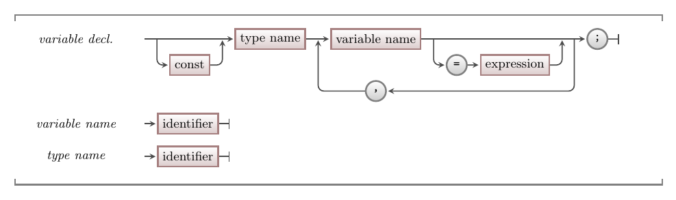

Variables are the same in C/C++ as in C#. They are used to store a value that you can change as the program runs.

:::note[Syntax]
Variable declaration in C/C++ is the same as in C#. You specify the name of the type first, and follow this with a comma separated list of names for the variables you want created.
You can optionally initialise a variable with a value as well as declare it.


:::

The names of the basic types are also the same in C/C++ as they were in C#:

- `int` for whole numbers.
- `double` for real numbers.
- `string` for text.
- `char` for a single character.
- `bool` for boolean values. In C/C++, there are constants for `true` and `false`, but 0 is also considered false with any other value considered to be true.

## Example

Here is the example from the [variables page](../../../../part-1-instructions/1-sequence-and-data/1-concepts/07-variable#example-using-multiple-variables) rewritten in C/C++. Notice that the **logic** is exactly the same, and that the code is only superficially different. Have a read through and compare it with the original code.

```cpp
#include "splashkit.h"

using std::to_string;
using std::stod;

int main()
{
    const double PI = 3.1415;
    double radius, height;
    string line;
    double bottle_volume, litres;

    write_line("Water Bottle Volume");
    write_line();
    write_line("Enter the radius and height of the bottle in centimeters");

    write("radius: ");
    line = read_line();
    radius = stod(line);

    write("height: ");
    line = read_line();
    height = stod(line);

    bottle_volume = PI * radius * radius * height;

    litres = bottle_volume / 1000;

    write_line();
    write_line("Volume " + to_string(bottle_volume) + " cm^3");
    write_line("       " + to_string(litres) + " litres");
}
```

Key changes include:

- Using different libraries:
  - We can access the SplashKit library using `#import "splashkit.h`.
  - We need `using std::to_string;` and `using std::stod;` to gain access to these C++ functions from the standard (`std`) library.
    - The [to_string](https://en.cppreference.com/w/cpp/string/basic_string/to_string) function is used to convert numbers to text.
    - In C/C++ you can use [stod](https://en.cppreference.com/w/cpp/string/basic_string/stof) to convert a string to a double. There is also [stoi](https://en.cppreference.com/w/cpp/string/basic_string/stol) to convert text to an integer.
- Changing names of identifiers:
  - `WriteLine` is now `write_line`.
  - `Write` becomes `write`.

C/C++ also lacks the elegant **string interpolation** feature we had in C#. This means you cannot easily embed values within your strings. Instead, can use `to_string` to convert numbers into strings, and then use string concatenation (`+`) to combine different strings together.

:::tip[How do we work this out?]
Finding the appropriate things to call in the libraries of the language you use will take time. The great thing is that you have tools like search engines and AI that can help. A simple search on how to convert a string to an integer in C++ will lead you to the [stod](https://en.cppreference.com/w/cpp/string/basic_string/stof) code, though there are also other options.
:::

Have a go at coding this up yourself, and run the program to see it working. The thought process to create this is the same as before, you just need to switch some details.
