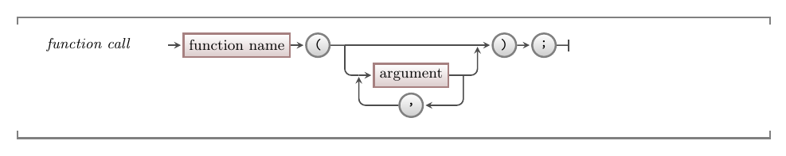

In C/C++, functions and procedures are the equivalent of [methods](../../../../part-1-instructions/1-sequence-and-data/1-concepts/02-method) in C#. They are functional units, things we can call on to achieve a task.

:::note[Syntax]

Function calls use the same syntax as we have been using for calling C# methods. To call a function, you use its name (identifier) followed by the required arguments within parenthesis.


:::

## Example

The code below matches the [previous example](../../../../part-1-instructions/1-sequence-and-data/1-concepts/03-method-cal#example-using-resultl) for calling methods in SplashKit.
Notice that there are no changes in logic.
As we are using the same library, we can call the same function calls, in the same order.
Just the identifiers for those functions have changed.

```cpp
#include "splashkit.h"

int main()
{
    open_window("Random Color", 800, 600);
    clear_screen(random_color());
    refresh_screen();
    delay(1000 * rnd(10));
}
```

:::tip
Converting these examples between languages is really simple -- the logic is the same, so you just need to make small adjustments to make it work.
:::
