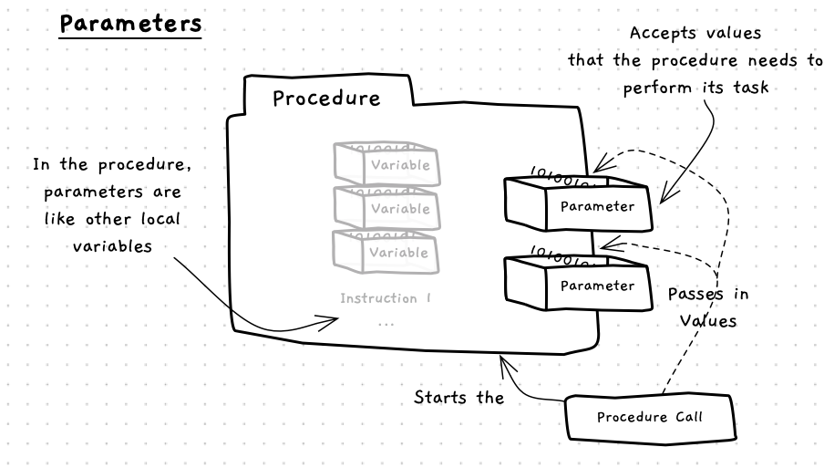
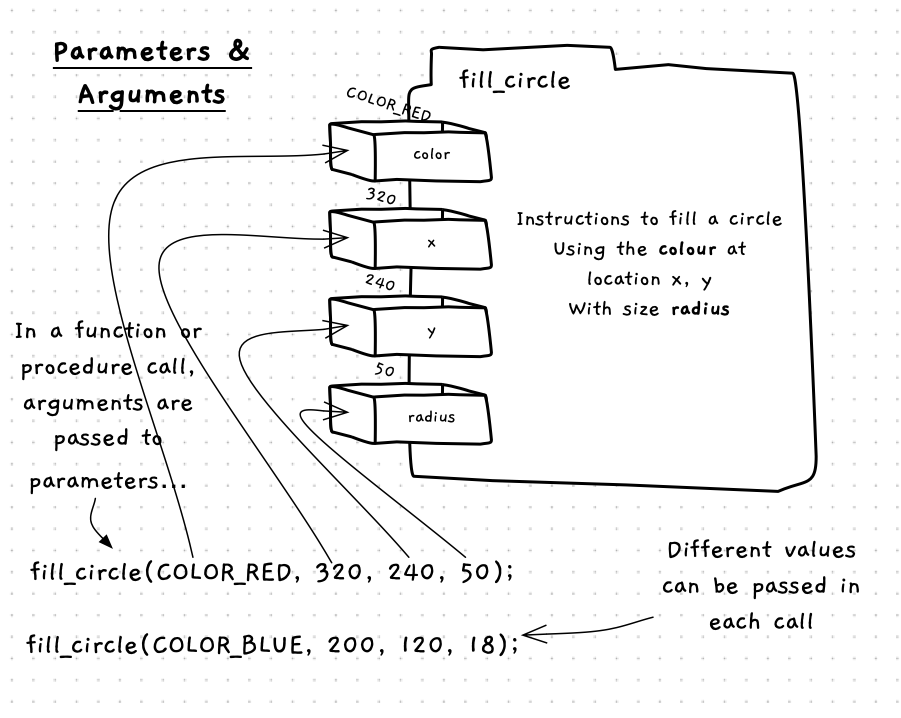

import MySwiper from '../../../../../../components/react/myswiper.jsx'

import sliderParameter01 from './images/slider-parameter/Slide1.png';
import sliderParameter02 from './images/slider-parameter/Slide2.png';
import sliderParameter03 from './images/slider-parameter/Slide3.png';
import sliderParameter04 from './images/slider-parameter/Slide4.png';
import sliderParameter05 from './images/slider-parameter/Slide5.png';
import sliderParameter06 from './images/slider-parameter/Slide6.png';
import sliderParameter07 from './images/slider-parameter/Slide7.png';
import sliderParameter08 from './images/slider-parameter/Slide8.png';
import sliderParameter09 from './images/slider-parameter/Slide9.png';
import sliderParameter10 from './images/slider-parameter/Slide10.png';
import sliderParameter11 from './images/slider-parameter/Slide11.png';

export const sliderParameter = [
  {
    src: sliderParameter01.src,
    altText: "The program starts at main() and the print_equation() procedure is called with parameters 2, 5.1 and 3",
    tipStart: 1,
    tips: [
      "The program starts at the <code>main()</code> function.",
      "<code>print_equation()</code> is called with arguments <code>2</code>, <code>5.1</code> and <code>3</code>.",
      "The program counter jumps to line 7, the start of the <code>print_equation()</code> procedure."
    ]
  },
  {
    src: sliderParameter02.src,
    altText: "The argument values from the caller are passed into the print_equation() procedure, and the values are stored in their respective parameters (variables)",
    tipStart: 2,
    tips: [
      "A new frame is allocated on the stack for the procedure, with space allocated on the stack for each parameter.",
      "The argument values from the caller are passed into <code>print_equation()</code>.",
      "The values that were passed in are stored in their respective parameters (variables).",
      "The program counter moves to line 8, then to line 9."
    ]
  },
  {
    src: sliderParameter03.src,
    altText: "The solution variable is allocated space on the stack, then evaluated using the values of the parameters",
    tipStart: 3,
    tips: [
      "The <code>solution</code> variable is allocated space on the stack.",
      "The expression in the assignment statement is evaluated, and the result stored.",
      "Notice how we are using the values passed to these parameters.",
    ]
  },
  {
    src: sliderParameter04.src,
    altText: "The write_line procedure executes and prints a string of the equation (using the values of the variables) to the terminal",
    tipStart: 4,
    tips: [
      "The <code>write_line</code> procedure executes and prints a string of the equation (using the values of the variables) to the terminal."
    ]
  },
  {
    src: sliderParameter05.src,
    altText: "The print_equation procedure block ends, and its variables are removed from the stack",
    tipStart: 5,
    tips: [
      "The <code>print_equation</code> procedure block ends, so its stack frame is removed",
      "All of its variables are removed from the stack.",
      "The program counter returns to the caller (line 3), and increments to line 4."
    ]
  },
  {
    src: sliderParameter06.src,
    altText: "Execution returns to the next line of the main() function, which contains another call to print_equation, but this time with different values for the parameters",
    tipStart: 6,
    tips: [
      "Execution returns to the next line of the <code>main()</code> function, which contains another call to <code>print_equation</code>, but this time with different values for the parameters.",
      "The program counter again jumps to line 7, the procedure declaration."
    ]
  },
  {
    src: sliderParameter07.src,
    altText: "The values from the caller are passed into the print_equation() procedure once again, and as a new frame is allocated on the stack, the values passed in are stored in their respective parameters (variables)",
    tipStart: 7,
    tips: [
      "A new frame is allocated on the stack for the procedure, with space for each parameter (variable).",
      "The argument values from the caller are passed into <code>print_equation()</code>.",
      "The values that were passed in are stored in their respective parameters (variables).",
      "The program counter moves to line 8, then to line 9."
    ]
  },
  {
    src: sliderParameter08.src,
    altText: "The solution variable is allocated space on the stack, then evaluated using the values of the parameters passed into the procedure",
    tipStart: 8,
    tips: [
      "The <code>solution</code> variable is allocated space on the stack.",
      "The expression in the assignment statement is evaluated, and the result stored."
    ]
  },
  {
    src: sliderParameter09.src,
    altText: "The write_line procedure executes and prints a string of the equation to the terminal",
    tipStart: 9,
    tips: [
      "The <code>write_line</code> procedure executes and prints a string of the equation to the terminal."
    ]
  },
  {
    src: sliderParameter10.src,
    altText: "The print_equation procedure ends, and its variables are removed from the stack",
    tipStart: 10,
    tips: [
      "The <code>print_equation</code> procedure block ends, so its variables are removed from the stack.",
      "The program counter returns to the caller (line 4), and increments to line 5."
    ]
  },
  {
    src: sliderParameter11.src,
    altText: "Execution returns to the next line of the main() function, which contains a return statement that returns control to the program caller, with an exit value of 0, ending the program's execution",
    tipStart: 11,
    tips: [
      "Execution returns to the next line of the <code>main()</code> function, which contains a <code>return</code> statement.",
      "This returns control to the program caller with an exit value of 0, thus ending the program's execution."
    ]
  }
];

Procedures are useful for grouping code, but in most cases the instructions they contain need to be given values to work with.
These values can be passed to the procedure using **parameters**. A parameter is a [variable](/book/part-1-instructions/1-sequence/2-trailside/07-variable) that has its value set by an [argument](/book/part-1-instructions/1-sequence/2-trailside/02-method#arguments) in the procedure call.
You have already seen how to provide values to functions and procedures when calling them, but now we will explore how to add and use parameters in our own functions and procedures.

As shown in the following image, you can picture parameters as variables that sit on the boundary of the function or procedure. Each parameter is a variable, which can be accessed in the function or procedure's instructions.



When a procedure is called, the arguments provide the values for the parameters. This allows the caller to give data to the function or procedure. The example below demonstrates this for with the `fill_circle` procedure. This has parameters for the color, position (x and y values), and radius for the circle. These are used in the procedure to draw the shape. During the call, you provide the values for these in the arguments, allowing the one function/procedure to draw any number of circles.



## Parameters - when, why, and how

In most cases your functions and procedures will need to know things in order to perform their actions. Perhaps the easiest way to think about this is as if you were asked to do the task. If you were asked to put something in the bin, you would need to be told what to dispose of. In a program, this could be coded as a `dispose` procedure, where the *thing* to dispose would be the parameter.

As you start to create a function or procedure, think about what it will need to be told in order to perform its actions. Code these as parameters, and you can then pass the actual values to use as arguments.

Think about the different functions and procedure we have been calling already. When you call `open_window` you passed in arguments for the title, width, and height of the window. This means there are three parameters in this procedure, the first accepting the value for the title, the second the width, and the third the height. The `open_window` code uses these values when it creates the window you see appear on the screen.

## In C/C++

:::tip[Syntax]
The C/C++ syntax for a procedure declaration with parameters is shown in the following diagram:


For completeness here is the diagram for a function declaration, but it is the same except for the type name at the start instead of `void`:


:::

Parameters are an optional addition to any function or procedure declaration.
The syntax in both cases is the same -- in between the declarations parentheses you write [variable declarations](/book/part-2-organised-code/1-starting-cpp/2-trailside/4-1-variable-constant) (without initialisation), separated by commas.
Each variable is a single parameter.

## Examples

### Procedures with parameters

The following code shows an example of a procedure with parameters.

```cpp
using std::to_string;

void print_equation(int m, double x, int c) 
{
    double solution = m * x + c;
    write_line(
      to_string(m) + " x " 
      + to_string(x) + " + " 
      + to_string(c) + " = " 
      + to_string(solution)
    );
}

int main() 
{
    print_equation(2, 5.1, 3);
    print_equation(7, 2.74, -8);
    return 0;
}
```

The `print_equation` procedure accepts three parameters: `m`, `x`, and `c`. This means that when `print_equation` is called, it must be passed three argument value. The first value will be passed to the `m` parameter, the second to `x`, and the third to `c`.

The swiper below explores how this code works.

<MySwiper client:only height="" images={sliderParameter}></MySwiper>