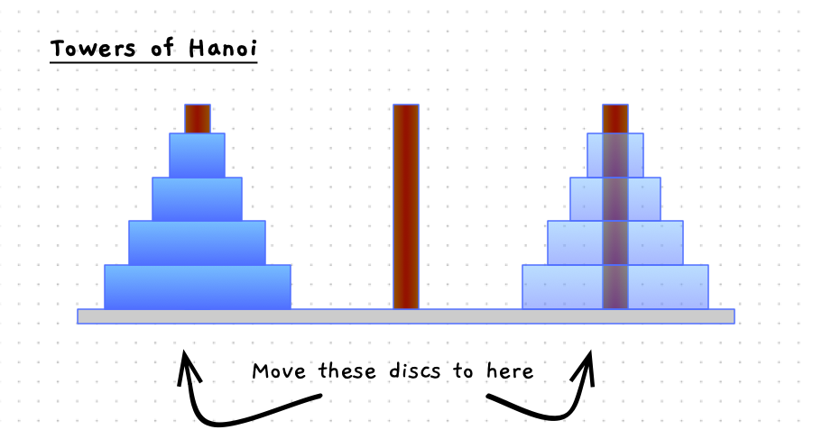

import { Accordion, AccordionItem } from 'accessible-astro-components'
import MySwiper from "/src/components/react/myswiper.jsx";
import HanoiSlide from "./images/hanoi/solution/hanoi.png";
import HanoiSlide0 from "./images/hanoi/solution/hanoi-00.png";
import HanoiSlide1 from "./images/hanoi/solution/hanoi-01.png";
import HanoiSlide2 from "./images/hanoi/solution/hanoi-02.png";
import HanoiSlide3 from "./images/hanoi/solution/hanoi-03.png";
import HanoiSlide4 from "./images/hanoi/solution/hanoi-04.png";
import HanoiSlide5 from "./images/hanoi/solution/hanoi-05.png";
import HanoiSlide6 from "./images/hanoi/solution/hanoi-06.png";
import HanoiSlide7 from "./images/hanoi/solution/hanoi-07.png";
import HanoiSlide8 from "./images/hanoi/solution/hanoi-08.png";
import HanoiSlide9 from "./images/hanoi/solution/hanoi-09.png";
import HanoiSlide10 from "./images/hanoi/solution/hanoi-10.png";
import HanoiSlide11 from "./images/hanoi/solution/hanoi-11.png";
import HanoiSlide12 from "./images/hanoi/solution/hanoi-12.png";
import HanoiSlide13 from "./images/hanoi/solution/hanoi-13.png";
import HanoiSlide14 from "./images/hanoi/solution/hanoi-14.png";

import HanoiRecursionSlide0 from "./images/hanoi/recursive/hanoi-00.png";
import HanoiRecursionSlide1 from "./images/hanoi/recursive/hanoi-01.png";
import HanoiRecursionSlide2 from "./images/hanoi/recursive/hanoi-02.png";
import HanoiRecursionSlide3 from "./images/hanoi/recursive/hanoi-03.png";

import HanoiRecursiveStepSlide0 from "./images/hanoi/recursive-step/hanoi-00.png";
import HanoiRecursiveStepSlide1 from "./images/hanoi/recursive-step/hanoi-01.png";
import HanoiRecursiveStepSlide2 from "./images/hanoi/recursive-step/hanoi-02.png";
import HanoiRecursiveStepSlide3 from "./images/hanoi/recursive-step/hanoi-03.png";
import HanoiRecursiveStepSlide4 from "./images/hanoi/recursive-step/hanoi-04.png";
import HanoiRecursiveStepSlide5 from "./images/hanoi/recursive-step/hanoi-05.png";
import HanoiRecursiveStepSlide6 from "./images/hanoi/recursive-step/hanoi-06.png";
import HanoiRecursiveStepSlide7 from "./images/hanoi/recursive-step/hanoi-07.png";

export const HanoiSwiper = [
    {
        src: HanoiSlide.src,
        altText: "Starting point",
        tips: []
    },
    {
        src: HanoiSlide0.src,
        altText: "Step 1",
        tips: []
    },
    {
        src: HanoiSlide1.src,
        altText: "Step 2",
        tips: []
    },
    {
        src: HanoiSlide2.src,
        altText: "Step 3",
        tips: []
    },
    {
        src: HanoiSlide3.src,
        altText: "Step 4",
        tips: []
    },
    {
        src: HanoiSlide4.src,
        altText: "Step 5",
        tips: []
    },
    {
        src: HanoiSlide5.src,
        altText: "Step 6",
        tips: []
    },
    {
        src: HanoiSlide6.src,
        altText: "Step 7",
        tips: []
    },
    {
        src: HanoiSlide7.src,
        altText: "Step 8",
        tips: []
    },
    {
        src: HanoiSlide8.src,
        altText: "Step 9",
        tips: []
    },
    {
        src: HanoiSlide9.src,
        altText: "Step 10",
        tips: []
    },
    {
        src: HanoiSlide10.src,
        altText: "Step 11",
        tips: []
    },
    {
        src: HanoiSlide11.src,
        altText: "Step 12",
        tips: []
    },
    {
        src: HanoiSlide12.src,
        altText: "Step 13",
        tips: []
    },
    {
        src: HanoiSlide13.src,
        altText: "Step 14",
        tips: []
    },
    {
        src: HanoiSlide14.src,
        altText: "Step 15",
        tips: []
    },
];

export const HanoiRecursionSwiper = [
    {
        src: HanoiRecursionSlide0.src,
        altText: "Starting point",
        tips: []
    },
    {
        src: HanoiRecursionSlide1.src,
        altText: "Step 1",
        tips: []
    },
    {
        src: HanoiRecursionSlide2.src,
        altText: "Step 2",
        tips: []
    },
    {
        src: HanoiRecursionSlide3.src,
        altText: "Step 3",
        tips: []
    },
];

export const HanoiRecursiveStepSwiper = [
    {
        src: HanoiRecursiveStepSlide0.src,
        altText: "Step 1",
        tips: []
    },
    {
        src: HanoiRecursiveStepSlide1.src,
        altText: "Step 2",
        tips: []
    },
    {
        src: HanoiRecursiveStepSlide2.src,
        altText: "Step 3",
        tips: []
    },
    {
        src: HanoiRecursiveStepSlide3.src,
        altText: "Step 4",
        tips: []
    },
    {
        src: HanoiRecursiveStepSlide4.src,
        altText: "Step 5",
        tips: []
    },
    {
        src: HanoiRecursiveStepSlide5.src,
        altText: "Step 6",
        tips: []
    },
    {
        src: HanoiRecursiveStepSlide6.src,
        altText: "Step 7",
        tips: []
    },
    {
        src: HanoiRecursiveStepSlide7.src,
        altText: "Step 8",
        tips: []
    },
];


The Towers of Hanoi is a puzzle involving moving discs between three poles. The rules are:

1. You must move all discs from pole 1 to pole 3.
2. You can only move one disc at a time.
3. Larger discs cannot be placed upon smaller ones.
4. Discs cannot be moved off the poles.

The start and end states are pictured in the image below.



Have a think about how to solve this, then we can think about how to build a program that will solve this for any given number of discs.

The following slider will step you through the solution to this when there are four discs on the starting pole. With 4 discs we need 15 moves to get the discs to the destination pole.

<MySwiper client:only height="" images={HanoiSwiper}></MySwiper>

## Recursive Solution

The recursive solution to this problem is quite elegant, with the bulk of the movements taken care of with only three lines of code! The secret is to think from the bottom up, and focus on only moving a single disc.

Have a look at the details in the following images. When you move the bottom disc, the steps involved are:

1. Move the discs above the current disc from pole 1 to pole 2, using pole 3 as the other pole.
2. Move the disc to pole 3.
3. Then, move the discs that were above the current disc from the pole 2, to pole 3.

<MySwiper client:only height="" images={HanoiRecursionSwiper}></MySwiper>

## Thinking this through

If you look at this, we can rename the poles to be `from_pole`, `destination_pole`, and `other_pole`. To start, we move the largest disc (4 in our example) from pole 1 (`from_pole`) to pole 3 (`destination_pole`) with pole 2 as the `other_pole`. Then the more general steps are:

1. Move `disc - 1` from the `from_pole` to the `other_pole`, using the `destination_pole` as a temporary holding area.
2. Move `disc` from `from_pole` to `destination_pole`.
3. Then, move `disc - 1` from the `other_pole`, to `destination_pole`, using the `from_pole` as a temporary holding area.

The following set of images will step you some way through this process. The grey arrows show the steps that are still in progress - these will be stack frames taking care of moving that disc. Notice how the destination switches between the different poles as you progress up from the bottom disc to the top, this is how the algorithm is taking care of selecting which pole should be used when.

<MySwiper client:only height="" images={HanoiRecursiveStepSwiper}></MySwiper>

In our case the *base case* will be when we get to disc 0 - there is no disc 0, so it can just return to the caller.

## Coding this up

Here is some starter code to get you started with this. Have a go at implementing this yourself. Then test it out with 4 discs and follow through with the first set of images from this page. You should be able to see all the steps that need to be taken printing out.

```cpp
#include "splashkit.h"

using std::to_string;

/**
 * Move the indicated disc from one pole to another - using the other pole as a temporary holding area.
 * 
 * @param n the disc number to move
 * @param from_pole the number of the pole to move from
 * @param destination_pole the number of the pole to move to
 * @param other_pole the number of the temporary holding pole
 */
void move_disc(int disc, int from_pole, int destination_pole, int other_pole)
{
    // Move `disc` from `from_pole` to `destination_pole`.
    write_line("Move disc " + to_string(disc) + " from pole " + to_string(from_pole) + " to pole " + to_string(destination_pole));
}

int main()
{
    int n = 3; // Number of discs
    int from_pole = 1;
    int destination_pole = 3;
    int other_pole = 2;

    // Move the discs using the Tower of Hanoi algorithm
    move_disc(n, from_pole, destination_pole, other_pole);

    return 0;
}
```

Have a go at implementing this yourself. Remember to check for the base case, and to implement the recursive path on a different path.

<Accordion>
  <AccordionItem
    header="Implement the towers of hanoi"
  >

```cpp {11-15,19-21}
/**
 * Move the indicated disc from one pole to another - using the other pole as a temporary holding area.
 * 
 * @param n the disc number to move
 * @param from_pole the number of the pole to move from
 * @param destination_pole the number of the pole to move to
 * @param other_pole the number of the temporary holding pole
 */
void move_disc(int disc, int from_pole, int destination_pole, int other_pole)
{
    // Base case: no discs to move
    if ( disc <= 0 ) return;

    // Move `disc - 1` from the `from_pole` to the `other_pole`, using the `destination_pole` as a temporary holding area.
    move_disc(disc - 1, from_pole, other_pole, destination_pole);

    // Move `disc` from `from_pole` to `destination_pole`.
    write_line("Move disc " + to_string(disc) + " from pole " + to_string(from_pole) + " to pole " + to_string(destination_pole));

    // Then, move `disc - 1` from the `other_pole`, to `destination_pole`.
    move_disc(disc - 1, other_pole, destination_pole, from_pole);
}
```

    </AccordionItem>
</Accordion>

When you have this working, try it with different numbers of discs.

:::tip

The key takeaway from all of this is to be able to think about each function independently. As you code up a function you can call on other functions to take care of part of the responsibilities for you. You will only rarely need to use recursion, but when you do, it can be a useful tool to have.

:::
