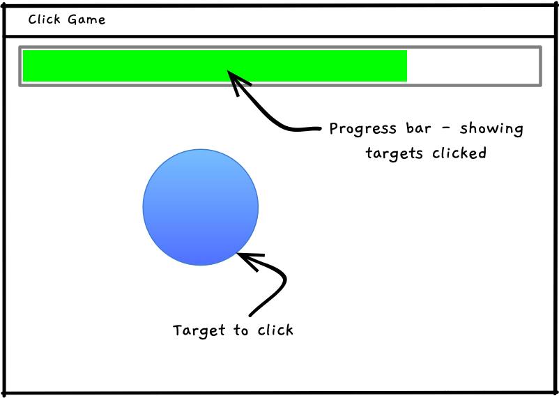

import NoCopy from '/src/components/NoCopy.astro'



<NoCopy>
For this activity, create a program that lets the user hit a number of circle targets.

The program will:

- Ask the user how many targets they want to hit.
- Loop while the user has not hit that many targets.
- Draw a filled circle target at a random location on the screen.
  - Draw a filled rectangle, showing the number of targets remaining to be hit.
- Check when targets are "hit", by the user clicking them, removing one from the targets remaining to be hit.
- Ends when the user has clicked the required number of targets.

Here is a sample execution.

```txt
Welcome to target click.

What is your target score: ten
Please enter a whole number
What is your target score: 10

Click 10 targets to end the game.

// a window opens, as shown above
// draw a target circle... (just one)
// when it is clicked...
//      Add one to the number hit
//      Change the position of the circle
// end after the player has hit the required number of targets
```

:::tip[Hints:]

Make sure you have at least the following functions and procedures:

- `target_hit`: accepts the position and size of the target, returns true if the user has clicked and the mouse is over the target.
- `draw_progress`: accepts parameters for the bar's location (x, y, width and height) and the percent fill. Use draw and fill rectangle to draw the progress bar to the screen at the location indicated.
- `read_string`, `read_integer`, `read_integer_range`, and `read_boolean` to read and validate input from the user.

:::
</NoCopy>

:::note[Useful SplashKit functions:]

You can use the [Point In Circle](https://splashkit.io/api/geometry/#point-in-circle-with-values) function to test if the mouse is in the circle. See [Mouse X](https://splashkit.io/api/input/#mouse-x) and [Mouse Y](https://splashkit.io/api/input/#mouse-y) to get the location of the mouse.

:::
