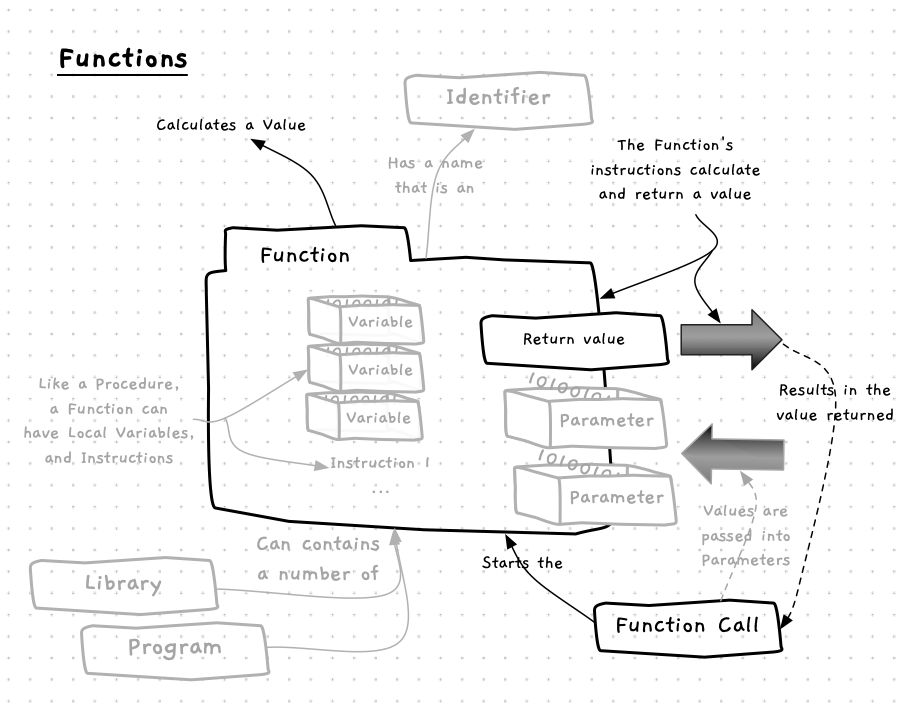
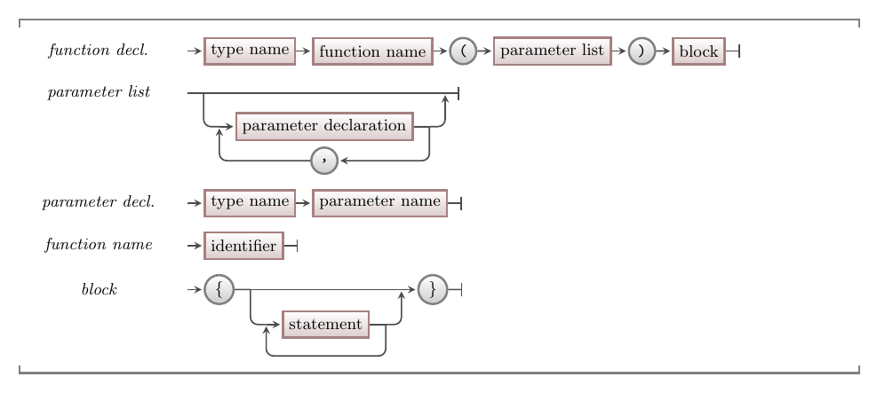

import { YouTube } from 'astro-embed';

Functions are used to **calculate values**. They are almost identical to procedures -- they have a name, contain instructions, and can be called to perform their actions. The *only* difference is what happens at the end. When a function ends, it [returns](/book/part-2-organised-code/2-organising-code/2-trailside/05-return) a value to the caller, whereas a procedure just ends. This means that procedures are called within [statements](/book/part-1-instructions/2-communicating-syntax/2-trailside/02-statement), whereas functions can be called within [expressions](/book/part-1-instructions/2-communicating-syntax/2-trailside/03-expression).



## Functions -- when, why, and how

Procedures are great as they let us group actions into isolated blocks of code. However, sometimes we need these blocks of code to **calculate** or **get** a value for us. In these cases we can create a function rather than a procedure. You can code the steps needed within the function to calculate or get the data needed, then anytime you need this value you can just call the function you created.

As with procedures, you can use a bottom-up or top-down approach to determining what functions your program will need.
Again, you are likely to use both approaches in tandem.

An important difference between procedures and functions is how you write the instructions they contain.
Because functions are *conceptually* different, they are *used* differently from procedures.
Procedures just contain instructions, so they are used as [statements].
Functions, however, return a value, so are valid [expressions] by themselves and can be used within other expressions.
Because of these different purposes, functions should generally not have any side effects when called (e.g., printing to the terminal).
There are no syntactic rules enforcing this, it is just considered bad practice to do so.

:::tip
You can think of procedures as tasks that perform an action, whereas functions are tasks that calculate a value. Procedures **do** things, and functions **calculate** things.
:::

## In C/C++

:::tip[Syntax]
The following diagram shows the syntax for a function declaration in C/C++.


:::

The syntax for a function declaration is very similar to the [syntax for a procedure declaration](/book/part-2-organised-code/2-organising-code/2-trailside/02-procedures#in-cc).
There are only two differences:

1. The function declaration starts with a data type name rather than `void`.
2. Most functions include a [return statement](/book/part-2-organised-code/2-organising-code/2-trailside/05-return) in the block to specify what value will be returned.

:::tip[What if there's no return?]
In C++, a function without a return statement results in [undefined behaviour](https://en.wikipedia.org/wiki/Undefined_behavior). This means that there is no standard for how the scenario will be handled. Your compiler by default will not warn you when your program has undefined behaviour.
:::

### Procedures as void functions

C/C++ does not have a strong distinction between functions and procedures. Technically, in C/C++ a procedure is just a function that returns a special `void` type. However, although there isn't really a difference in syntax between functions and procedures, it is still important to understand the conceptual difference between them.

## Examples

The code below shows an example of a simple function.
It is called `seconds_in_hour`, and returns an `int` value.
In this example we are showing you the syntax of a function declaration in practice, but we are also highlighting the concept of **scope**.
Notice that both `seconds_in_hour` and `main` have variables called `total`.
This is valid, and causes no conflicts, because each `total` variable is limited to the scope of their respective function.
They are entirely separate variables, with different locations in memory.

```cpp
#include "splashkit.h"

using std::to_string;

int seconds_in_hour()
{
    int total;
    total = 60 * 60;
    return total;
}

int main()
{
    int total;
    total = seconds_in_hour();
    write_line("There are " + to_string(total) + " seconds in an hour");

    return 0;
}
```

This example function is pretty trivial, and probably isn't something you would ever actually use -- a constant would be much more appropriate given all the values involved are unchanging literals.
Functions are much more useful when you can give them some data to work with.
We will explore how to do that next.

Now let's look at an example of a function with parameters.

There are three function declarations in the code below: `square`, `point_in_circle`, and `main`.
Each of these performs a number of steps and returns a value.

- The `square` function accepts a `val` parameter, and returns the square of this. This is achieved with a single line of code, but helps make the other code more readable.
- In `point_in_circle`, we accept parameters for the point (`pt_x` and `pt_y`) and the circle (`c_x`, `c_y`, and `c_radius`) and return a boolean value indicating if the point is within the circle. To achieve this, we can get the distance from the point to the center of the circle using the [Pythagorean theorem](https://en.wikipedia.org/wiki/Pythagorean_theorem), which we store in a local variable called `distance`, and then compare this with the circle's radius to get the result.
- The `main` function is the entry point, and returns a value that indicates if the program completed successfully or not. Returning 0 at the end indicates the program succeeded. Any other value is treated as an error code.

```cpp
#include "splashkit.h"

using std::to_string;
using std::sqrt;

double square(double val) 
{
    return val * val;
}

bool point_in_circle(double pt_x, double pt_y, double c_x, double c_y, double c_radius)
{
    double distance = sqrt(square(pt_x - c_x) + square(pt_y - c_y));
    return distance <= c_radius;
}

int main()
{
    write_line("5 squared is " + to_string(square(5)));

    write_line("A point at 1, 3 is in a circle at 0, 0, with radius 4: " + to_string(point_in_circle(1, 3, 0, 0, 4)) );

    return 0;
}
```

:::tip
To get the distance between the point and the center of the circle we are also using the [sqrt](https://en.cppreference.com/w/c/numeric/math/sqrt) function from the math standard library.
Don't worry if the maths here doesn't make sense -- it is not the point of the example!
Focus on how the function parameters are used.
:::

Notice we can use the `square` function in the calculation in `point_in_circle`. Once you have a function that calculates something, you can call it any time you need that value.

The great thing about parameters is that they really help you **generalise** what your functions and procedures can do. By accepting a value parameter, the `square` function can be used to square *any* `double` value. Similarly, by accepting parameters for the point and circle, the `point_in_circle` function can work for *any* point in *any* circle.

:::note[Summary]

- A function is a **construct** that you can create and use in your code.
- A function contains code to calculate a value. When you want this value, you call the function.
- Pure functions should have side effects, and always return the same value for the same input.
- Each function's instructions are **isolated** from the other code in your program.
- Functions are very similar to [procedures](/book/part-2-organised-code/2-organising-code/2-trailside/02-procedures):
  - The syntax for is similar. The only change is that the function starts with a data type indicating what it returns, instead of `void`.
  - They both have parameters to accept the arguments.
  - They are called in the same way, except that a procedure call is a [statement](/book/part-1-instructions/1-sequence/5-reference/01-sequence) while a function call can also be used in an experssion.
- The **procedure or function call** must provide argument values for each of the function or procedure's parameters.
- Within the function or procedure, the parameters can be used in the same way as any other
variables.
- It is **good practice** to use parameters to pass values into a function or procedure.

:::


:::note[Summary]


:::

