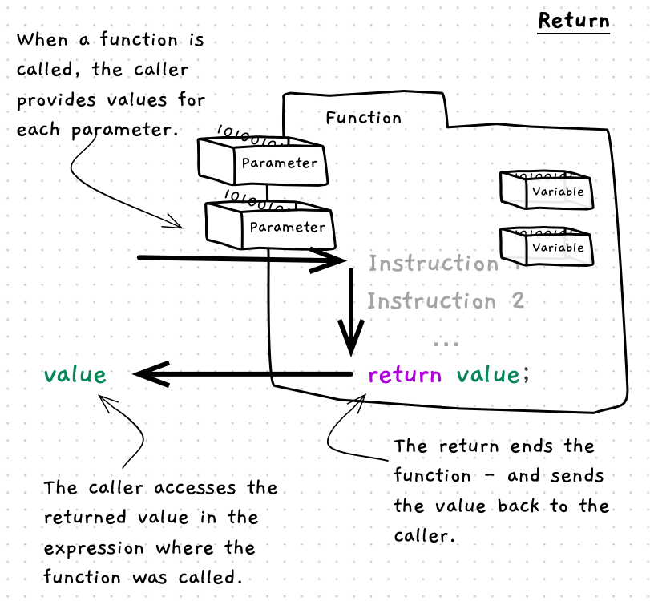

import MySwiper from '../../../../../../components/react/myswiper.jsx'

import sliderReturn01 from './images/slider-return/Slide1.png';
import sliderReturn02 from './images/slider-return/Slide2.png';
import sliderReturn03 from './images/slider-return/Slide3.png';
import sliderReturn04 from './images/slider-return/Slide4.png';
import sliderReturn05 from './images/slider-return/Slide5.png';
import sliderReturn06 from './images/slider-return/Slide6.png';
import sliderReturn07 from './images/slider-return/Slide7.png';
import sliderReturn08 from './images/slider-return/Slide8.png';

export const sliderReturn = [
  {
    src: sliderReturn01.src,
    altText: "The user launches the program from the command line. The program runs and starts at the main() function on line 1",
    tipStart: 1,
    tips: [
      "The user launches the program from the command line.",
      "The program runs and starts at the <code>main()</code> function on line 1.",
      "The program counter increments to line 2, then line 3."
    ]
  },
  {
    src: sliderReturn02.src,
    altText: "Line 2 contains a call to write_line(), whose parameter contains a call to test_return() function which will be evaluated first",
    tipStart: 2,
    tips: [
      "Line 2 contains a call to <code>write_line()</code>.",
      "The argument given to <code>write_line()</code> includes a call to the <code>test_return()</code> function.",
      "The program counter jumps to line 6, the start of the <code>test_return()</code> function.",
      "The program counter increments to line 7, then line 8, the first line of the function body."
    ]
  },
  {
    src: sliderReturn03.src,
    altText: "The first line (line 7) of test_return() contains a call to write_line() which prints 'test-return started' to the terminal",
    tipStart: 3,
    tips: [
      "Line 8 contains a call to <code>write_line()</code> which prints 'test-return started' to the terminal.",
      "The program counter increments to line 9."
    ]
  },
  {
    src: sliderReturn04.src,
    altText: "Line 8 then contains a return statement which immediately returns the integer value 3 to the caller, by-passing any other lines below it within the function",
    tipStart: 4,
    tips: [
      "Line 8 contains a <code>return</code> statement.",
      "It will <strong>immediately</strong> return the integer value 3 to the caller, skipping any other lines below it within the function.",
      "Execution skips to the end of the function (line 11) before returning to the caller (line 3).",
      "This means that the <code>write_line()</code> call at line 10 will never be run."
    ]
  },
  {
    src: sliderReturn05.src,
    altText: "Line 2 then finishes executing by printing its output to the terminal. In doing so, it utilizes the value 3 which was returned from the call to test_return()",
    tipStart: 5,
    tips: [
      "Line 2 then finishes executing by printing its output to the terminal.",
      "In doing so, it utilizes the value 3 which was returned from the call to <code>test_return()</code>.",
      "The program counter is incremented to line 4."
    ]
  },
  {
    src: sliderReturn06.src,
    altText: "The main() function ends with another return statement - It returns the integer value 0 to the caller",
    tipStart: 6,
    tips: [
      "At line 4 the <code>main()</code> function ends with another <code>return</code> statement.",
      "It returns the integer value 0 (success) to the caller, which in this case is the bash shell."
    ]
  },
  {
    src: sliderReturn07.src,
    altText: "The caller receives the return value, and the program ends",
    tipStart: 7,
    tips: [
      "The caller receives the return value, and the program ends.",

    ]
  },
  {
    src: sliderReturn08.src,
    altText: "In bash shell on linux, the built-in environment variable '$?' contains the status of the last command that was run. We can view this by running an 'echo' statement on the command line which will print the status to the terminal. You can see that the test-return program returned 0 to the shell",
    tipStart: 8,
    tips: [
      "In bash shell on linux, the built-in environment variable '<code>$?</code>' contains the status of the last command that was run.",
      "We can view this by running an '<code>echo</code>' statement on the command line which will print the status to the terminal.",
      "You can see that the test-return program returned 0 to the shell."
    ]
  }
];

The return statement is a kind of [jump statement](/book/part-1-instructions/3-control-flow/5-reference/05-0-jumping) that ends the current [function](/book/part-2-organised-code/1-structuring-code/5-reference/04-function-decl) or [procedure](/book/part-2-organised-code/1-structuring-code/5-reference/02-procedures). In a function, you use the return statement to provide the value that is sent back to the caller.


{/*TODO: add dotted paper background*/}

## Return -- when, why, and how

There are a couple of reasons why you may want to add a return statement to end the current function or procedure. In a function, you must end with a return statement to provide the value to be returned to the caller. However, you can also use a return statement to exit out of a procedure before reaching the end of its code.

When you use a return statement to exit a function or procedure early, you need something like an [if statement](/book/part-1-instructions/3-control-flow/5-reference/03-1-if) that checks if you should exit, and then put the return statement within the body of the if. This can be used when you know that the procedure or function only works in certain circumstances. For example, in the [change calculator](/book/part-1-instructions/3-control-flow/3-guided-tour/2-0-change-calculator) we could exit early if the user has not paid enough for the item, or have provided the exact value.

## In C/C++

:::tip[Syntax]

The following diagram shows the syntax for a return statement.


:::

A return statement is quite simple -- it is the word "return", followed by an optional expression, then a semicolon.
The use of an expression depends on whether you are using the return statement in a function or procedure:

- In a function, a return statement **must** have an expression.
- In a procedure, a return statement **must not** have an expression.

This is because a function returns a value, whereas a procedure does not.

When the return statement is executed the function or procedure ends and control is passed back to the calling statement.
If the return statement is in a function, the expression is evaluated and the value is returned to the caller.

## Examples

The following code shows the use of a return statement.
Note how the final line in `test_return` does not execute because the return statement is before it in the sequence of instructions.

```cpp
#include "splashkit.h"

using std::to_string;

int test_return() 
{
    write_line("test-return started");
    return 3;
    write_line("Cannot be run as code returned above!");
}

int main()
{
    write_line("Calling test_return - the value " + to_string(test_return()) + " is returned\n");
    return 0;
}

```

Let's explore how this code works.

<MySwiper client:only height="" images={sliderReturn}></MySwiper>

For other examples, have a look back at the [example using parameters](/book/part-2-organised-code/1-structuring-code/5-reference/04-function-decl#examples). The `square` function uses the return statement to return the squared value, while `point_in_circle` returns the value from the comparison to indicate if the point is within the circle.

:::note[Summary]

- Return is an **instruction** allowing you to jump out of the current function or procedure and back to the calling code.
- Return also allows you to specify the value to give back to the calling code from a function.
- Return statements can be combined with [branching](/book/part-1-instructions/3-control-flow/5-reference/03-0-branching) statements to selectively end if necessary.
- In a function, a return statement **must** have an expression.
- In a procedure, a return statement **must not** have an expression.

:::
