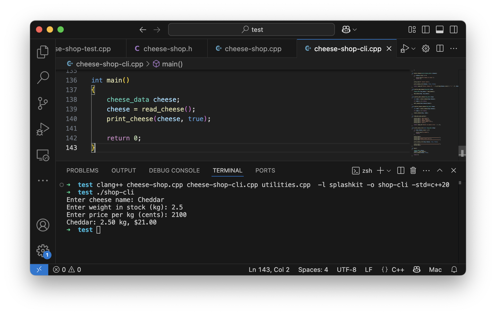
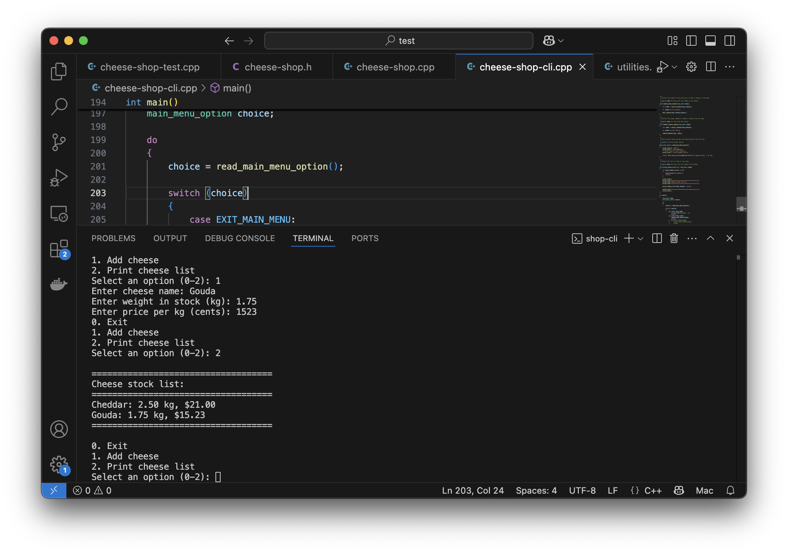

import { Accordion, AccordionItem } from 'accessible-astro-components'

We now have some basic code to work with cheese data. As a next step we can start to build the cheese shop with some basic stock management functionality - the ability to add, edit, and delete cheese within the cheese shop.

## Creating the Cheese Shop

In most cases the first part of any additional functionality will involve add in additional data elements. In this case we need to add the `cheese_shop_data` struct, which at the moment only needs to contain the dynamic array of cheeses.

:::tip

Use your own dynamic array if you can, otherwise use a `vector` to store the cheeses.

:::

<Accordion>
  <AccordionItem
    header="Code cheese data type and new cheese in header"
  >

```cpp {2,5,21-29}
#include <string>
#include <vector> // or your dynamic array header

using std::string;
using std::vector; // unless using your dynamic array

/**
 * Data about a cheese within an order or in stock.
 * 
 * @field name The name of the cheese.
 * @field weight The weight of the cheese in stock (kg).
 * @field price_per_kg The price of the cheese per kg (cents).
 */
struct cheese_data
{
    string name;
    double weight;
    int price_per_kg;  
};

/**
 * Data about the cheese shop - the stock on hand.
 * 
 * @field cheeses The list of cheeses in stock.
 */
struct shop_data
{
    vector<cheese_data> cheeses; // or your dynamic array
};

//...
```

  </AccordionItem>
</Accordion>

## Reading and adding cheese

With the shop existing in our data, we can add the code to read a cheese from the user and add it to the store's cheese list. We will need:

- Model and unit test changes:
  - An `add_cheese` procedure - adds the cheese to the end of our dynamic array / vector. Accepts parameters for the shop and the cheese to add.
  - Tests to check add cheese functions.
- Shop CLI changes:
  - `read_cheese` function - writes prompts, reads values from the user, and returns cheese data with these details.
  - `handle_add_cheese` procedure - accepts the shop. Reads cheese, and adds it to the shop.
  - `print_stock_list` procedure - accepts the shop and outputs the cheese within it.
  - Add a `main_menu_option` enumeration - this should contain each option from the menu: `EXIT_MAIN_MENU`, `ADD_CHEESE_MENU`, and `PRINT_STOCK_LIST_MENU`.
  - `read_main_menu` function - outputs a menu, has the user pick one of the options, and returns the chosen option to the caller. This will use the `main_menu_option`.

Approach this in the following order:

1. Add the following unit test. It captures the way we want `add_cheese` to be used. We have a shop, and the cheese is populated and added, meaning that it can be accessed within the shop. At this point it will not compile, as `add_cheese` does not exist - but now we know what it needs to look like.

    ```cpp
    TEST_CASE("Shop - Can add cheese to the shop")
    {
        shop_data shop;

        cheese_data cheese = new_cheese("Cheddar", 1.5, 2000);
        add_cheese(shop, cheese);

        REQUIRE(shop.cheeses.size() == 1);
        REQUIRE(shop.cheeses[0].name == "Cheddar");
        REQUIRE(shop.cheeses[0].weight == Approx(1.5));
        REQUIRE(shop.cheeses[0].price_per_kg == 2000);

        // Add another cheese
        cheese = new_cheese("Gouda", 2.0, 1500);
        add_cheese(shop, cheese);

        REQUIRE(shop.cheeses.size() == 2);
        REQUIRE(shop.cheeses[1].name == "Gouda");
        REQUIRE(shop.cheeses[1].weight == Approx(2.0));
        REQUIRE(shop.cheeses[1].price_per_kg == 1500);
        // Check the first cheese again
        REQUIRE(shop.cheeses[0].name == "Cheddar");
        REQUIRE(shop.cheeses[0].weight == Approx(1.5));
        REQUIRE(shop.cheeses[0].price_per_kg == 2000);
    }
    ```

2. Add the `add_cheese` header to the **cheese-shop.h** header file. If you compile now it should fail with a linker error, indicating that the `add_cheese` function does not exist. This will validate that you have the header correctly coded.
3. Now you can add the implementation to **cheese-shop.cpp**. This should now compile, and you can make sure that it functions correctly.

    At this point you have the new functionality in the model, and we can switch to the user interface code.
4. Create the `read_cheese` function. We can use our **utilities** code to read a string for the cheese name, a double for its weight, and an integer for its price. Use these to populate a `cheese_data` value and return it to the caller.
5. Test this by adjusting `main`.

   
6. Now you can add the `handle_add_cheese` procedure. This accepts the shop and uses your `read_cheese` to get the data, and then pass this to `add_cheese` to add the new cheese into the shop.
7. In order to see that this has worked, we need to add the `print_stock_list` procedure. This should output a report listing all the stock within the shop. Add a header and footer to the report to make sure that it is easy to see where it starts and ends.
8. With these in place you can now update `main`. Remove the cheese, and put in a shop. Initially this can just be some small test code, so you can see it work.
9. Finish up by creating a `read_main_menu`. This can output options for 0: Quit, 1: Add Cheese, and 2: Print Stock List - matching the values in the `main_menu_option`. Then update main to read the user's choice into a variable, loop while they do not choose to quit, either adding cheese (with `handle_add_cheese`) or printing the stock list.

    Run your program, and you should see we now have a functional component.



<Accordion>
  <AccordionItem
    header="Code for read and edit"
  >

Changes in **cheese-shop.h**:

```cpp
#include <string>
//...

/**
 * Add a new cheese to the shop's cheese list.
 * 
 * @param shop the shop's data
 * @param new_cheese the cheese to add
 */
void add_cheese(shop_data &shop, const cheese_data &new_cheese);
```

Changes in **cheese-shop.cpp**:

```cpp
//...

void add_cheese(shop_data &shop, const cheese_data &new_cheese)
{
    shop.cheeses.push_back(new_cheese); // or equivalent using your dynamic array
}
```

Changes to **cheese-shop-cli.cpp**:

```cpp
#include "splashkit.h"
#include "utilities.h"
#include "cheese-shop.h"

#include <format>
using std::format;

/**
 * The list of options in the main menu.
 * 
 * @option EXIT_MAIN_MENU The option to exit the main menu.
 * @option ADD_CHEESE_MENU The option to add a cheese.
 * @option PRINT_STOCK_LIST_MENU The option to print the stock list.
 */
enum main_menu_option
{
    EXIT_MAIN_MENU,
    ADD_CHEESE_MENU,
    PRINT_STOCK_LIST_MENU
};

/**
 * Output the cheese data to the terminal - on a single line.
 * 
 * @param cheese the cheese data to output
 */
void print_cheese(const cheese_data &cheese, bool with_full_details)
{
    write_line(cheese_to_string(cheese, with_full_details));
}

/**
 * Read data from the user and populate and return the cheese
 * data to the caller.
 * 
 * @return cheese_data populated with the data read from the user
 */
cheese_data read_cheese()
{
    cheese_data result;

    result.name = read_string("Enter cheese name: ");
    result.weight = read_double("Enter weight in stock (kg): ");
    result.price_per_kg = read_integer("Enter price per kg (cents): ");

    return result;
}

/**
 * Perform the steps needed to add a cheese to the shop.
 * 
 * @param shop the shop where the cheese is to be added.
 */
void handle_add_cheese(shop_data &shop)
{
    cheese_data new_cheese = read_cheese();

    add_cheese(shop, new_cheese);
}

/**
 * Show the main menu and get the chosen option from the user.
 * 
 * @return int the chosen option.
 */
main_menu_option read_main_menu_option()
{
    write_line("0. Exit");
    write_line("1. Add cheese");
    write_line("2. Print cheese list");

    return (main_menu_option)read_integer("Select an option (0-2): ", 0, 2);
}

/**
 * Output the list of stock in the shop.
 * 
 * @param shop the shop with the cheese to be output
 */
void print_stock_list(const shop_data &shop)
{
    if (shop.cheeses.size() == 0)
    {
        write_line("No cheese");
        return;
    }

    write_line();
    write_line("===================================");
    write_line("Cheese stock list:");
    write_line("===================================");

    for (int i = 0; i < cheeses.size(); i++)
    {
        print_cheese(shop.cheeses[i], true);
    }

    write_line("===================================");
    write_line();
}

int main()
{
    shop_data shop;
    main_menu_option choice;

    do
    {
        choice = read_main_menu_option();

        switch (choice)
        {
            case EXIT_MAIN_MENU:
                write_line("Exiting...");
                break;
            case ADD_CHEESE_MENU:
                handle_add_cheese(shop);
                break;
            case PRINT_STOCK_LIST_MENU:
                print_stock_list(shop);
                break;
        }
    } while (choice != EXIT_MAIN_MENU);

    return 0;
}

```

  </AccordionItem>
</Accordion>

## Editing cheese

With adding in place, we can now implement editing. Thinking through this, we need a way of selecting the cheese to edit, as well as user interface code to indicate which aspects need to change and provide the updated details.

To achieve this we can make the following changes:

- Shop CLI changes:
  - Refactor `print_stock_list` to separate out the code to print the list of cheese, so we can use it in `select_cheese`. For select cheese, we will print a number next to each cheese, which we won't do for the stock list. The new `print_stock_list` will now output a header, call `print_cheese_list`, and the output its footer.
  - `print_cheese_list` will accept the dynamic array (or vector) of cheeses and a boolean to indicate if this should include the index number (starting at 1) next to each cheese. It will loop through the cheeses. If it needs to output the index it can `write` the value of the current index. Then it will print the cheese details.
  - Add a `select_cheese` function - this can output an option "0: Select None", and then call `print_cheese_list` passing in the shop's list of cheese, and true to show the index. It will then return the integer the user enters at a "Select option: " prompt, minus 1 (making this the index of the cheese or -1 for none).
  - `handle_edit_cheese`: will be passed the shop, and can call `select_cheese` to get the index of the cheese to edit. 
  - `edit_cheese`: will accept a cheese by reference and check with the user which aspects to be edited. This could be done via a menu, or by asking for each field. In either case, you need to update the values in the cheese based on the user's intention. This will update the data in referenced cheese, ensuring that the edits are applied correctly.
  - Update `read_main_menu` and `main` to add an extra menu option and call `handle_edit_cheese` when that option is called.


<Accordion>
  <AccordionItem
    header="Code for editing cheese"
  >

Updated sections for **cheese-shop-cli.cpp**:

```cpp {13,20,51-72,74-91,93-113,127-139,150,153,197-199}
#include "splashkit.h"
#include "utilities.h"
#include "cheese-shop.h"

#include <format>
using std::format;

/**
 * The list of options in the main menu.
 * 
 * @option EXIT_MAIN_MENU The option to exit the main menu.
 * @option ADD_CHEESE_MENU The option to add a cheese.
 * @option EDIT_CHEESE_MENU The option to edit a cheese.
 * @option PRINT_STOCK_LIST_MENU The option to print the stock list.
 */
enum main_menu_option
{
    EXIT_MAIN_MENU,
    ADD_CHEESE_MENU,
    EDIT_CHEESE_MENU,
    PRINT_STOCK_LIST_MENU
};

/**
 * Output the cheese data to the terminal - on a single line.
 * 
 * @param cheese the cheese data to output
 */
void print_cheese(const cheese_data &cheese, bool with_full_details)
{
    write_line(cheese_to_string(cheese, with_full_details));
}

/**
 * Read data from the user and populate and return the cheese
 * data to the caller.
 * 
 * @return cheese_data populated with the data read from the user
 */
cheese_data read_cheese()
{
    cheese_data result;

    result.name = read_string("Enter cheese name: ");
    result.weight = read_double("Enter weight in stock (kg): ");
    result.price_per_kg = read_integer("Enter price per kg (cents): ");

    return result;
}

/**
 * Allow the user to edit the passed in cheese.
 * 
 * @param cheese a reference to the cheese to be updated.
 */
void edit_cheese(cheese_data &cheese)
{
    write_line("Editing cheese: " + cheese_to_string(cheese, true));
    
    if ( read_integer("Do you want to edit the name? (1 for yes, 0 for no): ", 0, 1) == 1 )
    {
        cheese.name = read_string("Enter new cheese name: ");
    }
    if ( read_integer("Do you want to edit the weight? (1 for yes, 0 for no): ", 0, 1) == 1 )
    {
        cheese.weight = read_double("Enter new weight in stock (kg): ");
    }
    if ( read_integer("Do you want to edit the price? (1 for yes, 0 for no): ", 0, 1) == 1 )
    {
        cheese.price_per_kg = read_integer("Enter new price per kg (cents): ");
    }
}

/**
 * Output these cheeses - optionally with the index.
 * 
 * @param cheeses the details to output
 * @param with_ids true if an index (1 based) should be included in the output
 */
void print_cheese_list(const vector<cheese_data> &cheeses, bool with_ids)
{
    for (int i = 0; i < cheeses.size(); i++)
    {
        cheese_data cheese = cheeses[i];
        if (with_ids)
        {
            write(format("{}: ", i + 1));
        }
        print_cheese(cheese, true);
    }
}

/**
 * Ask the user to select a cheese from the supplied list. Thsi returns the
 * index of the chosen cheese, or -1 if none are selected.
 * 
 * @param cheeses the cheese to output
 * @return int the index of the choseen cheese or -1 if none
 */
int select_cheese(vector<cheese_data> &cheeses)
{
    if (cheeses.size() == 0)
    {
        write_line("No cheese in stock.");
        return -1;
    }

    write_line("0: Select none");

    print_cheese_list(cheeses, true);

    return read_integer("Select cheese (0 - " + to_string(cheeses.size()) + "): ", 0, cheeses.size()) - 1;
}

/**
 * Perform the steps needed to add a cheese to the shop.
 * 
 * @param shop the shop where the cheese is to be added.
 */
void handle_add_cheese(shop_data &shop)
{
    cheese_data new_cheese = read_cheese();

    add_cheese(shop, new_cheese);
}

/**
 * Perform the steps to allow the user to edit a cheese in the shop.
 * 
 * @param shop the shop with the cheese to be edited
 */
void handle_edit_cheese(shop_data &shop)
{
    int index = select_cheese(shop.cheeses);

    if (index == -1) return;

    edit_cheese(shop.cheeses[index]);
}

/**
 * Show the main menu and get the chosen option from the user.
 * 
 * @return int the chosen option.
 */
main_menu_option read_main_menu_option()
{
    write_line("0. Exit");
    write_line("1. Add cheese");
    write_line("2. Edit cheese");
    write_line("3. Print cheese list");

    return (main_menu_option)read_integer("Select an option (0-3): ", 0, 3);
}

/**
 * Output the list of stock in the shop.
 * 
 * @param shop the shop with the cheese to be output
 */
void print_stock_list(const shop_data &shop)
{
    if (shop.cheeses.size() == 0)
    {
        write_line("No cheese");
        return;
    }

    write_line();
    write_line("===================================");
    write_line("Cheese stock list:");
    write_line("===================================");

    print_cheese_list(shop.cheeses, false);

    write_line("===================================");
    write_line();
}

int main()
{
    shop_data shop;
    main_menu_option choice;

    do
    {
        choice = read_main_menu_option();

        switch (choice)
        {
            case EXIT_MAIN_MENU:
                write_line("Exiting...");
                break;
            case ADD_CHEESE_MENU:
                handle_add_cheese(shop);
                break;
            case EDIT_CHEESE_MENU:
                handle_edit_cheese(shop);
                break;
            case PRINT_STOCK_LIST_MENU:
                print_stock_list(shop);
                break;
        }
    } while (choice != EXIT_MAIN_MENU);

    return 0;
}

```

  </AccordionItem>
</Accordion>

## Deleting cheese

Have a go at adding the ability to delete stock from the shop. This will need:

- Changes to the model and tests:
  - Add function to delete cheese from the shop
- Changes to the CLI:
  - Extend enumeration, and add menu options
  - Add code to handle the user interacts (using select cheese)

:::tip
If you are using the `vector<cheese_data>`, you can remove an element at an index using: `shop.cheeses.erase(shop.cheeses.begin() + index);`. This is not the most intuitive library, but you can easily find this with a quick web search or prompt to a generative AI.
:::
