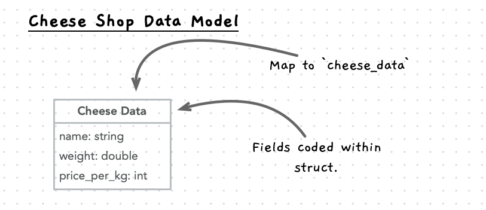

import { Accordion, AccordionItem } from 'accessible-astro-components'

Now we can start building this out using a test driven development approach. This approach involves creating tests to help us build and validate our code as we go.

## Setting up the project

1. Create a folder for your project.
2. Download the testing framework code:
   - [catch_amalgamated.hpp](https://raw.githubusercontent.com/catchorg/Catch2/refs/heads/devel/extras/catch_amalgamated.hpp)
   - [catch_amalgamated.cpp](https://raw.githubusercontent.com/catchorg/Catch2/refs/heads/devel/extras/catch_amalgamated.cpp)
3. Create the following files:
   - **cheese-shop.h**: a header file for our shared functions and data types.
   - **cheese-shop-test.cpp**: the code for our tests.
   - **cheese-shop.cpp**: the code for the model of our program.
   - **cheese-shop-cli.cpp**: the command line interface (CLI) code.
  
## Decide what to build first

Now you need to work out what to build first. We could build any part we want, but generally I would start with a core component that can be isolated from other parts - something we can build without needing other aspects to already be in place. This tends to mean starting with lower level aspects and building up from there to the larger entities.

For the cheese shop, the shop and orders require details of cheeses, meaning we probably want to start with the cheese data in this case.

With the focus on cheese, we need to refine this further to think about what we want to do with the cheese. Here we have multiple aspects to think about - the model and the user interface. Initially we can build a command line interface and then think later about how we can create a GUI or web application.

## Initial Cheese Functionality

In terms of the model, there are a few things we can code up for our cheese entity.

- Initialise a cheese value - making sure that it has sensible default values.
- Calculate total cost - used to calculate the value of a cheese given its details (weight and price per kilogram).
- Reduce weight - can be used to reduce the quantity of cheese.

### Initialise Cheese

The first thing we can code is the `new_cheese` function. This will initialise a cheese value, using passed in parameter values, and return it to the caller. We can use [default parameters](/book/part-2-organised-code/10-project/move-0-panorama/5-cpp-utilities), so the caller can choose not to provide any details, and get back a cheese value with an empty name, and 0 weight and price per kilogram.

Start by adding the `cheese_data` type, and adding a function header for the `new_cheese` function, to the **cheese-shop.h** header file. This will provide access to these to anything that includes the header.

Here is a good starting point. Have a go at coding this up yourself.

```cpp
#include <string>

using std::string;

//TODO: Declare cheese data struct here

//TODO: Declare new cheese header here
```

Use the details from your data model when coding up the struct. Remember to add documentation to your struct and function header. These will be useful for capturing what you are doing and will be used by Visual Studio Code to help describe your code as you go.



<Accordion>
  <AccordionItem
    header="Code cheese data type and new cheese in header"
  >

```cpp {5-17,19-27}
#include <string>

using std::string;

/**
 * Data about a cheese within an order or in stock.
 * 
 * @field name The name of the cheese.
 * @field weight The weight of the cheese in stock (kg).
 * @field price_per_kg The price of the cheese per kg (cents).
 */
struct cheese_data
{
    string name;
    double weight;
    int price_per_kg;  
};

/**
 * Initialise a cheese_data value - with parameters to initialise the name,
 * weight, and price_per_kg.
 * 
 * @param name The name of the cheese. Defaults to an empty string.
 * @param weight The weight of the cheese in stock (kg). Defaults to 0.0.
 * @param price_per_kg The price of the cheese per kg (cents). Defaults to 0.
 */
cheese_data new_cheese(string name = "", double weight = 0.0, int price_per_kg = 0);

```

  </AccordionItem>
</Accordion>

### Test first

Writing the test first will help us think through how this works, and that will further validate that what we have designed will be able to do what we need. Initially, the tests will fail, so when they do pass we know that we have built the necessary functionality (as long as our tests are exhaustive).

Start with the following - this will check that when we call `new_cheese` and pass in no arguments, we get back an initialised `cheese_data` value with an empty name and 0s for the weight and price. Have a go at adding additional test cases that will check that you can pass in arguments, and that these are used to update values within the returned struct.

```cpp
#include "catch_amalgamated.hpp"
#include "cheese-shop.h"

using Catch::Approx;

TEST_CASE("Cheese - Create new cheese with default values")
{
    cheese_data cheese;
    cheese = new_cheese();

    REQUIRE(cheese.name == "");
    REQUIRE(cheese.weight == 0.0);
    REQUIRE(cheese.price_per_kg == 0);
}

//TODO: Add a test to check that you can pass in different values and these
//      are used to set the fields
```

:::tip
Remember that floating point values, such as the weight, can end up with rounding errors that make them imprecise. When checking these values with this unit testing framework you can use the `Approx` class to check that the value is close enough to the expected value without it having to be exactly correct. For example `REQUIRE(cheese.weight == Approx(1.5));`.
:::

<Accordion>
  <AccordionItem
    header="Code for additional test cases"
  >

```cpp {16-26}
#include "catch_amalgamated.hpp"
#include "cheese-shop.h"

using Catch::Approx;

TEST_CASE("Cheese - Create new cheese with default values")
{
    cheese_data cheese;
    cheese = new_cheese();

    CHECK(cheese.name == "");
    CHECK(cheese.weight == 0.0);
    CHECK(cheese.price_per_kg == 0);
}

// Other cases to check passing in 1 or 2 arguments

TEST_CASE("Cheese - Provide name, weight, and price values for new cheese")
{
    cheese_data cheese;
    cheese = new_cheese("Cheddar", 1.5, 2000);

    REQUIRE(cheese.name == "Cheddar");
    REQUIRE(cheese.weight == Approx(1.5));
    REQUIRE(cheese.price_per_kg == 2000);
}

```

  </AccordionItem>
</Accordion>

We can try to compile this, using the following at the command line:

```sh
clang++ cheese-shop.cpp cheese-shop-test.cpp catch_amalgamated.cpp -l splashkit -o test
```

This should fail, as we have not yet coded the `new_cheese` function. The message you should get will be something like this:

```txt
Undefined symbols for architecture arm64:
  "new_cheese(std::__1::basic_string<char, std::__1::char_traits<char>, std::__1::allocator<char>>, double, int)", referenced from:
      CATCH2_INTERNAL_TEST_0() in cheese-shop-test-af1e39.o
      CATCH2_INTERNAL_TEST_2() in cheese-shop-test-af1e39.o
ld: symbol(s) not found for architecture arm64
clang++: error: linker command failed with exit code 1 (use -v to see invocation)
```

### Passing the Tests

Now we can start by implementing the code for the test. A true test driven style would aim to write as little code as possible, but enough to get the test to pass. This helps ensure that you have exhaustive test.

Open your **cheese-shop.cpp** file and implement an initial version of `new_cheese`. Add in the parameters (but without defaults here - as the header takes care of these) but just have it return the default struct. Like this:

```cpp
#include "cheese-shop.h"

cheese_data new_cheese(string name, double weight, int price_per_kg)
{
    cheese_data cheese;
    return cheese;
}
```

Now compile and run the program. You should see a report that looks like this:

```txt
Randomness seeded to: 3461913094

~~~~~~~~~~~~~~~~~~~~~~~~~~~~~~~~~~~~~~~~~~~~~~~~~~~~~~~~~~~~~~~~~~~~~~~~~~~~~~~
test is a Catch2 v3.8.1 host application.
Run with -? for options

-------------------------------------------------------------------------------
Cheese - Create new cheese with default values
-------------------------------------------------------------------------------
cheese-shop-test.cpp:6
...............................................................................

cheese-shop-test.cpp:12: FAILED:
  CHECK( cheese.weight == 0.0 )
with expansion:
  0.0 == 0.0

cheese-shop-test.cpp:13: FAILED:
  CHECK( cheese.price_per_kg == 0 )
with expansion:
  1830838720 (0x6d2061c0) == 0

-------------------------------------------------------------------------------
Cheese - Provide name, weight, and price values for new cheese
-------------------------------------------------------------------------------
cheese-shop-test.cpp:16
...............................................................................

cheese-shop-test.cpp:21: FAILED:
  REQUIRE( cheese.name == "Cheddar" )
with expansion:
  "" == "Cheddar"

===============================================================================
test cases: 2 | 2 failed
assertions: 4 | 1 passed | 3 failed
```

It shows that the tests have failed. The first test may pass, if you happen to have 0s in the right place on the stack initially, but that wasn't the case for me. So now we have the tests running, we can go ahead and make them pass.

Add the code to initialise the `cheese` data within the `new_cheese` function using the parameters provided.

<Accordion>
  <AccordionItem
    header="Code for new cheese"
  >
```cpp {6-8}
#include "cheese-shop.h"

cheese_data new_cheese(string name, double weight, int price_per_kg)
{
    cheese_data cheese;
    cheese.name = name;
    cheese.weight = weight;
    cheese.price_per_kg = price_per_kg;
    return cheese;
}
```

  </AccordionItem>
</Accordion>

Once you have the tests passing, we can then turn to building a start at the command line interface version for the program. This will use the model, and provide the code that controls the actions on the model, and collects and displays information to the user.

### Starting the command line interface

In the **cheese-shop-cli.cpp** file we need to add the following functions and procedures:

- `print_cheese`: a procedure that accepts a cheese data value and write it out to a single line.
- `main`: the main function used to control the program.

Here is some starter code. Start by building out the `main` function, and then add in `print_cheese` once you have a variable with some values you want to output.

```cpp
#include "splashkit.h"
#include "utilities.h"
#include "cheese-shop.h"

//TODO: add print_cheese here.

int main()
{
   //TODO create cheese here
   return 0;
}
```

<Accordion>
  <AccordionItem
    header="Code for main and print cheese"
  >

```cpp
#include "splashkit.h"
#include "utilities.h"
#include "cheese-shop.h"

void print_cheese(const cheese_data &cheese)
{
    write_line(
        cheese.name + ", " + 
        to_string(cheese.weight) + "kg, $" + 
        to_string(cheese.price_per_kg / 100.0) + " per kg"
    );
}

int main()
{
    cheese_data cheese;
    cheese = new_cheese("Cheddar", 1.5, 2000);

    print_cheese(cheese);

    return 0;
}
```

  </AccordionItem>
</Accordion>

You can now compile this without the tests or the testing framework. Just pass in your model and cli code, as shown here:

```sh
clang++ cheese-shop.cpp cheese-shop-cli.cpp -l splashkit -o cheese-shop
```

When you run this you should see something like this:

```txt
Cheddar, 1.500000kg, $20.000000 per kg
```

Nothing special, but we have a start from which we can build.

### Refactoring print cheese

At the moment we have some logic within `print_cheese` to determine how to represent a `cheese_data` value in text. This may be something that is useful elsewhere in the program and tests. Rather than having this logic in the CLI code, we can move this into the model.

Create a `cheese_string` function that is passed a `cheese_data` value and a boolean indicating if full details are required. This should then use the C++ [format](https://en.cppreference.com/w/cpp/utility/format/format) function to convert the cheese value into a string. The string should contain the name of the cheese, its weight, and price (in dollars per kilogram).

:::tip
The first parameter to `format` is the format string, which can be used to customise the format of the variables injected within it. To format a floating point value (e.g. `double`) you can use something like this: `format("{:.2f}", my_double)`, this will format the output to have 2 decimal places in the output. You can use this to format the weight and price.
:::

Remember to start with the tests, and then add the code to make this functional. You will need to update the *cheese-shop.h* header with the new function, add tests to the *cheese-shop-test.cpp*, implement the logic in *cheese-shop.cpp*, and then change the way you print the cheese in the *cheese-shop-cli.cpp*.

<Accordion>
  <AccordionItem
    header="Code for cheese string"
  >

For the **cheese-shop.h** we need to add in a new function header for the `cheese_string` function.

```cpp {29-36}
#include <string>

using std::string;

/**
 * Data about a cheese within an order or in stock.
 * 
 * @field name The name of the cheese.
 * @field weight The weight of the cheese in stock (kg).
 * @field price_per_kg The price of the cheese per kg (cents).
 */
struct cheese_data
{
    string name;
    double weight;
    int price_per_kg;  
};

/**
 * Initialise a cheese_data value - with parameters to initialise the name,
 * weight, and price_per_kg.
 * 
 * @param name The name of the cheese. Defaults to an empty string.
 * @param weight The weight of the cheese in stock (kg). Defaults to 0.0.
 * @param price_per_kg The price of the cheese per kg (cents). Defaults to 0.
 */
cheese_data new_cheese(string name = "", double weight = 0.0, int price_per_kg = 0);

/**
 * Convert a cheese_data value to a string.
 * 
 * @param cheese The cheese_data value to convert.
 * @param full_details If true, include full details of the cheese. Defaults to false.
 * @return string The string representation of the cheese_data value.
 */
string cheese_to_string(const cheese_data &cheese, bool full_details = false);
```

For the **cheese-shop-test.cpp** I added the following:

```cpp {6-36}
#include "catch_amalgamated.hpp"
#include "cheese-shop.h"

//...

TEST_CASE("Cheese - Convert cheese data to string")
{
    cheese_data cheese;
    cheese = new_cheese("Cheddar", 1.5, 2000);

    // Test full details
    string result = cheese_to_string(cheese, true);
    string expected = "Cheddar: 1.50 kg, $20.00";

    REQUIRE(result == expected);

    // Test without full details
    result = cheese_to_string(cheese, false);
    expected = "Cheddar";

    REQUIRE(result == expected);

    // Change the cheese details
    cheese = new_cheese("Camembert");

    result = cheese_to_string(cheese, false);
    expected = "Camembert";

    REQUIRE(result == expected);

    // Shows defaults - and 0s
    result = cheese_to_string(cheese, true);
    expected = "Camembert: 0.00 kg, $0.00";

    REQUIRE(result == expected);
}
```

In the **cheese-shop.cpp** we implement the logic for this using the C++ format function.

```cpp {15-28}
#include "cheese-shop.h"
#include <format>

using std::format;

cheese_data new_cheese(string name, double weight, int price_per_kg)
{
    cheese_data cheese;
    cheese.name = name;
    cheese.weight = weight;
    cheese.price_per_kg = price_per_kg;
    return cheese;
}

string cheese_to_string(const cheese_data &cheese, bool full_details)
{
    if (full_details)
    {
        return format("{}: {:.2f} kg, ${:.2f}", 
                    cheese.name,
                    cheese.weight,
                    cheese.price_per_kg / 100.0);
    }
    else
    {
        return cheese.name;
    }
}
```

Then you can use this in **cheese-shop-cli.cpp**.

```cpp {5-8}
#include "splashkit.h"
#include "utilities.h"
#include "cheese-shop.h"

void print_cheese(const cheese_data &cheese)
{
    write_line(cheese_to_string(cheese, true));
}

int main()
{
    cheese_data cheese;
    cheese = new_cheese("Cheddar", 1.5, 2000);

    print_cheese(cheese);

    return 0;
}
```

  </AccordionItem>
</Accordion>

### Add in additional cheese functionality

Now you can add unit tests and the code to make the following changes.

1. Add a `total_cost` function that accepts a `cheese_data` value and returns the cost (in cents) of that cheese. Test to ensure this works with different values, and include this in the output line.
2. Extend the details in the cheese string to include the total cost, so that this outputs the total price of the cheese in addition to the name, weight, and price per kilogram.
3. Create a `reduce_weight` procedure that accepts a reference to a `cheese_data` value, and is given a weight to reduce the cheese by. It should ignore negative values, and ensure that the final weight does not become negative. This will return the actual amount removed. For example, if you have 1.5 kg of cheese and attempt to reduce it by 1.7 kg then the resulting weight will be 0, and 1.5 will be returned. This will be used when orders are fulfilled in later iterations - you can add basic test code to the CLI to see this functioning.
4. Create a `increase_weight` procedure that accepts a reference to a `cheese_data` value, and is given a weight to add to the cheese. This should ignore negative values, but otherwise add the passed in weight to the weight already present. This will be used when stock is re-supplied in later iterations - you can add basic test code to the CLI to see this functioning.

For each of these, first develop the required unit tests and then add the code to the model and add something to the CLI version to see these working yourself.
