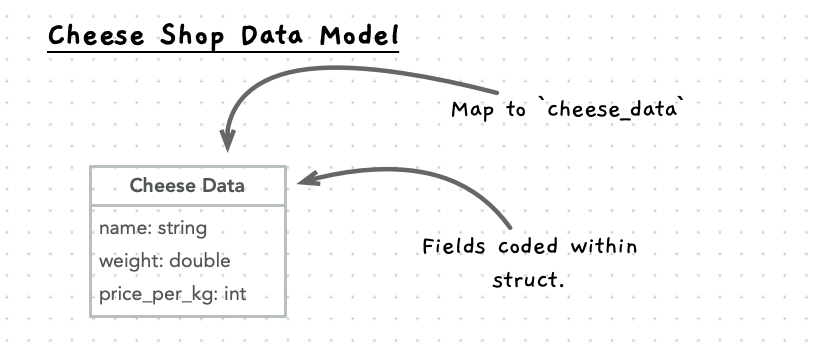

import { Accordion, AccordionItem } from 'accessible-astro-components'

Now let's start building this out with some simple code to check that our model works as we expect.

## Setting up the project

1. Create a folder for your project.
2. Create the following files:
   - **cheese-shop.h**: a header file for our shared functions and data types.
   - **cheese-shop-test.cpp**: the code for our tests.
   - **cheese-shop.cpp**: the code for the model of our program.
   - **cheese-shop-cli.cpp**: the command line interface (CLI) code.
3. Copy in your utilities.cpp and utilities.h files, so you can reuse these.
  
## Decide what to build first

Now you need to work out what to build first. We could build any part we want, but generally I would start with a core component that can be isolated from other parts - something we can build without needing other aspects to already be in place. This tends to mean starting with lower level aspects and building up from there to the larger entities.

For the cheese shop, the shop and orders require details of cheeses, meaning we probably want to start with the cheese data in this case.

With the focus on cheese, we need to refine this further to think about what we want to do with the cheese. Here we have multiple aspects to think about - the model and the user interface. Initially we can build a command line interface and then think later about how we can create a GUI or web application.

## Initial Cheese Functionality

In terms of the model, there are a few things we can code up for our cheese entity.

- Initialise a cheese value - making sure that it has sensible default values.
- Calculate total cost - used to calculate the value of a cheese given its details (weight and price per kilogram).
- Reduce weight - can be used to reduce the quantity of cheese.

### Initialise Cheese

The first thing we can code is the `new_cheese` function. This will initialise a cheese value, using passed in parameter values, and return it to the caller. We can use [default parameters](/book/part-2-organised-code/10-project/3-guided-tour/1-cpp-utilities), so the caller can choose not to provide any details, and get back a cheese value with an empty name, and 0 weight and price per kilogram.

Start by adding the `cheese_data` type, and adding a function header for the `new_cheese` function, to the **cheese-shop.h** header file. This will provide access to these to anything that includes the header.

Here is a good starting point. Have a go at coding this up yourself.

```cpp
#include "splashkit.h"
#include "splashkit-arrays.h"

//TODO: Declare cheese data struct here

//TODO: Declare new_cheese header here
```

Use the details from your data model when coding up the struct. Remember to add documentation to your struct and function header. These will be useful for capturing what you are doing and will be used by Visual Studio Code to help describe your code as you go.



<Accordion>
  <AccordionItem
    header="Code cheese data type and new cheese in header"
  >

```cpp {5-17,19-27}
#include "splashkit.h"
#include "splashkit-arrays.h"

/**
 * Data about a cheese within an order or in stock.
 * 
 * @field name The name of the cheese.
 * @field weight The weight of the cheese in stock (kg).
 * @field price_per_kg The price of the cheese per kg (cents).
 */
struct cheese_data
{
    string name;
    double weight;
    int price_per_kg;  
};

/**
 * Initialise a cheese_data value - with parameters to initialise the name,
 * weight, and price_per_kg.
 * 
 * @param name The name of the cheese. Defaults to an empty string.
 * @param weight The weight of the cheese in stock (kg). Defaults to 0.0.
 * @param price_per_kg The price of the cheese per kg (cents). Defaults to 0.
 */
cheese_data new_cheese(string name = "", double weight = 0.0, int price_per_kg = 0);

```

  </AccordionItem>
</Accordion>

### Implementing `new_cheese`

Open your **cheese-shop.cpp** file and implement an initial version of `new_cheese`. Add in the parameters (but without defaults here - as the header takes care of these) and the code to initialise the `cheese` data within the `new_cheese` function using the parameters provided.

<Accordion>
  <AccordionItem
    header="Code for new cheese"
  >

```cpp {6-8}
#include "cheese-shop.h"

cheese_data new_cheese(string name, double weight, int price_per_kg)
{
    cheese_data cheese;
    cheese.name = name;
    cheese.weight = weight;
    cheese.price_per_kg = price_per_kg;
    return cheese;
}
```

  </AccordionItem>
</Accordion>

We can now turn to building a start at the command line interface version for the program. This will use the model, with code that controls the actions we want performed on the model using the Terminal to collect and display information to the user.

### Starting the command line interface

In the **cheese-shop-cli.cpp** file we need to add the following functions and procedures:

- `print_cheese`: a procedure that accepts a cheese data value and write it out to a single line.
- `main`: the main function used to control the program.

Here is some starter code. Start by building out the `main` function, and then add in `print_cheese` once you have a variable with some values you want to output.

```cpp
#include "splashkit.h"
#include "utilities.h"
#include "cheese-shop.h"

//TODO: add print_cheese here.

int main()
{
   //TODO: create cheese here
   //TODO: print out the cheese
   return 0;
}
```

<Accordion>
  <AccordionItem
    header="Code for main and print cheese"
  >

```cpp
#include "splashkit.h"
#include "utilities.h"
#include "cheese-shop.h"

void print_cheese(const cheese_data &cheese)
{
    write_line(
        cheese.name + ", " + 
        to_string(cheese.weight) + "kg, $" + 
        to_string(cheese.price_per_kg / 100.0) + " per kg"
    );
}

int main()
{
    cheese_data cheese;
    cheese = new_cheese("Cheddar", 1.5, 2000);

    print_cheese(cheese);

    return 0;
}
```

  </AccordionItem>
</Accordion>

You can now compile and run this to test if it is working:

```sh
clang++ cheese-shop.cpp cheese-shop-cli.cpp -l splashkit -o cheese-shop -Wall
```

When you run this you should see something like this:

```txt
Cheddar, 1.500000kg, $20.000000 per kg
```

Nothing special, but we have a start from which we can build.

### Refactoring print cheese

At the moment we have some logic within `print_cheese` to determine how to represent a `cheese_data` value in text. In expanding this, we could move this into its own function by creating a `cheese_string` function that is passed a `cheese_data` value and a boolean indicating if full details are required, and it does the formatting and returns a string. This can then use the C++ [format](https://en.cppreference.com/w/cpp/utility/format/format) function to convert the cheese value into a string. The string should contain the name of the cheese, its weight, and price (in dollars per kilogram).

:::tip
The first parameter to `format` is the format string, which can be used to customise the format of the variables injected within it. To format a floating point value (e.g. `double`) you can use something like this: `format("{:.2f}", my_double)`, this will format the output to have 2 decimal places in the output. You can use this to format the weight and price.
:::

:::caution
The `format` function comes from the C++20 standard.
To compile any code using `format` you will need to let the compiler know that you are wanting to use C++20.
To do this, you can add the flag `-std=c++20`, or a later version, to your compilation command.
For example:

```sh
clang++ format-test.cpp -std=c++26 -l splashkit -o test -Wall
```

:::

We now need to work out where this goes. Is it just related to the command line interface (CLI), or is it related to the model? We need it in the CLI, but I imagine that this may be useful if other ways of interacting with the model are introduced.

To build this you will need to update the *cheese-shop.h* header with the new function, implement the logic in *cheese-shop.cpp*, and then change the way you print the cheese in the *cheese-shop-cli.cpp*.

<Accordion>
  <AccordionItem
    header="Code for cheese string"
  >

For the **cheese-shop.h** we need to add in a new function header for the `cheese_string` function.

```cpp {28-35}
#include "splashkit.h"
#include "splashkit-arrays.h"

/**
 * Data about a cheese within an order or in stock.
 * 
 * @field name The name of the cheese.
 * @field weight The weight of the cheese in stock (kg).
 * @field price_per_kg The price of the cheese per kg (cents).
 */
struct cheese_data
{
    string name;
    double weight;
    int price_per_kg;  
};

/**
 * Initialise a cheese_data value - with parameters to initialise the name,
 * weight, and price_per_kg.
 * 
 * @param name The name of the cheese. Defaults to an empty string.
 * @param weight The weight of the cheese in stock (kg). Defaults to 0.0.
 * @param price_per_kg The price of the cheese per kg (cents). Defaults to 0.
 */
cheese_data new_cheese(string name = "", double weight = 0.0, int price_per_kg = 0);

/**
 * Convert a cheese_data value to a string.
 * 
 * @param cheese The cheese_data value to convert.
 * @param full_details If true, include full details of the cheese. Defaults to false.
 * @return string The string representation of the cheese_data value.
 */
string cheese_to_string(const cheese_data &cheese, bool full_details = false);
```

In the **cheese-shop.cpp** we can implement the logic for this using the C++ format function.

```cpp {15-28}
#include "cheese-shop.h"
#include <format>

using std::format;

cheese_data new_cheese(string name, double weight, int price_per_kg)
{
    cheese_data cheese;
    cheese.name = name;
    cheese.weight = weight;
    cheese.price_per_kg = price_per_kg;
    return cheese;
}

string cheese_to_string(const cheese_data &cheese, bool full_details)
{
    if (full_details)
    {
        return format("{}: {:.2f} kg, ${:.2f}", 
                    cheese.name,
                    cheese.weight,
                    cheese.price_per_kg / 100.0);
    }
    else
    {
        return cheese.name;
    }
}
```

Then you can use this in **cheese-shop-cli.cpp**.

```cpp {5-8}
#include "splashkit.h"
#include "utilities.h"
#include "cheese-shop.h"

void print_cheese(const cheese_data &cheese)
{
    write_line(cheese_to_string(cheese, true));
}

int main()
{
    cheese_data cheese;
    cheese = new_cheese("Cheddar", 1.5, 2000);

    print_cheese(cheese);

    return 0;
}
```

  </AccordionItem>
</Accordion>

### Add in additional cheese functionality

Have a go at adding code to make the following changes.

1. Add a `total_cost` function that accepts a `cheese_data` value and returns the cost (in cents) of that cheese. Test to ensure this works with different values, and include this in the output line.
2. Extend the details in the cheese string to include the total cost, so that this outputs the total price of the cheese in addition to the name, weight, and price per kilogram.
3. Create a `reduce_weight` function that accepts a reference to a `cheese_data` value, and is given a weight to reduce the cheese by. It should ignore negative values, and ensure that the final weight does not become negative. This will return the actual amount removed. For example, if you have 1.5 kg of cheese and attempt to reduce it by 1.7 kg then the resulting weight will be 0, and 1.5 will be returned. This will be used when orders are fulfilled in later iterations - you can add basic test code to the CLI to see this functioning.
4. Create a `increase_weight` procedure that accepts a reference to a `cheese_data` value, and is given a weight to add to the cheese. This should ignore negative values, but otherwise add the passed in weight to the weight already present. This will be used when stock is re-supplied in later iterations - you can add basic test code to the CLI to see this functioning.

In each case, think about what you can put in the model and what needs to go into the CLI.

:::tip

Put as much as you can in the model - but it cannot include any code that interacts with the CLI (no `read_line`/`write_line` etc).

:::
