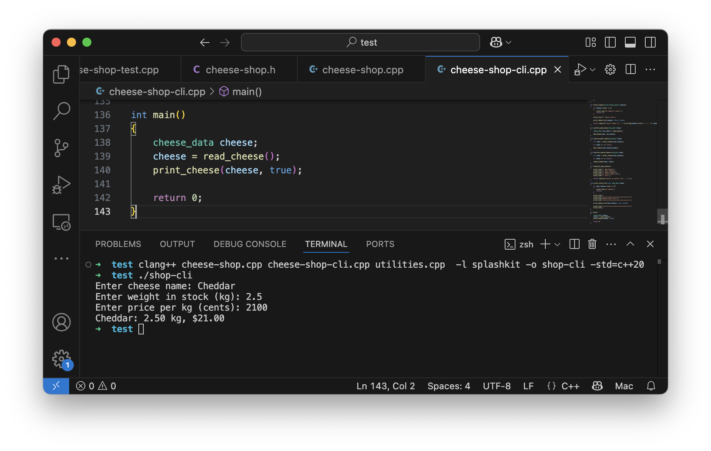
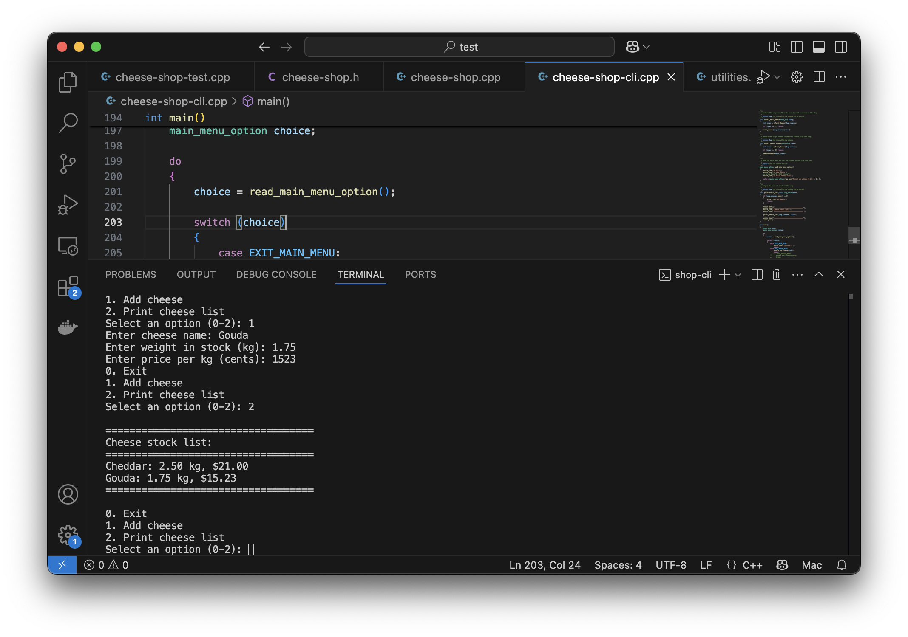

import { Accordion, AccordionItem } from 'accessible-astro-components'

We now have some basic code to work with cheese data. As a next step we can start to build the cheese shop with some basic stock management functionality - the ability to add, edit, and delete cheese within the cheese shop.

## Creating the Cheese Shop

In most cases the first part of any additional functionality will involve adding in additional data elements. In this case we need to add the `cheese_shop_data` struct, which at the moment only needs to contain the dynamic array of cheeses.

<Accordion>
  <AccordionItem
    header="Code cheese data type and new cheese in header"
  >

```cpp {2,5,21-29}
#include "splashkit.h"
#include "splashkit-arrays.h"

/**
 * Data about a cheese within an order or in stock.
 * 
 * @field name The name of the cheese.
 * @field weight The weight of the cheese in stock (kg).
 * @field price_per_kg The price of the cheese per kg (cents).
 */
struct cheese_data
{
    string name;
    double weight;
    int price_per_kg;  
};

/**
 * Data about the cheese shop - the stock on hand.
 * 
 * @field cheeses The list of cheeses in stock.
 */
struct shop_data
{
    dynamic_array<cheese_data> cheeses;
};

//...
```

  </AccordionItem>
</Accordion>

## Reading and adding cheese

With the shop existing in our data, we can add the code to read a cheese from the user and add it to the store's cheese list. We will need:

- Model changes:
  - An `add_cheese` procedure - adds the cheese to the end of our dynamic array. Accepts parameters for the shop and the cheese to add.
  - A `cheese_valid` function, that returns a boolean and outputs an error message via a string passed by reference.
- Shop CLI changes:
  - `read_cheese` function - writes prompts, reads values from the user, and returns cheese data with these details.
  - `handle_add_cheese` procedure - accepts the shop. Reads cheese, and adds it to the shop.
  - `print_stock_list` procedure - accepts the shop and outputs the cheese within it.
  - Add a `main_menu_option` enumeration - this should contain each option from the menu: `EXIT_MAIN_MENU`, `ADD_CHEESE_MENU`, and `PRINT_STOCK_LIST_MENU`.
  - `read_main_menu` function - outputs a menu, has the user pick one of the options, and returns the chosen option to the caller. This will use the `main_menu_option`.

Approach this in the following order:

### Read and add first

1. Add the `add_cheese` header to the **cheese-shop.h** header file.
2. Add the implementation to **cheese-shop.cpp**. 
3. Test this by updating `main` to add hard coded cheese data to the shop.
4. Create the `read_cheese` function. We can use our **utilities** code to read a string for the cheese name, a double for its weight, and an integer for its price. Use these to populate a `cheese_data` value and return it to the caller.
5. Test this by updating `main`.
6. Add the `cheese_valid` function - and loop `read_cheese` while this returns false. A cheese if valid if:
   - Its name is not empty (error message: "Name is empty")
   - Its weight needs is 0 or larger (error message: "Weight cannot be negative")
   - Its price needs is 0 or larger (error message: "Price cannot be negative")

    The `cheese_valid` function should check all conditions, and concatenate the error messages as needed.
7. Test this by running again.

   

### Coordinating adding

8. Now add the `handle_add_cheese` procedure. This accepts the shop and uses your `read_cheese` function to get the data, and pass it to `add_cheese` to add the new cheese into the shop.
10. In order to see that this has worked, we need to add the `print_stock_list` procedure. This should output a report listing all the stock within the shop. Add a header and footer to the report to make sure that it is easy to see where it starts and ends.
11. With these in place you can now update `main` to work with the shop data. Initially this can just be some small test code, so you can see it working as you go.
12. Test to make sure things are working as expected.

### Add a menu

13. Finish up by creating a `read_main_menu`. This can output options for 0: Quit, 1: Add Cheese, and 2: Print Stock List - matching the values in the `main_menu_option`. Then update main to read the user's choice into a variable, loop while they do not choose to quit, either adding cheese (with `handle_add_cheese`) or printing the stock list.

    Run your program, and you should see we now have a functional component.



<Accordion>
  <AccordionItem
    header="Code to help you get started with read and add"
  >

Changes in **cheese-shop.h**:

```cpp
#include <string>
//...

/**
 * Add a new cheese to the shop's cheese list.
 * 
 * @param shop the shop's data
 * @param new_cheese the cheese to add
 */
void add_cheese(shop_data &shop, const cheese_data &new_cheese);
```

Changes in **cheese-shop.cpp**:

```cpp
//...

void add_cheese(shop_data &shop, const cheese_data &new_cheese)
{
    shop.cheeses.add(new_cheese);
}
```

Changes to **cheese-shop-cli.cpp**:

```cpp
#include "splashkit.h"
#include "utilities.h"
#include "cheese-shop.h"

#include <format>
using std::format;

/**
 * The list of options in the main menu.
 * 
 * @option EXIT_MAIN_MENU The option to exit the main menu.
 * @option ADD_CHEESE_MENU The option to add a cheese.
 * @option PRINT_STOCK_LIST_MENU The option to print the stock list.
 */
enum main_menu_option
{
    EXIT_MAIN_MENU,
    ADD_CHEESE_MENU,
    PRINT_STOCK_LIST_MENU
};

/**
 * Output the cheese data to the terminal - on a single line.
 * 
 * @param cheese the cheese data to output
 */
void print_cheese(const cheese_data &cheese, bool with_full_details)
{
    write_line(cheese_to_string(cheese, with_full_details));
}

/**
 * Read data from the user and populate and return the cheese
 * data to the caller.
 * 
 * @return cheese_data populated with the data read from the user
 */
cheese_data read_cheese()
{
    cheese_data result;

    result.name = read_string("Enter cheese name: ");
    result.weight = read_double("Enter weight in stock (kg): ");
    result.price_per_kg = read_integer("Enter price per kg (cents): ");

    return result;
}

/**
 * Perform the steps needed to add a cheese to the shop.
 * 
 * @param shop the shop where the cheese is to be added.
 */
void handle_add_cheese(shop_data &shop)
{
    cheese_data new_cheese = read_cheese();

    add_cheese(shop, new_cheese);
}

/**
 * Show the main menu and get the chosen option from the user.
 * 
 * @return int the chosen option.
 */
main_menu_option read_main_menu_option()
{
    write_line("0. Exit");
    write_line("1. Add cheese");
    write_line("2. Print cheese list");

    return (main_menu_option)read_integer("Select an option (0-2): ", 0, 2);
}

/**
 * Output the list of stock in the shop.
 * 
 * @param shop the shop with the cheese to be output
 */
void print_stock_list(const shop_data &shop)
{
    if (shop.cheeses.length() == 0)
    {
        write_line("No cheese");
        return;
    }

    write_line();
    write_line("===================================");
    write_line("Cheese stock list:");
    write_line("===================================");

    for (int i = 0; i < cheeses.length(); i++)
    {
        print_cheese(shop.cheeses[i], true);
    }

    write_line("===================================");
    write_line();
}

int main()
{
    shop_data shop;
    main_menu_option choice;

    do
    {
        choice = read_main_menu_option();

        switch (choice)
        {
            case EXIT_MAIN_MENU:
                write_line("Exiting...");
                break;
            case ADD_CHEESE_MENU:
                handle_add_cheese(shop);
                break;
            case PRINT_STOCK_LIST_MENU:
                print_stock_list(shop);
                break;
        }
    } while (choice != EXIT_MAIN_MENU);

    return 0;
}

```

  </AccordionItem>
</Accordion>

