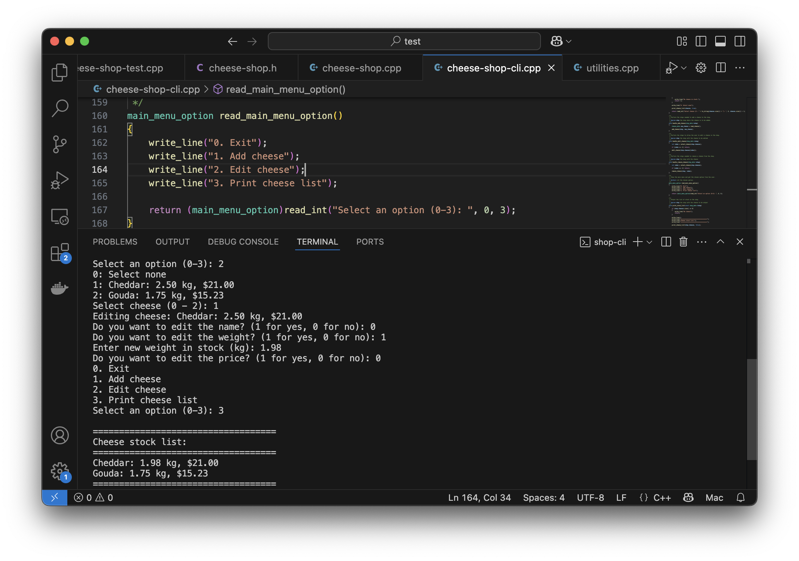

import { Accordion, AccordionItem } from 'accessible-astro-components'

## Editing cheese

With adding in place, we can now implement editing. Thinking through this, we need a way of selecting the cheese to edit, as well as user interface code to indicate which aspects need to change and provide the updated details.

To achieve this we can make the following changes:

- Shop CLI changes:
  - Refactor `print_stock_list` to separate out the code to print the list of cheese, so we can use it in `select_cheese`. For select cheese, we will print a number next to each cheese, which we won't do for the stock list. The new `print_stock_list` will now output a header, call `print_cheese_list`, and the output its footer.
  - `print_cheese_list` will accept the dynamic array of cheeses and a boolean to indicate if this should include the index number (starting at 1) next to each cheese. It will loop through the cheeses. If it needs to output the index it can `write` the value of the current index. Then it will print the cheese details.
  - Add a `select_cheese` function - this can output an option "0: Select None", and then call `print_cheese_list` passing in the shop's list of cheese, and true to show the index. It will then return the integer the user enters at a "Select option: " prompt, minus 1 (making this the index of the cheese or -1 for none).
  - `handle_edit_cheese`: will be passed the shop, and can call `select_cheese` to get the index of the cheese to edit. 
  - `edit_cheese`: will accept a cheese by reference and check with the user which aspects to be edited. This could be done via a menu, or by asking for each field. In either case, you need to update the values in the cheese based on the user's intention. This will update the data in referenced cheese, ensuring that the edits are applied correctly.
  - Update `read_main_menu` and `main` to add an extra menu option and call `handle_edit_cheese` when that option is called.



<Accordion>
  <AccordionItem
    header="Code for editing cheese"
  >

Updated sections for **cheese-shop-cli.cpp**:

```cpp {13,20,51-72,74-91,93-113,127-139,150,153,197-199}
#include "splashkit.h"
#include "utilities.h"
#include "cheese-shop.h"

#include <format>
using std::format;

/**
 * The list of options in the main menu.
 * 
 * @option EXIT_MAIN_MENU The option to exit the main menu.
 * @option ADD_CHEESE_MENU The option to add a cheese.
 * @option EDIT_CHEESE_MENU The option to edit a cheese.
 * @option PRINT_STOCK_LIST_MENU The option to print the stock list.
 */
enum main_menu_option
{
    EXIT_MAIN_MENU,
    ADD_CHEESE_MENU,
    EDIT_CHEESE_MENU,
    PRINT_STOCK_LIST_MENU
};

/**
 * Output the cheese data to the terminal - on a single line.
 * 
 * @param cheese the cheese data to output
 */
void print_cheese(const cheese_data &cheese, bool with_full_details)
{
    write_line(cheese_to_string(cheese, with_full_details));
}

/**
 * Read data from the user and populate and return the cheese
 * data to the caller.
 * 
 * @return cheese_data populated with the data read from the user
 */
cheese_data read_cheese()
{
    cheese_data result;

    result.name = read_string("Enter cheese name: ");
    result.weight = read_double("Enter weight in stock (kg): ");
    result.price_per_kg = read_integer("Enter price per kg (cents): ");

    return result;
}

/**
 * Allow the user to edit the passed in cheese.
 * 
 * @param cheese a reference to the cheese to be updated.
 */
void edit_cheese(cheese_data &cheese)
{
    write_line("Editing cheese: " + cheese_to_string(cheese, true));
    
    if ( read_integer("Do you want to edit the name? (1 for yes, 0 for no): ", 0, 1) == 1 )
    {
        cheese.name = read_string("Enter new cheese name: ");
    }
    if ( read_integer("Do you want to edit the weight? (1 for yes, 0 for no): ", 0, 1) == 1 )
    {
        cheese.weight = read_double("Enter new weight in stock (kg): ");
    }
    if ( read_integer("Do you want to edit the price? (1 for yes, 0 for no): ", 0, 1) == 1 )
    {
        cheese.price_per_kg = read_integer("Enter new price per kg (cents): ");
    }
}

/**
 * Output these cheeses - optionally with the index.
 * 
 * @param cheeses the details to output
 * @param with_ids true if an index (1 based) should be included in the output
 */
void print_cheese_list(const dynamic_array<cheese_data> &cheeses, bool with_ids)
{
    for (int i = 0; i < cheeses.length(); i++)
    {
        cheese_data cheese = cheeses[i];
        if (with_ids)
        {
            write(format("{}: ", i + 1));
        }
        print_cheese(cheese, true);
    }
}

/**
 * Ask the user to select a cheese from the supplied list. This returns the
 * index of the chosen cheese, or -1 if none are selected.
 * 
 * @param cheeses the cheese to output
 * @return int the index of the chosen cheese or -1 if none
 */
int select_cheese(const dynamic_array<cheese_data> &cheeses)
{
    if (cheeses.length() == 0)
    {
        write_line("No cheese in stock.");
        return -1;
    }

    write_line("0: Select none");

    print_cheese_list(cheeses, true);

    return read_integer("Select cheese (0 - " + to_string(cheeses.length()) + "): ", 0, cheeses.length()) - 1;
}

/**
 * Perform the steps needed to add a cheese to the shop.
 * 
 * @param shop the shop where the cheese is to be added.
 */
void handle_add_cheese(shop_data &shop)
{
    cheese_data new_cheese = read_cheese();

    add_cheese(shop, new_cheese);
}

/**
 * Perform the steps to allow the user to edit a cheese in the shop.
 * 
 * @param shop the shop with the cheese to be edited
 */
void handle_edit_cheese(shop_data &shop)
{
    int index = select_cheese(shop.cheeses);

    if (index == -1) return;

    edit_cheese(shop.cheeses[index]);
}

/**
 * Show the main menu and get the chosen option from the user.
 * 
 * @return int the chosen option.
 */
main_menu_option read_main_menu_option()
{
    write_line("0. Exit");
    write_line("1. Add cheese");
    write_line("2. Edit cheese");
    write_line("3. Print cheese list");

    return (main_menu_option)read_integer("Select an option (0-3): ", 0, 3);
}

/**
 * Output the list of stock in the shop.
 * 
 * @param shop the shop with the cheese to be output
 */
void print_stock_list(const shop_data &shop)
{
    if (shop.cheeses.length() == 0)
    {
        write_line("No cheese");
        return;
    }

    write_line();
    write_line("===================================");
    write_line("Cheese stock list:");
    write_line("===================================");

    print_cheese_list(shop.cheeses, false);

    write_line("===================================");
    write_line();
}

int main()
{
    shop_data shop;
    main_menu_option choice;

    do
    {
        choice = read_main_menu_option();

        switch (choice)
        {
            case EXIT_MAIN_MENU:
                write_line("Exiting...");
                break;
            case ADD_CHEESE_MENU:
                handle_add_cheese(shop);
                break;
            case EDIT_CHEESE_MENU:
                handle_edit_cheese(shop);
                break;
            case PRINT_STOCK_LIST_MENU:
                print_stock_list(shop);
                break;
        }
    } while (choice != EXIT_MAIN_MENU);

    return 0;
}

```

  </AccordionItem>
</Accordion>

## Deleting cheese

Have a go at adding the ability to delete stock from the shop. This will need:

- Changes to the model:
  - Add function to delete cheese from the shop
- Changes to the CLI:
  - Extend enumeration, and add menu options
  - Add code to handle the user interacts (using select cheese)
