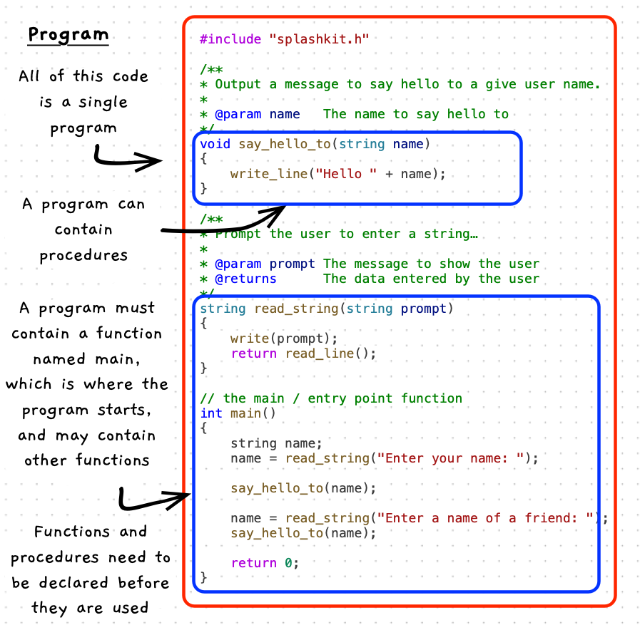

A program can contain functions, procedures, constants and variables. These allow the program's code to be organised into smaller functional blocks.



:::note[A program:]

- Must have a *main* function, which is the entry point for the program
- Can have a number of functions and procedures
- Can have global constants
- Should *not* have global variable

:::

## Example

Here is a simple C++ program.

```cpp
#include "splashkit.h"

/**
* Output a message to say hello to a give user name.
*
* @param name   The name to say hello to
*/
void say_hello_to(string name)
{
    write_line("Hello " + name);
}

/**
* Prompt the user to enter a string, and return the value to the caller.
*
* @param prompt The message to show the user
* @returns      The data entered by the user
*/
string read_string(string prompt)
{
    write(prompt);
    return read_line();
}

// a function declaration - the main / entry point function
int main()
{
    string name;
    name = read_string("Enter your name: ");

    say_hello_to(name);

    name = read_string("Enter a name of a friend: ");
    say_hello_to(name);

    return 0;
}
```
