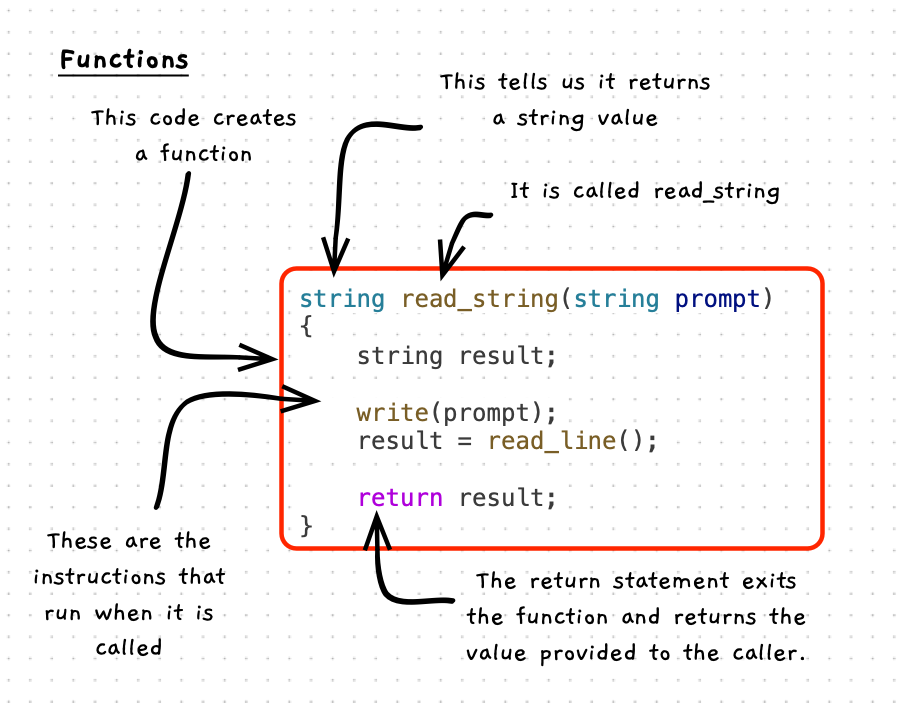

Functions are used to **calculate values**. They are almost identical to procedures -- they have a name, contain instructions, and can be called to perform their actions. The *only* difference is what happens at the end. When a function ends, it [returns](../05-return) a value to the caller, meaning you should call it within an expression where you want the result to be used.



:::note[A function:]

- Is a **building block** that you can create and use in your code.
- Contains code to calculate a value. When you want this value, you call the function.
- Generally does not have a side effect - you can call it multiple times and get the same response for the game parameter values.
- Syntax is just like a [procedure](./01-procedures), with a data type instead of `void`.
- Are self-contained, with its instructions isolated from the other code in your program.

:::

## Examples

The code below shows an example of a function called `read_string`. It is passed a `prompt` parameter, and returns the details that the user enters at the terminal in a string. We call the function in `main` as part of the expression within an assignment statement.

```cpp
#include "splashkit.h"

/**
* Prompt the user to enter a string, and return the value to the caller.
*
* @param prompt The message to show the user
* @returns      The data entered by the user
*/
string read_string(string prompt)
{
    string result;

    write(prompt);
    result = read_line();

    return result;
}

void main()
{
    string name;
    name = read_string("Enter your name: ");
    
    write_line("Hello " + name);

    return 0;
}
```
