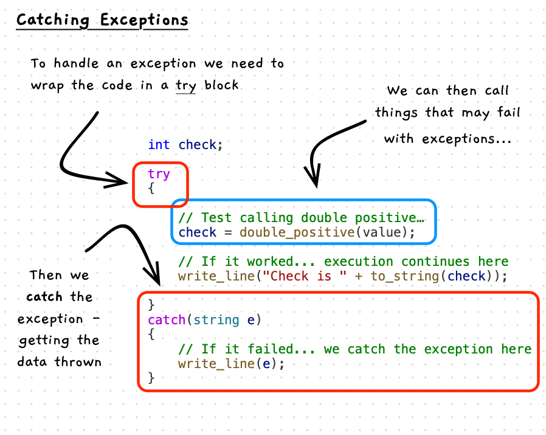

In some cases our function and procedures only work when certain conditions are met. For example, a function that reads from a file may only succeed if the file is available, and accessible. To cater for these cases modern programming languages provide a mechanism called *exceptions*. This provides an alternate return option out of a function or procedure, but requires some new mechanisms within the calling function/procedure.

## Throwing an exception

The following Illustration shows a `double_positive` function that expects the passed in values to be 0 or larger. In this case, we can check if the value passed in is less than 0 and throw an exception if that is the case. Here we throw a string message, so that the caller can have some context on what went wrong.


:::note

- Exception is a *term* given to the data you can "throw" from a function or procedure.
- In your code, `throw` can be used to exit the current block, and search for an error handler in the calling code.
- Due to the way strings are handled in C++ it will be best to store the message in a variable, and then throw the variable. Alternatively you can use `throw string("Message");`.

:::

## Catching an exception

Exceptions have added an alternate exist path from a function, so how can you handle these exceptions in the calling code?

In keeping with the *throwing* metaphor, the code to handle an exception is called a `catch` block. In C++, you wrap the code where an exception may be thrown within a `try` block, which may then be followed by one or more `catch` blocks to handle different kinds of exceptions. When an exception is thrown within the try block, the alternate return path searches for the matching catch block where execution then continues. Given it must search for a matching catch, exceptions will keep returning from each function until a matching catch is found or there are no calls left to terminate.



:::note

- To handle an exception, wrap the code where the exception may occur within a `try` block.
- Think about where you want the error to be handled, adding any following statements you want skipped when the error occurs within the try block as well.
- At the end of the try block, place a `catch` block with the matching data type of the type thrown by the called code.
- Within the catch block you can place any code you want to occur when the error is caught. This code is a bit like an else branch, in that it will be skipped if the exception does not occur.
- You can add a `catch(...)` to catch any exception.

:::

## Exception propagation

Exceptions require a `catch` block to provide the point to return to. As a result, if there is not a matching catch block (based on the type of the exception) then the exception must keep ending each function/procedure until it gets back to a point where a matching catch block exists. This process can cause the program to terminate, with the language tools then outputting a message to indicate that the program terminated due to an exception.

:::tip{Reflect}

Think back to our earlier code where attempting to convert user input to an integer or double could cause the program to terminate. This was the result of an unhandled exception. The conversion functions returned the number when it could, but when it could not, it threw an exception which we could have handled.

While we know how to handle exceptions now, the approach we used earlier is still preferred. In general, you are best **not** to use exceptions if you do not need to. So checking and then performing the action is still the better approach.

:::

## Example

This code demonstrates throwing and catching exceptions. The `double_positive` function requires a positive value to be passed to it. When `value` is less than 0, the function throws a string exception message. Throwing the exception ends the function, returning to the caller (`main` in this case) to search for a valid handler (`catch` block).

```cpp
#include "splashkit.h"

using std::to_string;

/**
 * Double the passed in positive value
 * 
 * @param value a positive integer
 * @return int double value
 * @exception string if value is less than 0
 */
int double_positive(int value)
{
    // Check that value is not negative
    if (value < 0)
    {
        // We have a problem - set a message to return
        string message = "Value must be positive";
        // Throw the message as an exception - ending the function
        throw message;
    }

    return value * 2;
}

int main()
{
    int check;

    try
    {
        // Test calling double positive with a positive value
        check = double_positive(5);
        // This should succeed, and the doubled value printed
        write_line("Check is " + to_string(check));
    
        // Test calling double positive with a negative value
        check = double_positive(-1);
        // This should fail, so this code will be skipped
        write_line("Check is " + to_string(check));
    }
    catch(string e)
    {
        // Output the error when it occurs.
        write_line(e);
    }
    catch(...)
    {
        // Use ... to catch any other exception.
        write_line("Some other exception occurred");
    }

    // See what happens when an exception occurs outside of a handler.
    check = double_positive(-5);
    
    return 0;
}
```

When this code is executed you will get the following output on the terminal.

```sh
Check is 10
Value must be positive
libc++abi: terminating due to uncaught exception of type std::__1::basic_string<char, std::__1::char_traits<char>, std::__1::allocator<char>>
```

:::note

1. The first call succeeds, and the code continues as normal.
2. The second call fails, throwing a string exception. The exception is caught in the catch block, allowing the code to continue from there.
3. Call three also fails. As we are not in a try block, this also causes `main` to exit. As main is the entry point, there are no other calls to terminate, so the program ends with the exception.

:::

:::tip

We will explore exceptions further in later sections. For now, it should be sufficient to have a broad understanding of this alternate exit path. Refrain from using or handling exceptions for now.

:::
