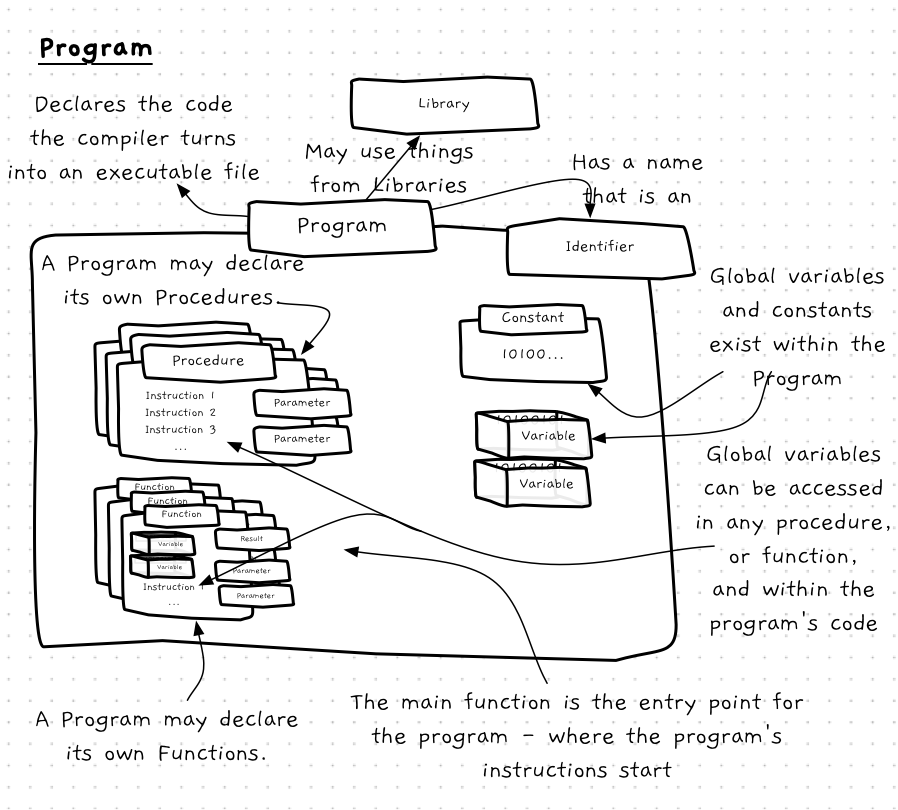
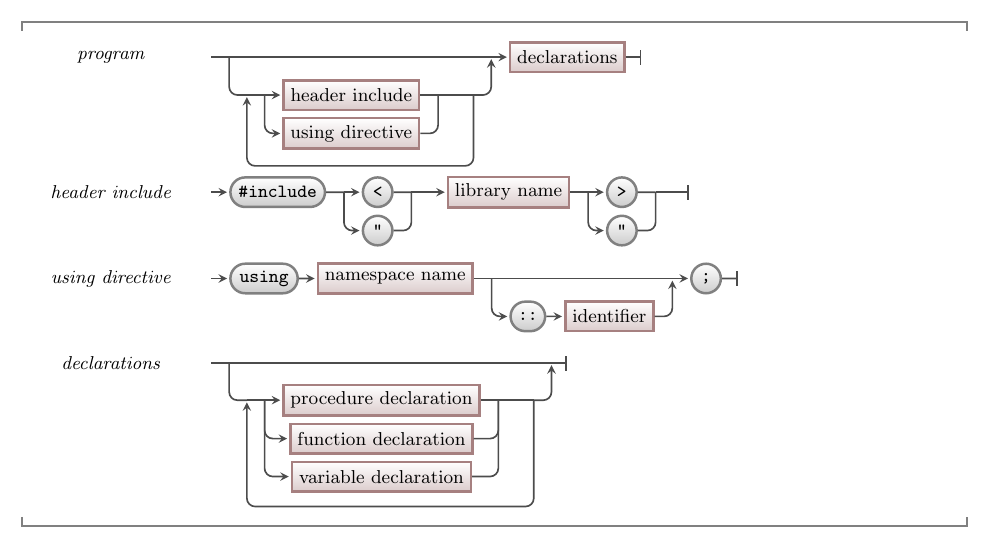

In order to organise your code, programs need to become more than just a list of instructions with variables. In this chapter you will see how to organise your code into functions and procedures.
This means that you now need to picture the concept of a program differently, as shown in the following concept map.



## Program -- when, why, and how

The role of the program has not changed -- it is still the main thing that people will run. What changes now is what we can see within the program, as your programs will be built from a collection of functions and procedures rather than a long sequence of instructions.
This change results in a new way of approaching program design. You don't need to start with low level details like specific logic. Instead, you can break the problem down into functions and procedures.

:::tip[Decomposition]
This activity is known as **decomposition**. You can break things down functionally, through **functional decomposition** by thinking about the different functional aspects that will be involved. Each of the different things you identify through this process can become a function or procedure in your code, allowing you to tackle the complexity involved in large programs one piece at a time.
:::

## In C/C++

:::tip[Syntax]

The syntax for a program in C/C++ is shown in the following diagram.


:::

This syntax contains some similar elements to the syntax you have already been using.
For example, as with C#, in C/C++ you need to specify where the compiler can find any library code you are going to use.
You can also declare variables and constants.

The major difference is that you can now also declare procedures and functions.
These are concepts we will explore shortly.
Additionally, for the file to contain a valid C/C++ program, you need to ensure that one of the functions within the program has the name `main`, and that it returns an integer value.

### Header include

The `#include` code allows you to include files that contain declarations for the different things you are going to use within your program. When you include a file you gain access to the functions, procedures, constants, and variables declared within it. You can then either compile the code for these yourself, or link in an existing library.
This is similar to the `using` statements you used in your C# code.

### Using directives

One of the challenges in programming is uniquely naming things we create. To help manage this, programming languages have come up with a mechanism to create **namespaces**, which allow you to define the [scope](../../../../part-1-instructions/3-control-flow/1-concepts/02-1-scope) in which a name must be unique. The `using` directive gives you easier access to particular items within another namespace.

In C/C++ the standard name space (which has the identifier `std`) contains some useful functions. You can access these anywhere using the full name of the function, which is defined by the namespace, two colons, then the function identifier. For example, the `to_string` function in the standard namespace can be accessed using `std::to_string`. This will always work, but means you have to type `std::` before `to_string` each time. The `using` statement lets you avoid this. By adding `using std::to_string;` at the top of the code, you can now just use `to_string` everywhere and the compiler will not complain, as you have told it you are "using" `std::to_string`.

## Example

Here is the code of a program with functions.
We have added comments to help you identify different parts of the syntax.
Don't worry if you don't understand all of this -- we still need to explore most of these concepts.
For now, focus on what looks different and what looks similar, and try to match the different sections with the syntax diagram above.
Also take note of `int main()`, which defines the [entry point](../../../1-starting-cpp/1-concepts/2-main-function) of the program.

```cpp
// includes and using statements

// - a header include
#include "splashkit.h"

// - a using directive
using std::to_string;

// a global constant declaration
const double PI = 3.1415;

// a function declaration
double square(double val) 
{
    return val * val;
}

// a function declaration
bool pount_in_circle(double pt_x, double pt_y, double c_x, double c_y, double c_radius)
{
    double distance = sqrt(square(pt_x - c_x) + square(pt_y - c_y));
    return distance <= c_radius;
}

double circle_area(double radius)
{
    return PI * square(radius);
}

// a function declaration - the main / entry point function
int main()
{
    write_line("5 squared is " + to_string(square(5.0)));

    write_line("A point at 1, 3 is in a circle at 0, 0, with radius 4" + to_string(point_in_circle(1, 3, 0, 0, 4)) );

    return 0;
}
```
