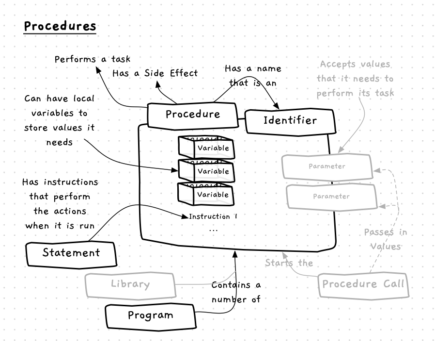
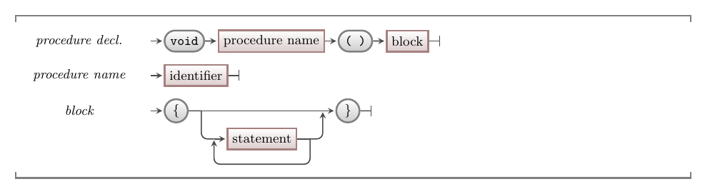

Procedures contain code that define the steps to **do something**. When a procedure is called the computer executes its instructions in sequence. Whatever the procedure changes when executed is the procedure's **side effect**. For example, a common side effect is to print something to the terminal.

In your programs you can define your own procedures, allowing you to divide a program's tasks into separate steps.



## Procedures -- when, why, and how

Being able to divide your program into separate groups of actions can greatly help you manage the code as the size of the project grows. This division should happen in a structured and thoughtful way. As you design a program, break it down into different sections. These sections might break down into smaller sections, which might break down further, and so on. Eventually you will get to a point where a section can reasonably be coded as a procedure. This process of **decomposition** is a **top-down** approach to software design.

You can also work **bottom-up**, starting with smaller parts and building on top of these as you work back to the overall program sections and logic. This usually starts with the identification of useful utilities that can be coded into procedures and used throughout the program.

Most likely, you will use a mix of the top-down and bottom-up approaches. For example, you might build small utility procedures while working to flesh out the main steps of the overall program.

As you build a program you will most likely also identify repeated blocks of code. In some cases you can remove this duplication using loops, but in many cases a loop isn't appropriate. When this happens you can usually capture the code in a procedure, allowing you to reuse it whenever required.

## In C/C++

:::tip[Syntax]
The syntax for a basic C/C++ procedure declaration is shown below.


:::

A **procedure declaration** starts with `void`. This indicates to the compiler that the next bit of code is a procedure declaration because it will return no data.
The **procedure name** can be any valid [identifier](../../../../part-1-instructions/2-communicating-syntax/1-concepts/04-identifier) that has not been used before in the same scope.
The empty parenthesis must appear after the procedure’s name, and before the *block* which contains the statements that define the procedure's logic.

:::note
In C/C++, `void` is a data type used to indicate the absence of return data.
:::

## Example

There are three procedures declared in the code below: `find_what_to_cook`, `purchase_missing_ingredients`, and `get_ingredients`. Following these there is also the declaration of the `main` function where the program starts executing. In `main` we call two of the procedures. The third procedure is called inside the `get_ingredients` procedure.

The **block** of a procedure declaration should look familiar, as it is the same as the syntax of a [compound statement](../../../../part-1-instructions/3-control-flow/1-concepts/02-0-compound-statement) and functions the same (i.e., groups a sequence of statements).
When looking at this example take note of how each procedure is declared, and match it to the syntax above.
Find each of the procedure calls, and think about what happens on the stack when these lines are executed.
Also note that we are now using the conventions of C/C++ -- procedure names are written in **snake_case**, with underscores (`_`) used to separate words.

```cpp
/*
 * Program: print_steps.cs
 * Prings out the steps to cook a meal... (partial)
 */

#include "splashkit.h"

void find_what_to_cook()
{
    write_line("Step 1 - Find what to cook -");
    write_line("1 - Find a recipe book");
    write_line("2 - Pick recipe");
} 

void purchase_missing_ingredients()
{
    write_line("Step 2(a) - Purchase Missing Ingredients -");
    write_line("1 - Goto Shop");
    write_line("2 - Find ingredients and put in basket");
    write_line("3 - Go to register and pay for ingredients in basket");
    write_line("4 - Return home");
}

void get_ingredients()
{
    write_line("Step 2 - Purchase Ingredients -");
    write_line("1 - Read recipe");
    write_line("2 - Write a list of ingredients");
    write_line("3 - Check food stocks, and tick off ingredients you already have");
    purchase_missing_ingredients();
}

int main()
{
    find_what_to_cook();
    get_ingredients();
    // etc...

    return 0;
}
```

:::note[Summary]

- A procedure is a **building block** that you can create and use in your code.
- Each procedure contains code to perform a certain task. When you want the task performed, you call the procedure.
- Procedures have a **side effect**, meaning that a procedure changes something when it is executed.
- A procedure is defined by its **name** and the **steps** it performs.
- Each procedure's instructions are **isolated** from the other code in your program.

:::
