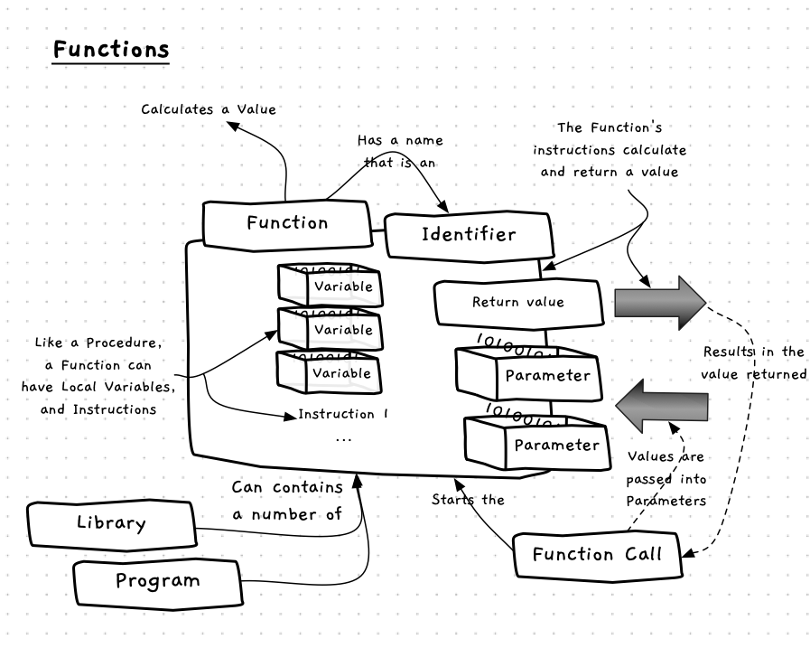
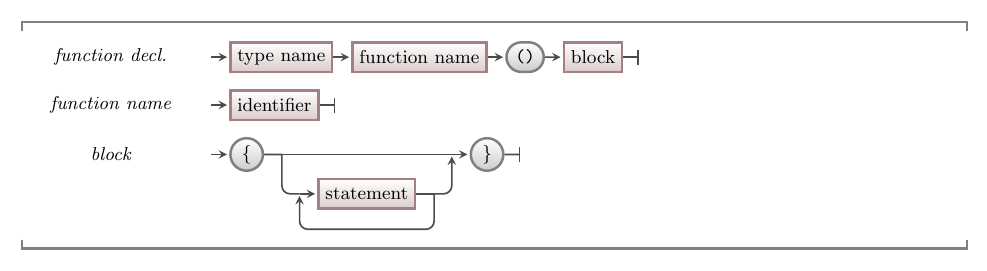

Functions are used to **calculate values**. They are almost identical to procedures -- they have a name, contain instructions, and can be called to perform their actions. The *only* difference is what happens at the end. When a function ends, it [returns](../05-return) a value to the caller, whereas a procedure just ends. This means that procedures are called within [statements](../../../../part-1-instructions/2-communicating-syntax/1-concepts/02-statement), whereas functions can be called within [expressions](../../../../part-1-instructions/2-communicating-syntax/1-concepts/03-expression).



## Functions -- when, why, and how

Procedures are great as they let us group actions into isolated blocks of code. However, sometimes we need these blocks of code to **calculate** or **get** a value for us. In these cases we can create a function rather than a procedure. You can code the steps needed within the function to calculate or get the data needed, then anytime you need this value you can just call the function you created.

As with procedures, you can use a bottom-up or top-down approach to determining what functions your program will need.
Again, you are likely to use both approaches in tandem.

An important difference between procedures and functions is how you write the instructions they contain.
Because functions are *conceptually* different, they are *used* differently from procedures.
Procedures just contain instructions, so they are used as [statements].
Functions, however, return a value, so are valid [expressions] by themselves and can be used within other expressions.
Because of these different purposes, functions should generally not have any side effects when called (e.g., printing to the terminal).
There are no syntactic rules enforcing this, it is just considered bad practice to do so.

:::tip
You can think of procedures as tasks that perform an action, whereas functions are tasks that calculate a value. Procedures **do** things, and functions **calculate** things.
:::

## In C/C++

:::tip[Syntax]
The following diagram shows the syntax for a function delcaration in C/C++.


:::

The syntax for a function declaration is very similar to the [syntax for a procedure declaration](../02-procedures#in-cc).
There are only two differences:

1. The function declaration starts with a data type name rather than `void`.
2. Most functions include a [return statement](../05-return) in the block to specify what value will be returned.

:::tip[What if there's no return?]
In C++, a function without a return statement results in [undefined behaviour](https://en.wikipedia.org/wiki/Undefined_behavior). This means that there is no standard for how the scenario will be handled. Your compiler by default will not warn you when your program has undefined behaviour.
:::

### Procedures as void functions

C/C++ does not have a strong distinction between functions and procedures. Technically, in C/C++ a procedure is just a function that returns a special `void` type. However, although there isn't really a difference in syntax between functions and procedures, it is still important to understand the conceptual difference between them.

## Examples

The code below shows an example of a simple function.
It is called `seconds_in_hour`, and returns an `int` value.
In this example we are showing you the syntax of a function declaration in practice, but we are also highlighting the concept of **scope**.
Notice that both `seconds_in_hour` and `main` have variables called `total`.
This is valid, and causes no conflicts, because each `total` variable is limited to the scope of their respective function.
They are entirely separate variables, with different locations in memory.

```cpp
#include "splashkit.h"

using std::to_string;

int seconds_in_hour()
{
    int total;
    total = 60 * 60;
    return total;
}

int main()
{
    int total;
    total = seconds_in_hour();
    write_line("There are " + to_string(total) + " seconds in an hour");

    return 0;
}
```

This example function is pretty trivial, and probably isn't something you would ever actually use -- a constant would be much more appropriate given all the values involved are unchanging literals.
Functions are much more useful when you can give them some data to work with.
We will explore how to do that next.

:::note[Summary]

- A function is a **building block** that you can create and use in your code.
- A function contains code to calculate a value. When you want this value, you call the function.
- Functions should generally not have side effects.
- A function is defined by its **name**, the **steps** it performs, and its **return type**.
- The syntax for a function is just like a [procedure](../02-procedures), with a data type instead of `void`.
- Each function's instructions are **isolated** from the other code in your program.

:::
