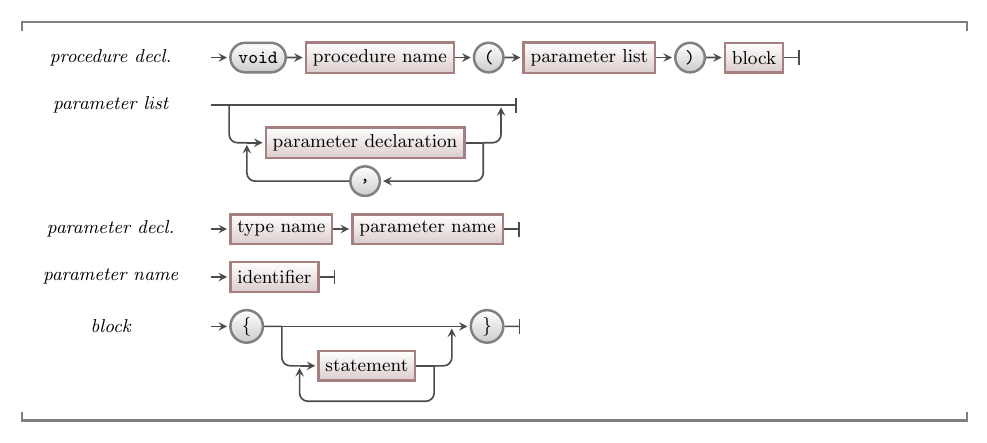

import MySwiper from '../../../../../../components/react/myswiper.jsx'

import sliderParameter01 from './images/slider-parameter/slider-parameter-01.png';
import sliderParameter02 from './images/slider-parameter/slider-parameter-02.png';
import sliderParameter03 from './images/slider-parameter/slider-parameter-03.png';
import sliderParameter04 from './images/slider-parameter/slider-parameter-04.png';
import sliderParameter05 from './images/slider-parameter/slider-parameter-05.png';
import sliderParameter06 from './images/slider-parameter/slider-parameter-06.png';
import sliderParameter07 from './images/slider-parameter/slider-parameter-07.png';
import sliderParameter08 from './images/slider-parameter/slider-parameter-08.png';
import sliderParameter09 from './images/slider-parameter/slider-parameter-09.png';
import sliderParameter10 from './images/slider-parameter/slider-parameter-10.png';
import sliderParameter11 from './images/slider-parameter/slider-parameter-11.png';

export const sliderParameter = [
  {
    src: sliderParameter01.src,
    altText: "The program starts at the main() function and the print_equation() function is called with parameters 2, 5.1 and 3",
    tipStart: 1,
    tips: [
      "The program starts at the <code>main()</code> function",
      "The <code>print_equation()</code> function is called with parameters <code>2</code>, <code>5.1</code> and <code>3</code>"
    ]
  },
  {
    src: sliderParameter02.src,
    altText: "The parameter values from the caller are passed into the print_equation() function, and as a new block is allocated on the stack for the function, the values are stored in their respective variables",
    tipStart: 2,
    tips: [
      "The parameter values from the caller are passed into the <code>print_equation()</code> function, and as a new block is allocated on the stack for the function, the values are stored in their respective variables"
    ]
  },
  {
    src: sliderParameter03.src,
    altText: "The solution variable is allocated space on the stack, then evaluated using the values of the parameters passed into the function",
    tipStart: 3,
    tips: [
      "The <code>solution</code> variable is allocated space on the stack, then evaluated using the values of the parameters passed into the function"
    ]
  },
  {
    src: sliderParameter04.src,
    altText: "The write_line function executes and prints a string of the equation (using the values of the stack variables) to the terminal",
    tipStart: 4,
    tips: [
      "The <code>write_line</code> function executes and prints a string of the equation (using the values of the stack variables) to the terminal"
    ]
  },
  {
    src: sliderParameter05.src,
    altText: "The print_equation function block ends, and it's variables are removed from the stack",
    tipStart: 5,
    tips: [
      "The <code>print_equation</code> function block ends, and it's variables are removed from the stack"
    ]
  },
  {
    src: sliderParameter06.src,
    altText: "Execution returns to the next line of the main() function, which contains another call to print_equation, but this time with different parameter values",
    tipStart: 6,
    tips: [
      "Execution returns to the next line of the <code>main()</code> function, which contains another call to <code>print_equation</code>, but this time with different parameter values"
    ]
  },
  {
    src: sliderParameter07.src,
    altText: "The parameter values from the caller are passed into the print_equation() function once again, and as a new block is allocated on the stack for the function, the values are stored in their respective variables",
    tipStart: 7,
    tips: [
      "The parameter values from the caller are passed into the <code>print_equation()</code> function once again, and as a new block is allocated on the stack for the function, the values are stored in their respective variables"
    ]
  },
  {
    src: sliderParameter08.src,
    altText: "The solution variable is allocated space on the stack, then evaluated using the values of the parameters passed into the function",
    tipStart: 8,
    tips: [
      "The <code>solution</code> variable is allocated space on the stack, then evaluated using the values of the parameters passed into the function"
    ]
  },
  {
    src: sliderParameter09.src,
    altText: "The write_line function executes and prints a string of the equation (using the values of the stack variables) to the terminal",
    tipStart: 9,
    tips: [
      "The <code>write_line</code> function executes and prints a string of the equation (using the values of the stack variables) to the terminal"
    ]
  },
  {
    src: sliderParameter10.src,
    altText: "The print_equation function block ends, and it's variables are removed from the stack",
    tipStart: 10,
    tips: [
      "The <code>print_equation</code> function block ends, and it's variables are removed from the stack"
    ]
  },
  {
    src: sliderParameter11.src,
    altText: "Execution returns to the next line of the main() function, which contains a return statement that returns control to the program caller, with an exit value of 0, ending the program's execution",
    tipStart: 11,
    tips: [
      "Execution returns to the next line of the <code>main()</code> function, which contains a return statement", "This returns control to the program caller, with an exit value of 0, thus ending the program's execution"
    ]
  }
];


The instructions within a [procedure](../01-procedures) define the actions that occur when that procedure is called. In most cases, these instructions need to be given values to work with. These values can be passed to the procedure using **parameters**. A parameter is a [variable](../../../../part-1-instructions/1-sequence-and-data/1-concepts/07-variable) that has its value set by an [argument](../../../../part-1-instructions/1-sequence-and-data/1-concepts/02-method#arguments) in the procedure call.

<a id="FigureParameter"></a>



<div class="caption"><span class="caption-figure-nbr">Figure 5.16: </span> Parameters allow data to be passed to functions and procedures</div> <br/>

## Parameters - Why, When, How

In most cases your functions and procedures will need to know things in order to perform their actions. Perhaps the easiest way to think about this is as if you were asked to do the task. If I asked you to bin something, you would need me to tell you want to dispose of. In a program, this could be coded as a `dispose` procedure, where the *thing* to dispose would be the parameter.

As you start to create a procedure, think about what it will need to be told in order to perform its actions. Code these as parameters, and you can then pass the actual values to use as arguments.

Think about the different functions and procedure we have been calling already. When you call `open_window` you passed its arguments for the title, width, and height of the window. This means there are three parameters in this procedure, the first accepting the value for the title, the second the width, and the third the height. The `open_window` code uses these values when it creates the window you see appear on the screen.

## In C/C++

:::tip[Syntax]

- In C/C++, parameters can be declared in any [function or procedure](../00-functions-and-procedures)
- The syntax in [Figure 5.x](#FigureParameterSyntax) shows the C/C++ code for declaring parameters within a procedure.
- Parameters in C/C++ are declared like other [variables](../../../../part-1-instructions/1-sequence-and-data/1-concepts/07-variable), with the [type](../../../../part-1-instructions/1-sequence-and-data/1-concepts/06-type) followed by the parameter’s name.

<a id="FigureParameterSyntax"></a>


<div class="caption"><span class="caption-figure-nbr">Figure 5.x: </span>C/C++ syntax for a procedure declaration with parameters</div><br/>

:::

## Example

See [Listing 5.x](#ListingParameters) below for an example of a procedure with parameters.

<a id="ListingParameters"></a>

```cpp
/* Program: Print an equation with its solution */

void print_equation(int m, double x, int c) 
{
  double solution = m * x + c;
  write_line( to_string(m) + " x " + to_string(x) + " + " + to_string(c) + " = " + to_string(solution));
}

int main() 
{
  print_equation(2, 5.1, 3);
  print_equation(7, 2.74, -8);
  return 0;
}
```
<div class="caption"><span class="caption-figure-nbr">Listing 5.x: </span>Parameter Tests</div>

The `print_equation` procedure accepts three parameters: `m`, `x`, and `c`. This means that when `print_equation` is called, it must be passed three argument value. The first value will be passed to the `m` parameter, the second to `x`, and the third to `c`.

You can also look at the example code in the [functions page](../04-function-decl). Both the `square` and `point_in_circle` functions accept parameters in order to achieve their tasks. The `square` function needs to be told the value you want to square, while the `point_in_circle` needs to know the location of the point (`pt_x` and `pt_y`) and the location and size of the circle (`c_x`, `c_y`, `c_radius`). 

The great thing about parameters is that it really helps you generalise what your function can do. By accepting a value parameter, the `square` function can be used to square any `double` value. Similarly, by accepting parameters for the point and circle, the `point_in_circle` function can work for any point in any circle.

<MySwiper client:only height="" images={sliderParameter}></MySwiper>

:::note[Summary]

- Parameter is the **term** given to a [variable](../12-variable) declared to accept the value from an argument passed to a [function or procedure](../00-functions-and-procedures) when it is called.
- The **procedure call** must provide argument values for each of the procedure’s parameters. These arguments are assigned to the procedures parameters, so that the procedure can use these when it runs.
- Parameters allow you to pass values into a [function or procedure](../00-functions-and-procedures). 
- Within the function or procedure, the parameters can be used in the same way as any other
variables.
- It is **good practice** to use parameters to pass values into a function or procedure.

:::
