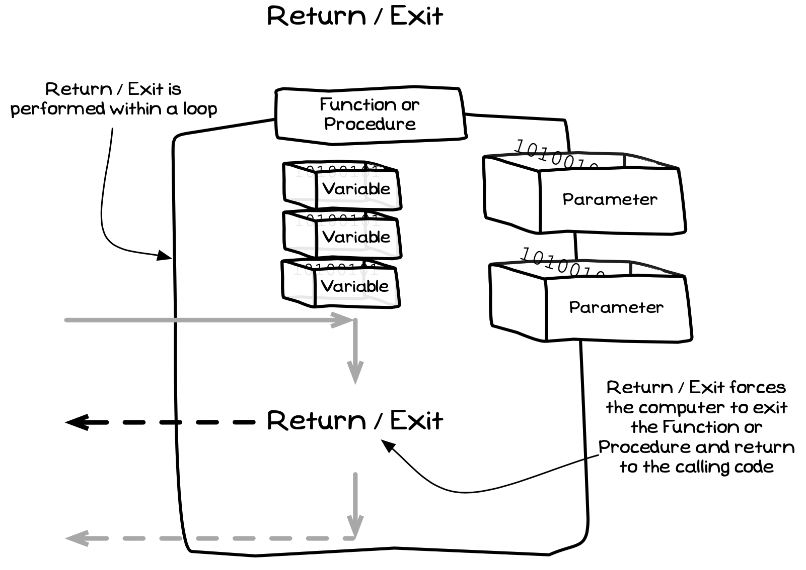

The return statement is a kind of [jump statement](../../../../part-1-instructions/3-control-flow/1-concepts/05-0-jumping). It ends the current [function](../04-function-decl) or [procedure](../01-procedures). This is useful for skipping the rest of the processing of the function or procedure, exiting it early and returning to the calling code. In a function, you also use the return statement to provide the value that is sent to the caller.

<a id="FigureExit"></a>


<div class="caption"><span class="caption-figure-nbr">Figure x.y: </span>Exit ends the current Function or Procedure</div><br/>

:::note

- Return is an **instruction**, allowing you to jump out of the current function or procedure and return to the calling code.
- Return should be coded within [branching](../../../../part-1-instructions/3-control-flow/1-concepts/03-0-branching) statements that checks if the function or procedure should end.

The return statement also provides the value that will be returned when exiting from a function. As this sets the value to be returned, you **must** have a return statement as the last instruction within a function.

:::

## Return - Why, When, How

There are a couple of reasons why you may want to add a return statement to exit out of the current function or procedure. This includes providing value from function, but can also be used to exit early under certain conditions.

Every function must return a value, so for every function must return a value at least at the end of the function. You may also need to exit early, and in these cases you will have to return something. So when you do have a function that may end early, you need to work out what it will return to the caller.

When you use return statements to exit a function or procedure early, you need something like an if statement that checks if you should exit, and then put the return statement within the body of the if. This can be used when you know that the procedure or functions only works in certain circumstances, and exit when these are not met. For example, in the change calculator we can exit early if they have not paid enough for the item, or if they have provided the exact value.

## In C/C++

:::tip[Syntax]

- [Figure 5.x](#FigureReturnStatementSyntax) shows code for a function declaration in C#.

<a id="FigureReturnStatementSyntax"></a>


<div class="caption"><span class="caption-figure-nbr">Figure 5.x: </span>C/C++ syntax for a return statement</div><br/>

- The [expression](../../../../part-1-instructions/2-communicating-syntax/1-concepts/03-expression) in the return statement is optional so that you can call it within both functions and procedures.
  - In a function, your return statement **must** have the value to return in the expression.
  - In a procedure, your return statement **must not** have a value - it does not return a value.
- When the return statement is executed the current function or procedure ends.
- In a function, value of the expression in the return statement is returned to the function call that started the function.

:::

## Examples

[Listing 5.x](#ListingReturnStatement) illustrates the point that `return` ends the current function, with only the first `write_line` call being run in the `test_return()` function.

<a id="ListingReturnStatement"></a>

```cpp
/* Program: test-return.cs */
#include "splashkit.h"

using std::to_string;

int test_return() 
{
    write_line("test-return started");
    return 3;
    write_line("Cannot be run as code returned above!");
}

int main() {
  write_line("Calling test_return - the value " + to_string(test_return()) + " is returned\n");
  return 0;
}
```
<div class="caption"><span class="caption-figure-nbr">Listing 5.x: </span>Example illustrating return in action</div>

For other examples, have a look back at the [functions page](../04-function-decl). The `square` function uses the return statement to return the squared value, while the `point_in_circle` returns the value from the comparison as this indicates if the point is within the circle.

**TODO: add slider**
