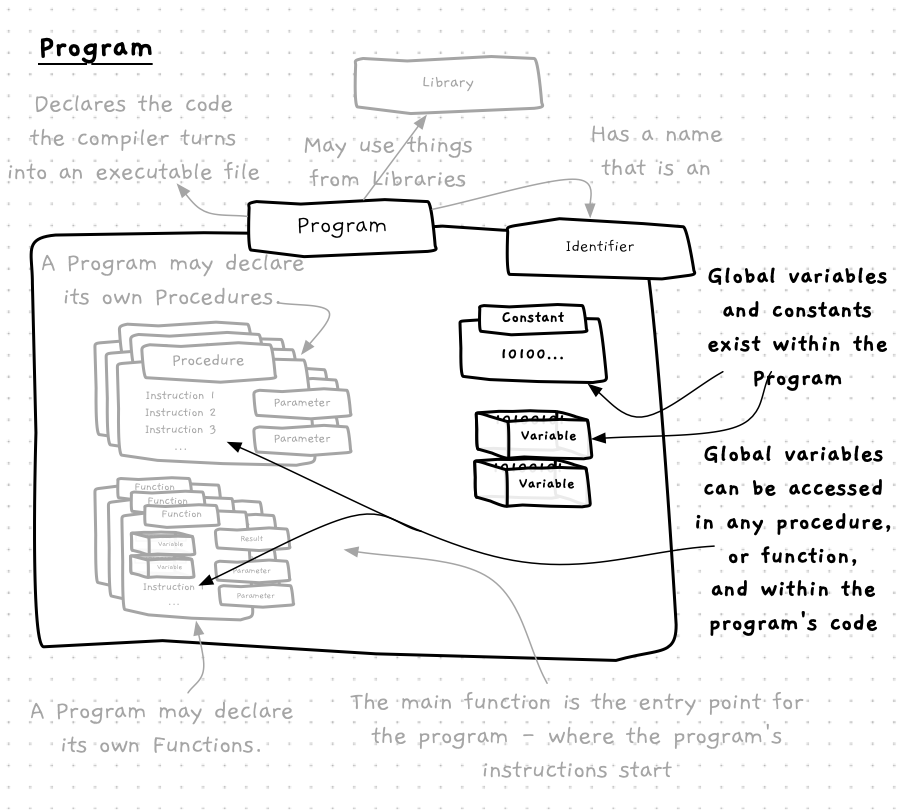

Variables and constants can be declared **outside** of functions and procedures, within the program itself. [Variables](../../../../part-1-instructions/1-sequence-and-data/1-concepts/07-variable) declared in this way are called **global variables**.

It may seem tempting to use global variables to share values between functions and procedures, but this is a **bad** idea. Global variables should be **avoided**, and for many problems are unnecessary.

The issue with global variables is that their values can be changed from *anywhere* within the program's code. This can make it difficult to locate the source of errors when global variables are used in larger programs. There are some cases where you will need to use these, but you should always have looked for several ways not to do this before accepting that you really do need them.

While global **variables** should be avoided, constants **should** be declared globally. The value of a constant cannot change, so the issues with global variables do not affect constants. In contrast, global constants help ensure that values remain consistent throughout the program. As a result, most constants generally end up being global constants.

<a id="FigureGlobalVariable"></a>



<div class="caption"><span class="caption-figure-nbr">Figure 5.15: </span> Variables declared within a Program are Global Variables</div><br/>

## In C/C++

:::tip[Syntax]

Variables and constants declared **outside** of a function or procedure are global.

:::

## Example

```cpp
#include "splashkit.h"

using std::to_string;

// Declare (unnecessary) global variables
int x;
string message_text = "Hello world";

void my_procedure()
{
  write_line("In my procedure");

  // Global variables declared outside of functions and procedures
  message_text = "Hello Jupiter";
  write_line("Value of global variable x = " + to_string(x));

  x = x + 1;
  write_line("Value of global variable message = " + message_text);
  
  write_line("Ending my procedure");
}

int main() 
{
  x = 9;
  write_line("Value of global variable x = " + to_string(x));
  write_line("Value of global variable message = " + message_text);
  
  x = 3;
  my_procedure();
  write_line("Value of global variable x = " + to_string(x));
  write_line("Value of global variable message = " + message_text);

  return 0;
}
```

<div class="caption"><span class="caption-figure-nbr">Listing 5.x: </span>Example declaration of global variables</div>

Reading through the above code, look at **main**. Notice how we set the value of `x` to be 3, then a couple of lines later output the value of `x`... but what does it output?

- What does the program shown in Listing 5.x output to the terminal?<br/>
- What is the value of x when the program completes?
<br/>
<details>
  <summary role="button">Answer</summary>
  
- Program output
  ```bash
  Value of global variable x = 9
  Value of global variable message = Hello world
  In my procedure
  Value of global variable x = 3
  Value of global variable message = Hello Jupiter
  Ending my procedure
  Value of global variable x = 4
  Value of global variable message = Hello Jupiter
  ```
- value of x at program completion: 4;
</details>
</span>
<br>

:::note[Summary]

- Global Variable is the **term** given to a Variable that is declared within the program.
- [Variables](../12-variable)  that are declared within a [Program](../00-program) are called **Global Variables**.
- Global Variables can be accessed by the program’s instructions, and by the instructions in any of the Procedures.
- You should **avoid** using Global Variables. These variables can be accessed anywhere within the Program, making it difficult to locate errors.
- Using Global Variables introduces hidden dependencies between [Methods](../03-method), breaking the isolated nature of the Procedures.
- [Constants](../13-constant) **should** be declared globally, and used to give meaning to values entered into your code.

:::
