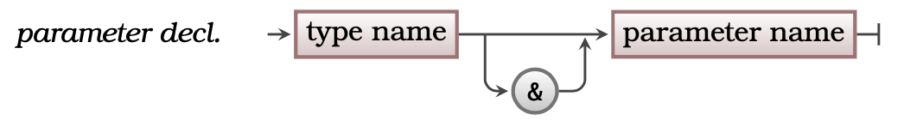

## Concept

There are actually two ways that values can be passed to [Parameters](../16-parameter). This relates back to the fact that [Variables](../12-variable) have two aspects: the Value within the Variable, and the Variable itself. These two means of passing parameters allow you to either pass a value, or pass a Variable.

<a id="FigurePassByValueAndPassByReference"></a>


<div class="caption"><span class="caption-figure-nbr">Figure 5.17: </span> Parameters can accept data by reference or by value</div> <br/>

## In C#


:::tip[Syntax]

C has limited support for pass by reference, but this feature was added with the extensions in the C++ language. The following syntax shows how to declare a parameter that will be passed by reference. Please note that this is not standard C code, and will require you to use a C++ compiler.

- The syntax in [Figure 5.x](#FigureParameterPassByReferenceSyntax) shows the C# code for pass by reference parameters

<a id="FigureParameterPassByReferenceSyntax"></a>


<div class="caption"><span class="caption-figure-nbr">Figure 5.x: </span>C# Syntax for by-ref parameters</div><br/>

:::

## Examples

- See [Listing 5.x](#ListingParametersPassByReference) below for an example of a method with pass by reference parameters.

<a id="ListingParametersPassByReference"></a>

```csharp
/* Program: test-byref.cs */

void double_it(int &data) {
    printf("Data passed in was %d, about to double it...\n", data);
    data = data * 2;
    printf("In double_it data is now %d\n", data);
}

int main() {
  int val = 3;

  printf("In main val is %d\n", val);
  double_it(val);
  printf("Back in main val is now %d\n", val);
  return 0;
}
```
<div class="caption"><span class="caption-figure-nbr">Listing 5.x: </span>Example of passing by reference using C#</div>


## Activities

[TODO]

:::note[Summary]

- Pass by Reference and Pass by Value are **terms** that explain how data is passed to a [Parameter](../16-parameter).
- Most parameters are passed by value.
- Pass by value copies the value to the parameter. This means pass by value can work with any [Expression](../04-expression).
- Pass by reference allows you to pass the [Variables](../12-variable) itself to the parameter.
- The main use for pass by reference is to allow the [Method](../03-method) or [Function](../20-function) to store a value in the Variable passed to the parameter.
- It is called pass by reference due to the way it is implemented, with the parameter receiving a reference to the Variable. Section **???** will cover this in more detail, conceptually the Variable itself is passed to the Parameter

:::
