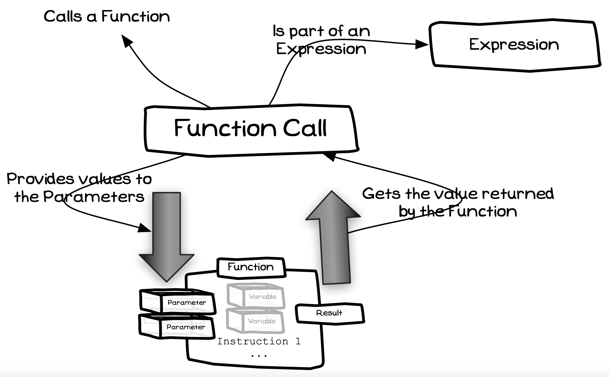

## Concept

A Function Call is used to execute a [Function](../20-function), and to read the value that is returned. This is similar to a [Method Call](../02-method-call), but unlike a method call it must be done as part of an [Expression](../23-expression).

<a id="FigureFunctionCall"></a>



<div class="caption"><span class="caption-figure-nbr">Figure 5.21: </span>A Function Call is part of an Expression where the value is calculated</div> <br/>

## In C#

:::tip[Syntax]

- [Figure 5.x](#FigureFunctionCallSyntax) shows the C# syntax for a function call

- A C# function call is similar to a [Method Call](../02-method-call).
- You use the name of the [Function](../20-function), its [identifier](../07-identifier), to indicate which function is called.
- Following the Function’s name is the list of arguments, these are the values (or variables) that are being passed to the called Function.
- The return type of the Function determines where the Function may be called.
- Method, `void` Functions, can only be called in a Method Call Statement.
- Other Functions can be used in [Expressions](../23-expression), see Expressions (with Function Calls, Variables, and Constants). In these cases the type of data returned by the Function will determine the type of the Function Call.

<a id="FigureFunctionCallSyntax"></a>


<div class="caption"><span class="caption-figure-nbr">Figure 5.x: </span>C# Syntax for a function call</div><br/>

:::

## Examples

- In [Listing 5.x](#ListingFunctionCalls) the values of the inner function calls are passed to the arguments of the outer calls. This means that `square(5)` is calculated first then `square(4)`. The results of these two Function Calls are then passed as the arguments into the call to the `sum` Function. In this case the Function call will be `sum(25,16)` with being the result returned by `square(5)` and `16` being the result returned by `square(4)`.

<a id="ListingFunctionCalls"></a>

```csharp
/* Program:test-fn-calls.cs */
#include <stdio.h>

int square(int x) { return x * x; }
int sum(int a, int b) { return a + b; };

int main() {
    int answer = sum(square(5), square(4));
    printf("5 squared + 4 squared is %d\n", answer);

    printf("(1 + 2) + (3 + 4) = %d\n", sum(sum(1,2), sum(3,4)));
    printf("2 squared, squared = %d\n", square(square(2)));
}
```
<div class="caption"><span class="caption-figure-nbr">Listing 5.x: </span>Example of Function Calls</div>

## Activities

[TODO]

:::note[Summary]

- A Function Call is an **action**, but one that is performed as part of an [Expression](../23-expression).
- Function calls can appear in any expression. For example, you can use a Function Call to calculate the value in an [Assignment Statement](../19-assignment-statement). You can use a [Method Call](../02-method-call) to calculate the argument values for a method call.
 

:::