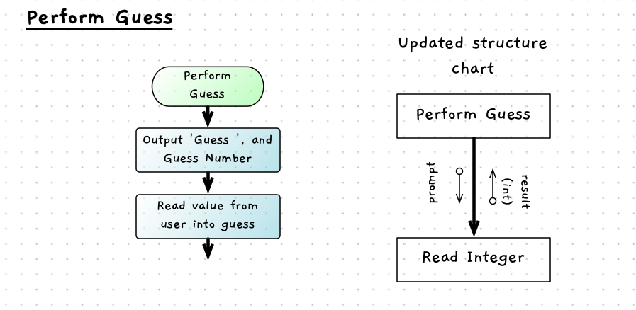
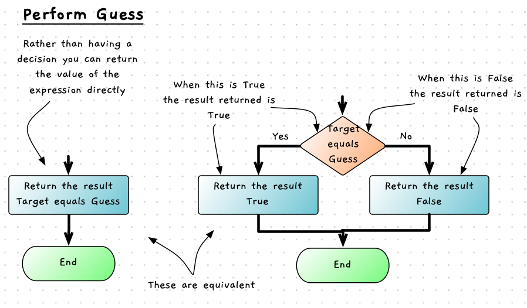

import { Accordion, AccordionItem } from 'accessible-astro-components'

Now that we have the different functions and procedure, we can now start to design the control flow for the Guess that Number program. For the Guess that Number program we can start by designing the control flow within the `Perform Guess` function. The specification of this is shown the table below. Think about the steps that need to be performed to achieve this. If you had been asked to do this what would you need to do?


<a id="TablePerformGuessSpecs"></a>

|   |   |
|---|---|
| **Function** | `Perform Guess` |
| **Description** |  `Perform Guess` is responsible for coordinating the actions needed to perform a single guess within a game of *Guess that Number*. The user's `guess` is read, and the value checked against the `target` value. A message is then output telling the user if the target value is less than, larger than, or equal to their guess. This function returns true when the user’s guess is equal to the target, otherwise it returns false.|
| **Returns** | `Boolean`: True when the user has guessed the number, false otherwise. |
| **Parameters** | `Guess Number`: The number of the current guess (from 1st to 7th guess), used in the prompt asking for the user to enter their guess. |
|| `Target`: The number the user is aiming to guess. |

<div class="caption">Specification for the <code>Perform Guess</code> function</div>

## Read the Guess

The first task the function needs to perform is to get the guess from the user. This can be performed in a **sequence**: display a prompt, read the value from the user.

This sequence sounds familiar. Rather than re-coding this here, we can incorporate our `read_integer` function in the program that we created [earlier](/book/part-2-organised-code/2-organising-code/2-put-together/00-2-explore-functions#read-integer).



<div class="caption">Initial sequence for the Perform Guess function</div>

Let's start coding this up. Create a new C++ code file, and we can put in place some starter code and then build out from this iteratively. We can use the following as a starting point. Add in your [read integer](/book/part-2-organised-code/2-organising-code/2-put-together/00-2-explore-functions) and build the start of perform guess.

```cpp
#include "splashkit.h"

// add read string, read integer, and read integer range here

// code the start of perform guess here

int main()
{
  perform_guess(1, 37);
  perform_guess(2, 37);
  perform_guess(3, 37);

  return 0;
}
```

:::tip
Always build your programs iteratively! Build just a little at a time. Think, code, compile, run, test, repeat.
:::

<Accordion>
  <AccordionItem
    header="Initial code for perform guess"
  >

```cpp
/**
 * Perform the steps for the guess. Reads the value entered by the user,
 * outputs a message, and then returns true if the got it otherwise it returns
 * false.
 *
 * @param guess_number the sequence number of the guess, this should start at 1
 * @param target the number the user is aiming to guess
 *
 * @return true if the user guesses the number, otherwise false.
 */
bool perform_guess(int guess_number, int target)
{
  int guess;

  guess = read_integer("Guess " + to_string(guess_number) + ": ");

  return false;
}
```

  </AccordionItem>
</Accordion>

## Give Feedback

The next step in this sequence is to give the user feedback based upon their guess and the target number. This code requires the ability to *select* a given branch. The computer needs to output different messages based upon the user's guess.

We can group together a few if-else statements to achieve this. The first `if-else` block can check if the `target` is greater than the user's `guess`. If this is true then the computer can take the first branch and output the message 'The number is larger than' and the value from the user's guess.

Within the false path from the first decision we can include another `if-else` block to check if the target is **less than** the user's guess. When this path is taken, we can get the computer to output the message 'The number is less than' and the value from the user's guess

Finally, we have the remaining `else` path. This is taken when the guess it is not larger or smaller than the target, meaning this path is taken when the guess is equal to the target. This can output a success message.

These three paths are illustrated in the following flowchart.


<div class="caption">Perform guess flowchart</div>

Have a go at implementing this before we look at what value to return.

<Accordion>
  <AccordionItem
    header="Perform guess with feedback"
  >

```cpp
/**
 * Perform the steps for the guess. Reads the value entered by the user,
 * outputs a message, and then returns true if the got it otherwise it returns
 * false.
 *
 * @param guess_number the sequence number of the guess, this should start at 1
 * @param target the number the user is aiming to guess
 *
 * @return true if the user guesses the number, otherwise false.
 */
bool perform_guess(int guess_number, int target)
{
  int guess;

  guess = read_integer("Guess " + to_string(guess_number) + ": ");

  if (target < guess)
  {
    write_line("The number is less than " + to_string(guess));
  }
  else if (target > guess)
  {
    write_line("The number is larger than " + to_string(guess));
  }
  else
  {
    write_line("Well done... the number was " + to_string(guess));
  }

  return false;
}
```

  </AccordionItem>
</Accordion>

When you run this make sure to test that each branch is run correctly.

## Returning

The last action in the code is to return a Boolean result indicating if the user's guess is equal to the target number. This may sound like a place where we need to use an if statement - i.e. if the target equals the guess, return true, else return false. This would work, but we can do this more efficiently and concisely.

The flowchart below shows the *trick* that is being performed at the end of `perform guess`'s code.
Perform guess needs to return a result indicating if the user has guessed the number of not. 
This will be a Boolean value, with true indicating the user guessed the number.
Instead of using an if statement, you can just directly return the expression that would have been used in the if statement's condition. Think about it. If the condition was true, you returned true, if the condition was false you returned false. It is much easier and faster to just return the value of the condition itself.


<div class="caption">A Boolean result is returned from the function</div>

  :::note

- In *most* cases it is better to have less code if possible, as long as this does not obscure the purpose of the code
- This is an example of replacing *actions* with *data*. The more *intelligence* you can build into the data in your programs, the more flexible they will be

:::

Have a go at adjusting this in your perform guess function. Adjust main so that you can check what the result is. Here is what I used to test this.

```cpp
#include "splashkit.h"

// add read string, read integer, and read integer range here

// code the start of perform guess here

int main()
{
  while ( ! perform_guess(1, 37) )
  {
    write_line("Try again...");
  }

  return 0;
}
```

:::tip
Remember you can use the `ctrl-c` key combination to generate a signal to kill the program if you get stuck in an infinite loop!
:::


<Accordion>
  <AccordionItem
    header="Perform guess with result"
  >

```cpp
/**
 * Perform the steps for the guess. Reads the value entered by the user,
 * outputs a message, and then returns true if the got it otherwise it returns
 * false.
 *
 * @param guess_number the sequence number of the guess, this should start at 1
 * @param target the number the user is aiming to guess
 *
 * @return true if the user guesses the number, otherwise false.
 */
bool perform_guess(int guess_number, int target)
{
  int guess;

  guess = read_integer("Guess " + to_string(guess_number) + ": ");

  if (target < guess)
  {
    write_line("The number is less than " + to_string(guess));
  }
  else if (target > guess)
  {
    write_line("The number is larger than " + to_string(guess));
  }
  else
  {
    write_line("Well done... the number was " + to_string(guess));
  }

  return guess == target;
}
```

  </AccordionItem>
</Accordion>

## Test it out

What happens if you enter a value larger than 100 or less than 0? Could we use anything we have created before to give a better user experience in these cases? They are not really valid guesses.
