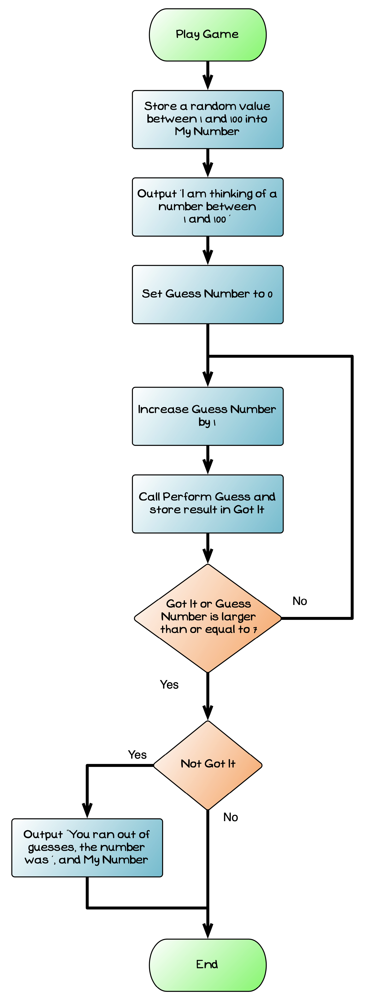

import { Accordion, AccordionItem } from 'accessible-astro-components'

We are almost at a fully functional game. We can now put aside the `perform guess` code - we have it working, so you do not need to focus on how it works now. Instead, you can focus your attention on the next function or procedure: `play game`.

`Play game` will be responsible for coordinating the actions of the game, while `perform guess` coordinates the actions for a *single* guess. The following table captures a specification for this procedure.

|   |   |
|---|---|
| **Name** | *Play Game* |
| **Description** | `Play game` is responsible for coordinating the actions involved in playing a single game of *Guess that Number*. Initially the computer will generate a random target value, and output starting text. Then it will repeatedly ask the user to guess the number, until either the user has guessed the value or they have run out of guesses. If the user does run out of guesses then the computer ends the game, and tells the user the target value. |

<div class="caption">Specification for the <code>Play Game</code> procedure</div>

To start let's update our code to add in this `play game` procedure.

```cpp
#include "splashkit.h"

// add read string, read integer, and read integer range here

// add perform guess here

// start play game here - you can copy in the old code from main

int main()
{
  play_game();
  return 0;
}
```

<Accordion>
  <AccordionItem
    header="Start of play game"
  >

```cpp
/**
 * Implements a simple guessing game. The program generate
 * a random number, and the player tries to guess it.
 */
void play_game()
{
  while ( ! perform_guess(1, 37) )
  {
    write_line("Try again...");
  }
}
```

  </AccordionItem>
</Accordion>

## Data for play game

The implementation of this procedure will require us to store some data. I think the following local variables will be needed:

- `My Number`: This will store the computer's randomly chosen number.
- `Guess Number`: This will store the current guess the user is at, allowing the computer to stop looping when the number of guesses exceeds 7.
- `Got It`: A Boolean value to indicate if the user did guess the number, allowing the computer to stop looping when the user guesses the number.

The flowchart below shows the logic for play game. This has a *loop* to ask the user to perform up to 7 guesses. The condition on this loop occurs *after* the loop body as the user must have at least one guess - so we can use a [do while](/book/part-1-instructions/3-control-flow/1-concepts/04-2-do-while) loop.

There is also a *selection* after the loop to output the answer if the user ran out of guesses. This is only done when the user has not guessed it themselves. This does not need to perform any other actions when the user did guess the number, so the false branch is empty. We added `got it` as a variable so that we can do this, otherwise we could have just used `perform guess` in the condition as we did when we were testing it.

:::note

- Notice how you can focus on the process for playing the game, without needing to worry about the details of performing a single guess.
- The condition of the if statement in `Play Game` check if the `Got It` is `false` using the not logical operator.

:::


<div class="caption">Logic for the Play Game method</div><br/>

We can also express this in pesudecode as:

```text
Procedure: Play Game
-------------------------------
Constants:
  - MAX_GUESSES: an integer with value 7
  - MAX_NUMBER: an integer with value 100
Local Variables:
  - My Number, Guess Number (Integer)
  - Got It (Boolean)
Steps
  Assign My Number, a Random number between 1 and MAX_NUMBER
  Assign to Guess Number, the value 0
  Output 'I am thinking of a number between 1 and ', and MAX_NUMBER
  Repeat
       Increase Guess Number by 1
       Assign Got It, the result of PerformGuess(Guess Number, My Number)
  While Guess Number < MAX_GUESSES and not Got It
  If Not Got It then
       Output 'You ran out of guesses... the number was ', and My Number
```

<div class="caption">Pseudocode for Play Game</div>

Have a go at coding this yourself now. To generate the random number we can use SplashKit's [rnd](https://splashkit.io/api/utilities/#rnd-1) function. You can pass this a min and a max, and it will return a random number between those values.

:::note

- Isn't it nice to have already coded the logic for perform guess. Here you can then just focus on the steps to play the game.
- Notice the indentation make it easier to see which instructions are within the loop and branches of this code
- Breaking the logic into separate functions and procedures helps make your job easier!

:::

<Accordion>
  <AccordionItem
    header="Play game code"
  >

To make this neater, I introduced two constants for the maximum number and the maximum number of guesses.

```cpp
const int MAX_NUMBER = 100;
const int MAX_GUESSES = 7;

/**
 * Implements a simple guessing game. The program generate
 * a random number, and the player tries to guess it.
 */
void play_game()
{
  int my_number, guess_number;
  bool got_it;

  my_number = rnd(1, MAX_NUMBER);
  guess_number = 0; // Keep track of the number of guesses

  write_line("I am thinking of a number between 1 and " + to_string(MAX_NUMBER) + "\n");

  do
  {
    guess_number++;
    got_it = perform_guess(guess_number, my_number);
  } while (guess_number < MAX_GUESSES && !got_it);

  if (!got_it)
  {
    write_line("You ran out of guesses... the number was " + to_string(my_number) + "\n");
  }
}
```

  </AccordionItem>
</Accordion>

## Test it out

Give your game a go. Can you guess the value within the 7 guesses?
