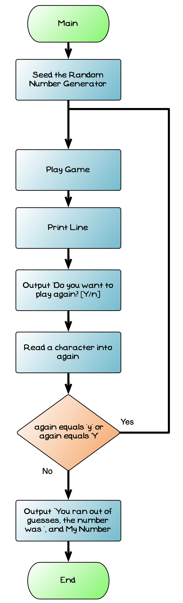

import { Accordion, AccordionItem } from 'accessible-astro-components'

The last function is `main`. This is responsible for coordinating the actions of the program. It will call `play game` in a loop that repeatedly plays the game until the user decides to quit. `Main` will need one local variable called `again`. This will store the text, and will be used to store the value read from the user's response to the '*play again*' prompt.

We can make use of our [print line](/book/part-2-organised-code/2-organising-code/2-put-together/00-1-explore-procedures) procedure to help separate different games. We can also use [read string](/book/part-2-organised-code/2-organising-code/2-put-together/00-2-explore-functions) to check if the user wants to run this again.


<div class="caption">Flowchart for the Main method</div>

:::note

Computers cannot generate truly random numbers. Instead, it uses a numeric sequence that appears to be random. SplashKit seeds the number generator using the current time when you start using it. Seeding the generator with the current time ensures that this random sequence starts at a different value each time the program is run.

:::

The following pseudocode shows the steps in main.

```text
Function: Main
-------------------------------
Local Variables:
  - again (string)
Steps
  Do
    Play Game
    Print Line
    Read string with prompt "Play again? [Y or n]: " and store in again
  While again != "n" and again != "N"
```

<div class="caption">Pseudocode for Print Line</div>

Have a go at coding this yourself. When this works you should be able to play multiple games of guess the number.

:::note
Notice how you can focus on different parts of the program, and how you can reuse functions and procedures you create. These are important advantages of dividing your code up onto smaller functional blocks.
:::

<Accordion>
  <AccordionItem
    header="Main for the guessing game"
  >

```cpp
#include "splashkit.h"

// add read string, read integer, and read integer range here

// add print line here

// add perform guess here

// add play game here

/**
 * Loops the guessing game until the user decided to quite.
*/
int main()
{
  string again = "";

  do
  {
    play_game();

    write_line();
    print_line(50);
    again = read_string("Do you want to play again [Y/n]? ");
  } while (again != "N" && again != "n");

  write_line("\nBye - enjoy the rest of your day!");
  return 0;
}
```

  </AccordionItem>
</Accordion>
