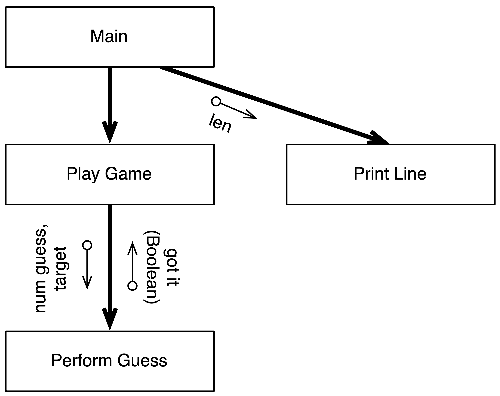

Software design is all about building **digital realities** through **abstraction**. This is the process of determining the essential features of the problem and modelling that in the building blocks that you create in your code. When designing the building blocks that will make up your code, you need to think about problem, and try to create things in your code that represent the actions and data you imagine when thinking about the problem and the digital reality you want to create.

## Identifying Functions and Procedures

Our understanding of the Guess that Number game indicates that there are two processes that need to be performed within the program: **play game** and **perform guess**. These two processes can be coded as functions or procedures in the program's code.

`Play Game` code can be implemented as a procedure. It will be responsible for running the process of the game, starting with telling the user it has 'thought of a number', through to coordinating the guesses, ending only when the user gets the answer of runs out of guesses.

`Perform Guess` can be created to contain the logic for performing a single guess. This will need to be a function so it can return a boolean value indicating if the user has guessed the target number. The code in `Perform Guess` will be responsible for asking the user to enter a guess, and then giving them the feedback on their guess. As this has the details of the guess, its result is needed to allow `Play Game` to determine if the game has ended.

The `Perform Guess` code will also need to accept parameters to tell it what the current `target` value is. This data will exist within the `Play Game` code, so `Perform Guess` will need a parameter to accept the `target`. 

A nicety may be to tell the user which guess they are up to. Once again, this information is stored in `Play Game`, so a second parameter can be added to allow `Play Game` to pass in the `guess number` along with the `target` number.

In addition to these it has been decided to add a `Print Line` procedure to display a line of '-' characters. This will be displayed at the end of the game before the user is asked if they want to play again. A `length` parameter will enable the caller to indicate how many of these characters are printed on the line.

## Visualising the Code

The structure chart showing these functions and procedures for this game is shown in [Figure x.y](#FigureGuessThatNumberStructureChart), and the Sequence Diagram is shown in [Figure x.y](#FigureGuessThatNumberSequenceDiagram). Notice how these help show what it is that we are creating. At this level we can see that this is a game that involves performing guesses. A good design for a digital reality will connect with us, helping us see what it is all about. These visualisations help us picture the design, and think about how it works.

### Structure Chart

Figure x.y: Structure Chart for the Guess that Number program
 

A structure chart shows the structure of the solution, visually showing the functions and procedures and the calls between them. Each box in the diagram represents either a function or a procedure. The arrows show one function calling another. Along the arrow, you have indicators of data flows showing values passed to parameters and returned from functions. These data flows are shown alongside the call arrow, with their own smaller arrow to indicate the direction of the flow.

By reading Figure [3.16](#FigureGuessThatNumberStructureChart) you can see which parts of the code are functions and which are procedures. `Perform Guess` is a function as it have to return data to `Play Game`. Both `PlayGame` and `PrintLine` are procedures as they do not return anything to their callers.

We can also see the parameters we are including in the design. `Perform Guess` will need two parameters for the number of the guess and the target, and `Print Line` has a length parameter. As you think through the structure of your program, you can use this visualisation to make sure that each function and procedure has the data it needs, and can pass the required information to the functions and procedures it calls.

For example, we can look at `Play Game`, it accepts no parameters but will need to be able to pass `Perform Guess` which guess number we are up to, and the target. Both of these will need to be local variables in `Play Game`, which will work for this program. In other cases, you can use this to identify additional parameters that the function or procedure may need to make these calls.

The Structure Chart shows the **static structure** of the code, indicating the calls between the functions and procedures, but not communicating *when* these are called, or *how many times*. This *dynamic* information is
captured in the Sequence Diagram shown in Figure [x.y](#FigureGuessThatNumberSequenceDiagram).

### Sequence Diagrams

This diagram shows the sequence in which the function and procedure calls are performed. Notice that this diagram has also shows the data that flows into and out of the functions and procedures.

Figure x.y: Sequence Diagram for the Guess that Number program
 

The sequence diagram shows how the program runs over time. The top of the diagram indicates the start, with time progressing as you read down the diagram. Each solid arrow represents a function or procedure call, the vertical bar represents that function or procedure running, and the dashed arrows at its end represents the function or procedure returning.

This allows you to visualise each function/procedure using the vertical bar, from where it is called to where it returns. From this bar, you then have the sequence of the calls that the function/procedure makes. For example, if you follow the main function's life bar down, you can see it calls `Play Game` and then `Print Line`.

Over the top of these calls you have boxes to illustrate control flow actions, such as loops and branches. In this we can see a loop *until the user quits* in main. This means that the actions within the box occur within the loop.

The diagram does not show all function/procedure calls, just those that we want to communicate. So there are calls to things like `write_line` and `read_line` that we have chosen not to show.

You can use the sequence diagram to think through the actions involved in key parts of your program. This lets you check that you have the necessary details, and lets you see the main elements of control flow across multiple functions and procedures at the same time.

## Control Flow

Having chosen the functions and procedure we want to build, the next step is to design the control flow that will enable these functions and procedures, and the program itself, to achieve their goals. You can think of each function/procedure as having a certain responsibility that it must meet in order for the overall solution to work.