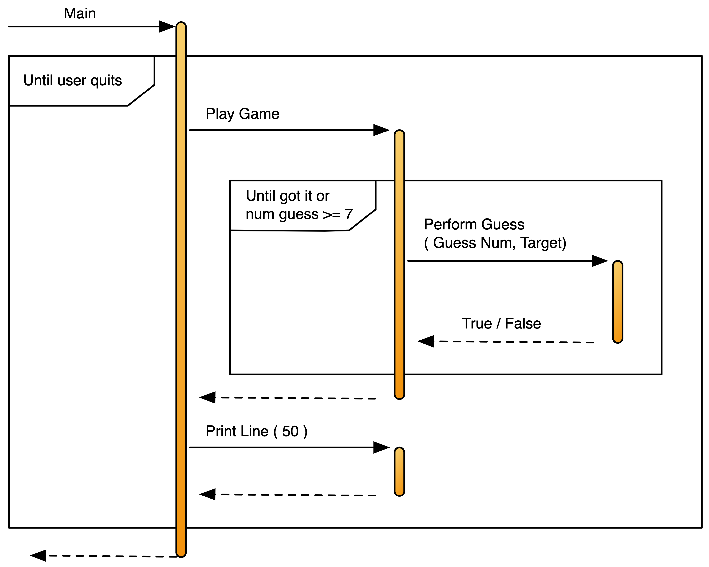

## Choosing Artefacts for Guess that Number

Software design is all about **abstraction**. This is the process of determining the essential features of the problem and modelling that in the artefacts that you create in your code. When designing the artefacts that will make up your code you need to think about problem, and try to create artefacts in your code that represent the actions and data you imagine when thinking about the problem.

Our understanding of the Guess that Number game indicates that there are two processes that need to be performed within the program: **play game** and **perform guess**. These two processes can be coded as either Functions or Procedures in the program's code. The `Play Game` code can be implemented as a Procedure. It will be responsible for running the process of the game, starting with telling the user it has 'thought of a number', through to coordinating the guesses, ending only when the user gets the answer of runs out of guesses.

`Perform Guess`, on the other hand, will need to be a Function as it must return back a Boolean Data value indicating if the user has guessed the number. The code in `Perform Guess` will be responsible for asking the user to enter a guess, and then giving them the feedback on their guess. As this has the details of the guess, its result is needed to allow `Play Game` to determine if the user has guessed the number.

The `Perform Guess` code will also need to accept parameters to tell it what the current `target` value is. This data will exist within the `Play Game` code, so it will need a mechanism to pass that code to `Perform Guess`. A Parameter is needed in `Perform Guess` to accept `target` will enable this. 

A nicety may be to allow tell the user which guess they are up to. Once again, this information is stored in `Play Game`, so a second parameter can be added to allow `Play Game` to pass in the `guess number` along with the `target` number.

In addition to these it has been decided to add a `Print Line` procedure to display a line of '-' characters. This will be displayed at the end of the game before the user is asked if they want to play again. A `length` parameter will enable the caller to indicate how many of these characters are printed on the line.

The Structure Chart showing these artefacts is shown in [Figure x.y](#FigureGuessThatNumberStructureChart), and the Sequence Diagram is shown in [Figure x.y](#FigureGuessThatNumberSequenceDiagram). Notice that there is some relationship here between the artefacts that we are creating and the steps in the game itself. The earlier it is to see the relationship between these artefacts and the problem, the better job you have done abstracting your solution.

 
import guessThatNumberStructureChart from './images/guess-that-number-structure-chart.png';

Figure x.y: Structure Chart for the Guess that Number program
 

Figure x.y: Sequence Diagram for the Guess that Number program
 
